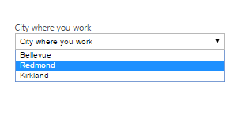
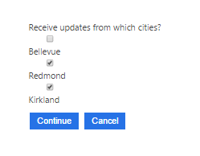
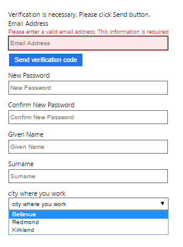

#  Add claims and customize user input using custom policies in Azure Active Directory B2C

[!INCLUDE [active-directory-b2c-advanced-audience-warning](../../includes/active-directory-b2c-advanced-audience-warning.md)]

In this article, you add a new user provided entry (a claim) to your sign-up user journey in Azure Active Directory (Azure AD) B2C.  You configure the entry as a dropdown and define whether it's required.

## Prerequisites

Complete the steps in the article [Getting Started with Custom Policies](active-directory-b2c-get-started-custom.md). Test the sign-up or sign-in user journey to sign up a new local account before proceeding.

## Add claims

Gathering initial data from your users is achieved using the sign-up or sign-in user journey. Additional claims can be gathered later by using a profile edit user journey. Anytime Azure AD B2C gathers information directly from the user interactively, the Identity Experience Framework uses its self-asserted provider.


### Define the claim

Let's ask the user for their city. Add the following element to the **ClaimsSchema** element in the TrustFrameworkBase policy file:

```xml
<ClaimType Id="city">
  <DisplayName>city</DisplayName>
  <DataType>string</DataType>
  <UserHelpText>Your city</UserHelpText>
  <UserInputType>TextBox</UserInputType>
</ClaimType>
```

The following elements are used to define the claim:

- **DisplayName** - A string that defines the user-facing label.
- **UserHelpText** - Helps the user understand what is required.
- **UserInputType** - Can be a text box, a radio selection, a drop-down list, or a multiple selection.

#### TextBox

```xml
<ClaimType Id="city">
  <DisplayName>city where you work</DisplayName>
  <DataType>string</DataType>
  <UserHelpText>Your city</UserHelpText>
  <UserInputType>TextBox</UserInputType>
</ClaimType>
```

#### RadioSingleSelect

```xml
<ClaimType Id="city">
  <DisplayName>city where you work</DisplayName>
  <DataType>string</DataType>
  <UserInputType>RadioSingleSelect</UserInputType>
  <Restriction>
    <Enumeration Text="Bellevue" Value="bellevue" SelectByDefault="false" />
    <Enumeration Text="Redmond" Value="redmond" SelectByDefault="false" />
    <Enumeration Text="Kirkland" Value="kirkland" SelectByDefault="false" />
  </Restriction>
</ClaimType>
```

#### DropdownSingleSelect



```xml
<ClaimType Id="city">
  <DisplayName>city where you work</DisplayName>
  <DataType>string</DataType>
  <UserInputType>DropdownSingleSelect</UserInputType>
  <Restriction>
    <Enumeration Text="Bellevue" Value="bellevue" SelectByDefault="false" />
    <Enumeration Text="Redmond" Value="redmond" SelectByDefault="false" />
    <Enumeration Text="Kirkland" Value="kirkland" SelectByDefault="false" />
  </Restriction>
</ClaimType>
```

#### CheckboxMultiSelect



```xml
<ClaimType Id="city">
  <DisplayName>Receive updates from which cities?</DisplayName>
  <DataType>string</DataType>
  <UserInputType>CheckboxMultiSelect</UserInputType>
  <Restriction>
    <Enumeration Text="Bellevue" Value="bellevue" SelectByDefault="false" />
    <Enumeration Text="Redmond" Value="redmond" SelectByDefault="false" />
    <Enumeration Text="Kirkland" Value="kirkland" SelectByDefault="false" />
  </Restriction>
</ClaimType>
```

### Add the claim to the user journey

1. Add the claim as an `<OutputClaim ClaimTypeReferenceId="city"/>` to the `LocalAccountSignUpWithLogonEmail` technical profile found in the TrustFrameworkBase policy file. This technical profile uses the SelfAssertedAttributeProvider.

    ```xml
    <TechnicalProfile Id="LocalAccountSignUpWithLogonEmail">
      <DisplayName>Email signup</DisplayName>
      <Protocol Name="Proprietary" Handler="Web.TPEngine.Providers.SelfAssertedAttributeProvider, Web.TPEngine, Version=1.0.0.0, Culture=neutral, PublicKeyToken=null" />
      <Metadata>
        <Item Key="IpAddressClaimReferenceId">IpAddress</Item>
        <Item Key="ContentDefinitionReferenceId">api.localaccountsignup</Item>
        <Item Key="language.button_continue">Create</Item>
      </Metadata>
      <CryptographicKeys>
        <Key Id="issuer_secret" StorageReferenceId="TokenSigningKeyContainer" />
      </CryptographicKeys>
      <InputClaims>
        <InputClaim ClaimTypeReferenceId="email" />
      </InputClaims>
      <OutputClaims>
        <OutputClaim ClaimTypeReferenceId="objectId" />
        <OutputClaim ClaimTypeReferenceId="email" PartnerClaimType="Verified.Email" Required="true" />
        <OutputClaim ClaimTypeReferenceId="newPassword" Required="true" />
        <OutputClaim ClaimTypeReferenceId="reenterPassword" Required="true" />
        <OutputClaim ClaimTypeReferenceId="executed-SelfAsserted-Input" DefaultValue="true" />
        <OutputClaim ClaimTypeReferenceId="authenticationSource" />
        <OutputClaim ClaimTypeReferenceId="newUser" />
        <!-- Optional claims, to be collected from the user -->
        <OutputClaim ClaimTypeReferenceId="givenName" />
        <OutputClaim ClaimTypeReferenceId="surName" />
        <OutputClaim ClaimTypeReferenceId="city"/>
      </OutputClaims>
      <ValidationTechnicalProfiles>
        <ValidationTechnicalProfile ReferenceId="AAD-UserWriteUsingLogonEmail" />
      </ValidationTechnicalProfiles>
      <UseTechnicalProfileForSessionManagement ReferenceId="SM-AAD" />
    </TechnicalProfile>
    ```

2. Add the claim to the AAD-UserWriteUsingLogonEmail technical profile as a `<PersistedClaim ClaimTypeReferenceId="city" />` to write the claim to the AAD directory after collecting it from the user. You may skip this step if you prefer not to persist the claim in the directory for future use.

    ```xml
    <!-- Technical profiles for local accounts -->
    <TechnicalProfile Id="AAD-UserWriteUsingLogonEmail">
      <Metadata>
        <Item Key="Operation">Write</Item>
        <Item Key="RaiseErrorIfClaimsPrincipalAlreadyExists">true</Item>
      </Metadata>
      <IncludeInSso>false</IncludeInSso>
      <InputClaims>
        <InputClaim ClaimTypeReferenceId="email" PartnerClaimType="signInNames.emailAddress" Required="true" />
      </InputClaims>
      <PersistedClaims>
        <!-- Required claims -->
        <PersistedClaim ClaimTypeReferenceId="email" PartnerClaimType="signInNames.emailAddress" />
        <PersistedClaim ClaimTypeReferenceId="newPassword" PartnerClaimType="password" />
        <PersistedClaim ClaimTypeReferenceId="displayName" DefaultValue="unknown" />
        <PersistedClaim ClaimTypeReferenceId="passwordPolicies" DefaultValue="DisablePasswordExpiration" />
        <!-- Optional claims. -->
        <PersistedClaim ClaimTypeReferenceId="givenName" />
        <PersistedClaim ClaimTypeReferenceId="surname" />
        <PersistedClaim ClaimTypeReferenceId="city" />
      </PersistedClaims>
      <OutputClaims>
        <OutputClaim ClaimTypeReferenceId="objectId" />
        <OutputClaim ClaimTypeReferenceId="newUser" PartnerClaimType="newClaimsPrincipalCreated" />
        <OutputClaim ClaimTypeReferenceId="authenticationSource" DefaultValue="localAccountAuthentication" />
        <OutputClaim ClaimTypeReferenceId="userPrincipalName" />
        <OutputClaim ClaimTypeReferenceId="signInNames.emailAddress" />
      </OutputClaims>
      <IncludeTechnicalProfile ReferenceId="AAD-Common" />
      <UseTechnicalProfileForSessionManagement ReferenceId="SM-AAD" />
    </TechnicalProfile>
    ```

3. Add the `<OutputClaim ClaimTypeReferenceId="city" />` claim to the technical profiles that read from the directory when a user signs in.

    ```xml
    <TechnicalProfile Id="AAD-UserReadUsingEmailAddress">
      <Metadata>
        <Item Key="Operation">Read</Item>
        <Item Key="RaiseErrorIfClaimsPrincipalDoesNotExist">true</Item>
        <Item Key="UserMessageIfClaimsPrincipalDoesNotExist">An account could not be found for the provided user ID.</Item>
      </Metadata>
      <IncludeInSso>false</IncludeInSso>
      <InputClaims>
        <InputClaim ClaimTypeReferenceId="email" PartnerClaimType="signInNames" Required="true" />
      </InputClaims>
      <OutputClaims>
        <!-- Required claims -->
        <OutputClaim ClaimTypeReferenceId="objectId" />
        <OutputClaim ClaimTypeReferenceId="authenticationSource" DefaultValue="localAccountAuthentication" />
        <!-- Optional claims -->
        <OutputClaim ClaimTypeReferenceId="userPrincipalName" />
        <OutputClaim ClaimTypeReferenceId="displayName" />
        <OutputClaim ClaimTypeReferenceId="otherMails" />
        <OutputClaim ClaimTypeReferenceId="signInNames.emailAddress" />
        <OutputClaim ClaimTypeReferenceId="city" />
      </OutputClaims>
      <IncludeTechnicalProfile ReferenceId="AAD-Common" />
    </TechnicalProfile>
    ```

    ```xml
    <TechnicalProfile Id="AAD-UserReadUsingObjectId">
      <Metadata>
        <Item Key="Operation">Read</Item>
        <Item Key="RaiseErrorIfClaimsPrincipalDoesNotExist">true</Item>
      </Metadata>
      <IncludeInSso>false</IncludeInSso>
      <InputClaims>
        <InputClaim ClaimTypeReferenceId="objectId" Required="true" />
      </InputClaims>
      <OutputClaims>
        <!-- Optional claims -->
        <OutputClaim ClaimTypeReferenceId="signInNames.emailAddress" />
        <OutputClaim ClaimTypeReferenceId="displayName" />
        <OutputClaim ClaimTypeReferenceId="otherMails" />
        <OutputClaim ClaimTypeReferenceId="givenName" />
        <OutputClaim ClaimTypeReferenceId="city" />
      </OutputClaims>
      <IncludeTechnicalProfile ReferenceId="AAD-Common" />
    </TechnicalProfile>
    ```
   
4. Add the `<OutputClaim ClaimTypeReferenceId="city" />` claim to the SignUporSignIn.xml file so that this claim is sent to the application in the token after a successful user journey.

    ```xml
    <RelyingParty>
      <DefaultUserJourney ReferenceId="SignUpOrSignIn" />
      <TechnicalProfile Id="PolicyProfile">
        <DisplayName>PolicyProfile</DisplayName>
        <Protocol Name="OpenIdConnect" />
        <OutputClaims>
          <OutputClaim ClaimTypeReferenceId="displayName" />
          <OutputClaim ClaimTypeReferenceId="givenName" />
          <OutputClaim ClaimTypeReferenceId="surname" />
          <OutputClaim ClaimTypeReferenceId="email" />
          <OutputClaim ClaimTypeReferenceId="objectId" PartnerClaimType="sub"/>
          <OutputClaim ClaimTypeReferenceId="identityProvider" />
          <OutputClaim ClaimTypeReferenceId="city" />
        </OutputClaims>
        <SubjectNamingInfo ClaimType="sub" />
      </TechnicalProfile>
    </RelyingParty>
    ```

## Test the custom policy

1. Sign in to the [Azure portal](https://portal.azure.com).
2. Make sure you're using the directory that contains your Azure AD tenant by clicking the **Directory and subscription filter** in the top menu and choosing the directory that contains your Azure AD tenant.
3. Choose **All services** in the top-left corner of the Azure portal, and then search for and select **App registrations**.
4. Select **Identity Experience Framework (Preview)**.
5. Select **Upload Custom Policy**, and then upload the two policy files that you changed.
2. Select the sign-up or sign-in policy that you uploaded, and click the **Run now** button.
3. You should be able to sign up using an email address.

The signup screen should look similar to this:



The token sent back to your application includes the `city` claim.

```json
{
  "exp": 1493596822,
  "nbf": 1493593222,
  "ver": "1.0",
  "iss": "https://contoso.b2clogin.com/f06c2fe8-709f-4030-85dc-38a4bfd9e82d/v2.0/",
  "sub": "9c2a3a9e-ac65-4e46-a12d-9557b63033a9",
  "aud": "4e87c1dd-e5f5-4ac8-8368-bc6a98751b8b",
  "acr": "b2c_1a_trustf_signup_signin",
  "nonce": "defaultNonce",
  "iat": 1493593222,
  "auth_time": 1493593222,
  "email": "joe@outlook.com",
  "given_name": "Joe",
  "family_name": "Ras",
  "city": "Bellevue",
  "name": "unknown"
}
```

## Optional: Remove email verification

To skip email verification, you can choose to remove `PartnerClaimType="Verified.Email"`. In this case, the email address is required but not verified, unless “Required” = true is removed.  Carefully consider if this option is right for your use cases.

Verified email is enabled by default in the `<TechnicalProfile Id="LocalAccountSignUpWithLogonEmail">` in the TrustFrameworkBase policy file:

```xml
<OutputClaim ClaimTypeReferenceId="email" PartnerClaimType="Verified.Email" Required="true" />
```

## Next steps

Learn how to [Use custom attributes in a custom profile edit policy](active-directory-b2c-create-custom-attributes-profile-edit-custom.md).
