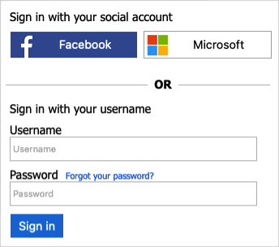

# Set up a sign-in flow in Azure Active Directory B2C

[!INCLUDE [active-directory-b2c-choose-user-flow-or-custom-policy](../../includes/active-directory-b2c-choose-user-flow-or-custom-policy.md)]

## Sign-in flow overview

The sign-in policy lets users: 

* Users can sign in with an Azure AD B2C Local Account
* Sign-up or sign-in with a social account
* Password reset
* Users cannot sign up for an Azure AD B2C Local Account - To create an account, an Administrator can use [MS Graph API](microsoft-graph-operations.md).



## Prerequisites

If you haven't already done so, [register a web application in Azure Active Directory B2C](tutorial-register-applications.md).

::: zone pivot="b2c-user-flow"

## Create a sign-in user flow

To add sign-in policy:

1. Sign in to the [Azure portal](https://portal.azure.com).
1. Select the **Directory + Subscription** icon in the portal toolbar, and then select the directory that contains your Azure AD B2C tenant.
1. In the Azure portal, search for and select **Azure AD B2C**.
1. Under **Policies**, select **User flows**, and then select **New user flow**.
1. On the **Create a user flow** page, select the **Sign in** user flow.
1. Under **Select a version**, select **Recommended**, and then select **Create**. ([Learn more](user-flow-versions.md) about user flow versions.)
1. Enter a **Name** for the user flow. For example, *signupsignin1*.
1. For **Identity providers**, select **Email sign-in**.
1. For **Application claims**, choose the claims and attributes that you want to send to your application. For example, select **Show more**, and then choose attributes and claims for **Display Name**, **Given Name**,  **Surname**, and **User's Object ID**. Click **OK**.
1. Click **Create** to add the user flow. A prefix of *B2C_1* is automatically prepended to the name.

### Test the user flow

1. Select the user flow you created to open its overview page, then select **Run user flow**.
1. For **Application**, select the web application named *webapp1* that you previously registered. The **Reply URL** should show `https://jwt.ms`.
1. Click **Run user flow**.
1. You should be able to sign in with the account that you created (using MS Graph API), without the sign-up link. The returned token includes the claims that you selected.

::: zone-end

::: zone pivot="b2c-custom-policy"

## Remove the sign-up link

The **SelfAsserted-LocalAccountSignin-Email** technical profile is a [self-asserted](self-asserted-technical-profile.md), which is invoked during the sign-up or sign-in flow. To remove the sign-up link, set the `setting.showSignupLink` metadata to `false`. Override the SelfAsserted-LocalAccountSignin-Email technical profiles in the extension file. 

1. Open the extensions file of your policy. For example, _`SocialAndLocalAccounts/`**`TrustFrameworkExtensions.xml`**_.
1. Find the `ClaimsProviders` element. If the element doesn't exist, add it.
1. Add the following claims provider to the `ClaimsProviders` element:

    ```xml
    <ClaimsProvider>
      <DisplayName>Local Account</DisplayName>
      <TechnicalProfiles>
        <TechnicalProfile Id="SelfAsserted-LocalAccountSignin-Email">
          <Metadata>
            <Item Key="setting.showSignupLink">false</Item>
          </Metadata>
        </TechnicalProfile>
      </TechnicalProfiles>
    </ClaimsProvider>
    ```

1. Within `<BuildingBlocks>` element, add the following [ContentDefinition](contentdefinitions.md) to reference the version 1.2.0, or newer data URI:

    ```XML
    <ContentDefinitions>
     <ContentDefinition Id="api.localaccountsignup">
        <DataUri>urn:com:microsoft:aad:b2c:elements:contract:unifiedssp:1.2.0</DataUri>
      </ContentDefinition>
    </ContentDefinitions>
    ```

## Update and test your policy

1. Sign in to the [Azure portal](https://portal.azure.com).
1. Make sure you're using the directory that contains your Azure AD tenant by selecting the **Directory + subscription** filter in the top menu and choosing the directory that contains your Azure AD tenant.
1. Choose **All services** in the top-left corner of the Azure portal, and then search for and select **App registrations**.
1. Select **Identity Experience Framework**.
1. Select **Upload Custom Policy**, and then upload the two policy files that you changed.
1. Select the sign-in policy that you uploaded, and click the **Run now** button.
1. You should be able to sign in with the account that you created (using MS Graph API), without the sign-up link.

::: zone-end

## Next steps

* Add a [sign-in with social identity provider](add-identity-provider.md).
* Set up a [password reset flow](add-password-reset-policy.md).
