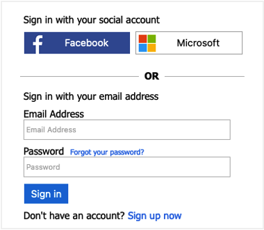
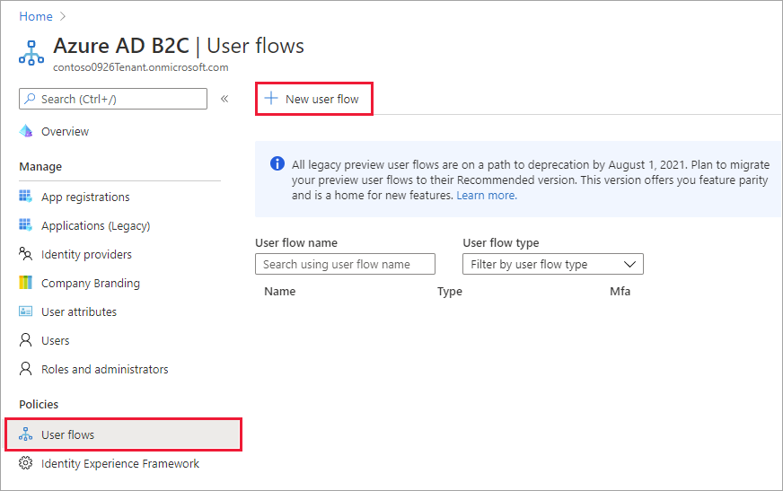

# Set up a sign-up and sign-in flow in Azure Active Directory B2C

[!INCLUDE [active-directory-b2c-choose-user-flow-or-custom-policy](../../includes/active-directory-b2c-choose-user-flow-or-custom-policy.md)]

## Sign-up and sign-in flow

Sign-up and sign-in policy lets users: 

* Sign-up with local account
* Sign-in with local account
* Sign-up or sign-in with a social account
* Password reset

## Prerequisites

If you haven't already done so, [register a web application in Azure Active Directory B2C](tutorial-register-applications.md).

::: zone pivot="b2c-user-flow"

## Create a sign-up and sign-in user flow

The sign-up and sign-in user flow handles both sign-up and sign-in experiences with a single configuration. Users of your application are led down the right path depending on the context.

1. Sign in to the [Azure portal](https://portal.azure.com).
1. Select the **Directory + Subscription** icon in the portal toolbar, and then select the directory that contains your Azure AD B2C tenant.
1. In the Azure portal, search for and select **Azure AD B2C**.
1. Under **Policies**, select **User flows**, and then select **New user flow**.

    

1. On the **Create a user flow** page, select the **Sign up and sign in** user flow.

    

1. Under **Select a version**, select **Recommended**, and then select **Create**. ([Learn more](user-flow-versions.md) about user flow versions.)

    

1. Enter a **Name** for the user flow. For example, *signupsignin1*.
1. For **Identity providers**, select **Email sign-up**.
1. For **User attributes and claims**, choose the claims and attributes that you want to collect and send from the user during sign-up. For example, select **Show more**, and then choose attributes and claims for **Country/Region**, **Display Name**, and **Postal Code**. Click **OK**.

    

1. Click **Create** to add the user flow. A prefix of *B2C_1* is automatically prepended to the name.
2. Follow the steps to [handle the flow for "Forgot your password?"](add-password-reset-policy.md?pivots=b2c-user-flow.md#self-service-password-reset-recommended) within the sign-up or sign-in policy.

### Test the user flow

1. Select the user flow you created to open its overview page, then select **Run user flow**.
1. For **Application**, select the web application named *webapp1* that you previously registered. The **Reply URL** should show `https://jwt.ms`.
1. Click **Run user flow**, and then select **Sign up now**.

    

1. Enter a valid email address, click **Send verification code**, enter the verification code that you receive, then select **Verify code**.
1. Enter a new password and confirm the password.
1. Select your country and region, enter the name that you want displayed, enter a postal code, and then click **Create**. The token is returned to `https://jwt.ms` and should be displayed to you.
1. You can now run the user flow again and you should be able to sign in with the account that you created. The returned token includes the claims that you selected of country/region, name, and postal code.

> [!NOTE]
> The "Run user flow" experience is not currently compatible with the SPA reply URL type using authorization code flow. To use the "Run user flow" experience with these kinds of apps, register a reply URL of type "Web" and enable the implicit flow as described [here](tutorial-register-spa.md).

::: zone-end

::: zone pivot="b2c-custom-policy"

## Create a sign-up and sign-in policy

Custom policies are a set of XML files you upload to your Azure AD B2C tenant to define user journeys. We provide starter packs with several pre-built policies including: sign-up and sign-in, password reset, and profile editing policy. For more information, see [Get started with custom policies in Azure AD B2C](custom-policy-get-started.md).

::: zone-end

## Next steps

* Add a [sign-in with social identity provider](add-identity-provider.md).
* Set up a [password reset flow](add-password-reset-policy.md).
