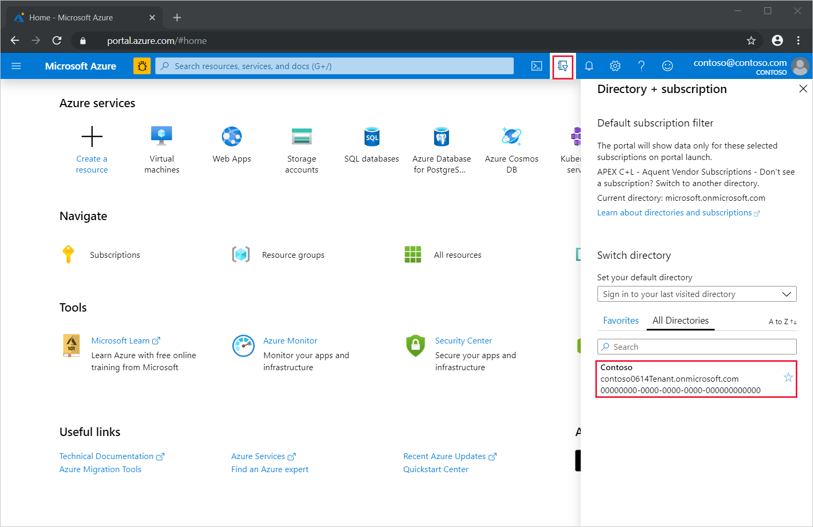
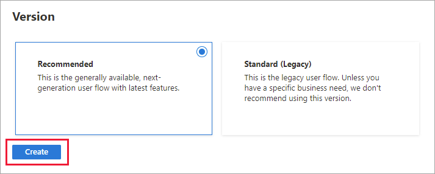
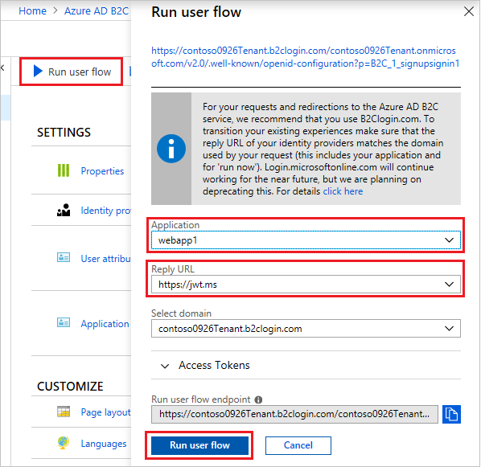

# Create a user flow in Azure Active Directory B2C

You can create [user flows](user-flow-overview.md) of different types in your Azure Active Directory B2C (Azure AD B2C) tenant and use them in your applications as needed. User flows can be reused across applications.

> [!IMPORTANT]
> We've changed the way we reference user flow versions. Previously, we offered V1 (production-ready) versions, and V1.1 and V2 (preview) versions. Now, we've consolidated user flows into **Recommended** (next-generation preview) and **Standard** (generally available) versions. All V1.1 and V2 legacy preview user flows are on a path to deprecation by **August 1, 2021**. For details, see [User flow versions in Azure AD B2C](user-flow-versions.md).

## Before you begin

- **Register the application** you want to use to test the new user flow. For an example, see the [Tutorial: Register a web application in Azure AD B2C](tutorial-register-applications.md).
- **Add external identity providers** if you want to enable user sign-in with providers like Azure AD, Amazon, Facebook, GitHub, LinkedIn, Microsoft, or Twitter. For an example, see [Tutorial: Add identity providers to your applications in Azure AD B2C](tutorial-add-identity-providers.md).
- **Configure the local account identity provider** to specify the identity types (email, username, phone number) you want to support for local accounts in your tenant. Then you can choose from these supported identity types when you create individual user flows. When a user completes the user flow, a local account is created in your Azure AD B2C directory, and your **Local account** identity provider authenticates the user's information. Configure your tenant's local account identity provider with these steps:

   1. Sign in to the [Azure portal](https://portal.azure.com/). 
   2. Select the **Directory + subscription** filter in the top menu and choose the directory that contains your Azure AD B2C tenant.
   3. In the search bar at the top of the Azure portal, search for and select **Azure AD B2C**.
   4. Under **Manage**, select **Identity providers**.
   5. In the identity provider list, select **Local account**.
   6. In the **Configure local IDP** page, select all the identity types you want to support. Selecting options here simply makes them available for the user flows you create later:
      - **Phone** (preview): Allows a user to enter a phone number, which is verified at sign-up and becomes their user ID.
      - **Email** (default): Allows a user to enter an email address, which is verified at sign-up and becomes their user ID.
      - **Username**: Allows a user to create their own unique user ID. An email address is collected from the user and verified.
    7. Select **Save**.

## Create a user flow

1. Sign in to the [Azure portal](https://portal.azure.com).
2. Select the **Directory + Subscription** icon in the portal toolbar, and then select the directory that contains your Azure AD B2C tenant.

    

3. In the Azure portal, search for and select **Azure AD B2C**.
4. Under **Policies**, select **User flows**, and then select **New user flow**.

    

5. On the **Create a user flow** page, select the type of user flow you want to create (see [User flows in Azure AD B2C](user-flow-overview.md) for an overview).

    

6. Under **Select a version**, select **Recommended**, and then select **Create**. ([Learn more](user-flow-versions.md) about user flow versions.)

    

7. Enter a **Name** for the user flow (for example, *signupsignin1*, *profileediting1*, *passwordreset1*).
8. Under **Identity providers**, choose the options depending on the type of user flow you're creating:

   - **Local account**. If you want to allow users to create local accounts in your Azure AD B2C tenant, select the type of identifier you want them to use (for example, email, user ID, or phone). Only those identity types that are configured in your [local account identity provider](#before-you-begin) settings are listed.

   - **Social identity providers**. If you want to allow user sign-in with [social identity providers you've added](tutorial-add-identity-providers.md), like Azure AD, Amazon, Facebook, GitHub, LinkedIn, Microsoft, or Twitter, select the providers from the list.

9. For **User attributes and claims**, choose the claims and attributes that you want to collect and send from the user during sign-up. Select **Show more**. Select the attributes and claims, and then select **OK**.

    

10. Select **Create** to add the user flow. A prefix of *B2C_1* is automatically prepended to the name.

### Test the user flow

1. Select **Policies** > **User flows**, and then select the user flow you created. On the user flow overview page, select **Run user flow**.
1. For **Application**, select the web application you registered in step 1. The **Reply URL** should show `https://jwt.ms`.
1. Select **Run user flow**.
2. Depending on the type of user flow you're testing, either sign up using a valid email address and follow the sign-up flow, or sign in using an account that you previously created.

    

1. Follow the user flow prompts. When you complete the user flow, the token is returned to `https://jwt.ms` and should be displayed to you.

> [!NOTE]
> The "Run user flow" experience is not currently compatible with the SPA reply URL type using authorization code flow. To use the "Run user flow" experience with these kinds of apps, register a reply URL of type "Web" and enable the implicit flow as described [here](tutorial-register-spa.md).

## Next steps

- [Add Conditional Access to Azure AD B2C user flows](conditional-access-user-flow.md)
- [Customize the user interface in an Azure AD B2C user flow](customize-ui-overview.md)
