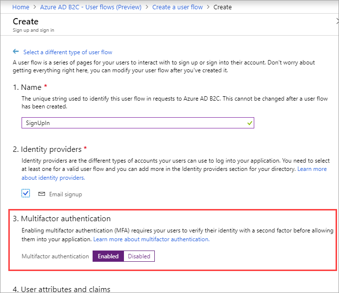

# Enable multi-factor authentication in Azure Active Directory B2C

Azure Active Directory B2C (Azure AD B2C) integrates directly with [Azure Multi-Factor Authentication](../active-directory/authentication/multi-factor-authentication.md) so that you can add a second layer of security to sign-up and sign-in experiences in your applications. You enable multi-factor authentication without writing a single line of code. If you already created sign up and sign-in user flows, you can still enable multi-factor authentication.

This feature helps applications handle scenarios such as the following:

- You don't require multi-factor authentication to access one application, but you do require it to access another. For example, the customer can sign into an auto insurance application with a social or local account, but must verify the phone number before accessing the home insurance application registered in the same directory.
- You don't require multi-factor authentication to access an application in general, but you do require it to access the sensitive portions within it. For example, the customer can sign in to a banking application with a social or local account and check the account balance, but must verify the phone number before attempting a wire transfer.

## Set multi-factor authentication

When you create a user flow, you have the option to enable multi-factor authentication.

Set **Multifactor authentication** to **Enabled**.

You can use **Run user flow** to verify the experience. Confirm the following scenario:

A customer account is created in your tenant before the multi-factor authentication step occurs. During the step, the customer is asked to provide a phone number and verify it. If verification is successful, the phone number is attached to the account for later use. Even if the customer cancels or drops out, the customer can be asked to verify a phone number again during the next sign-in with multi-factor authentication enabled.

## Add multi-factor authentication

It's possible to enable multi-factor authentication on a user flow that you previously created.

To enable multi-factor authentication:

1. Open the user flow and then select **Properties**.
2. Next to **Multifactor authentication**, select **Enabled**.
3. Click **Save** at the top of the page.

