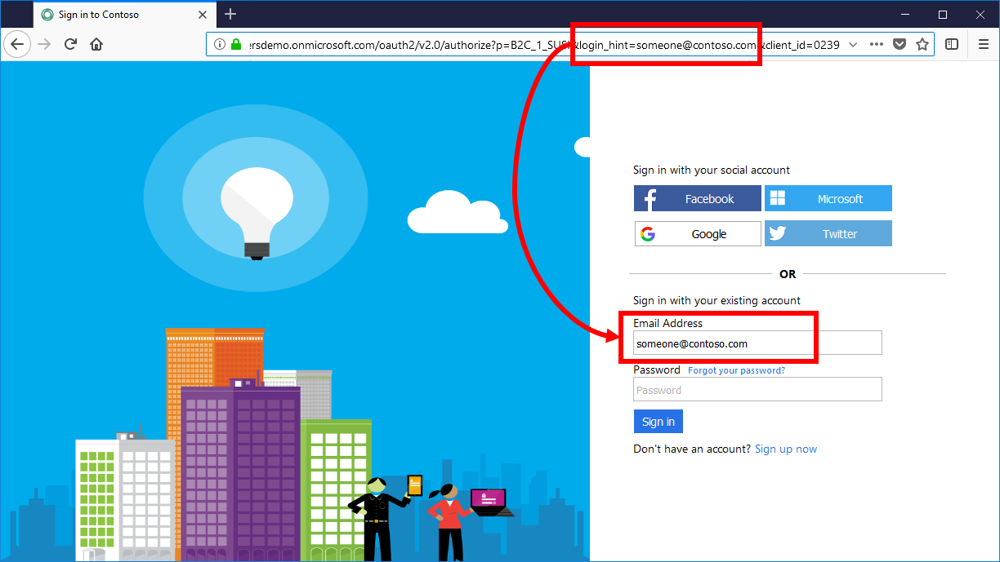
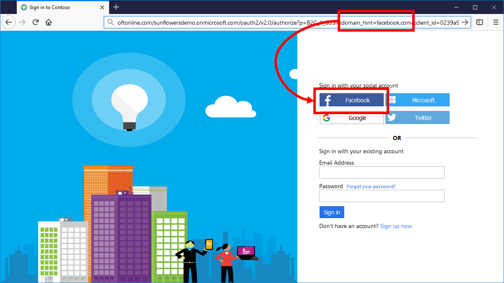

# Set up direct sign-in using Azure Active Directory B2C

When setting up sign-in for your application using Azure Active Directory (AD) B2C, you can prepopulate the sign-in name or direct sign-in to a specific social identity provider, such as Facebook, LinkedIn, or a Microsoft account. 

## Prepopulate the sign-in name

During a sign-in user journey, a relying party application may target a specific user or domain name. When targeting a user, an application can specify, in the authorization request, the `login_hint` query parameter with the user sign-in name. Azure AD B2C automatically populates the sign-in name, while the user only needs to provide the password.

 

The user is able to change the value in the sign-in textbox.

If you are using a custom policy, override the `SelfAsserted-LocalAccountSignin-Email` technical profile. In the `<InputClaims>` section, set the DefaultValue of the signInName claim to `{OIDC:LoginHint}`. The `{OIDC:LoginHint}` variable contains the value of the `login_hint` parameter. Azure AD B2C reads the value of the signInName claim and pre-populates the signInName textbox.

```xml
<ClaimsProvider>
  <DisplayName>Local Account</DisplayName>
  <TechnicalProfiles>
    <TechnicalProfile Id="SelfAsserted-LocalAccountSignin-Email">
      <InputClaims>
        <!-- Add the login hint value to the sign-in names claim type -->
        <InputClaim ClaimTypeReferenceId="signInName" DefaultValue="{OIDC:LoginHint}" />
      </InputClaims>
    </TechnicalProfile>
  </TechnicalProfiles>
</ClaimsProvider>
```

## Redirect sign-in to a social provider

If you configured the sign-in journey for your application to include social accounts, such as Facebook, LinkedIn, or Google, you can specify the `domain_hint` parameter. This query parameter provides a hint to Azure AD B2C about the social identity provider that should be used for sign-in. For example, if the application specifies `domain_hint=facebook.com`, sign-in goes directly to the Facebook sign-in page.

 

If you are using a custom policy, you can configure the domain name using the `<Domain>domain name</Domain>` XML element of any `<ClaimsProvider>`. 

```xml
<ClaimsProvider>
    <!-- Add the domain hint value to the claims provider -->
    <Domain>facebook.com</Domain>
    <DisplayName>Facebook</DisplayName>
    <TechnicalProfiles>
    ...
```


