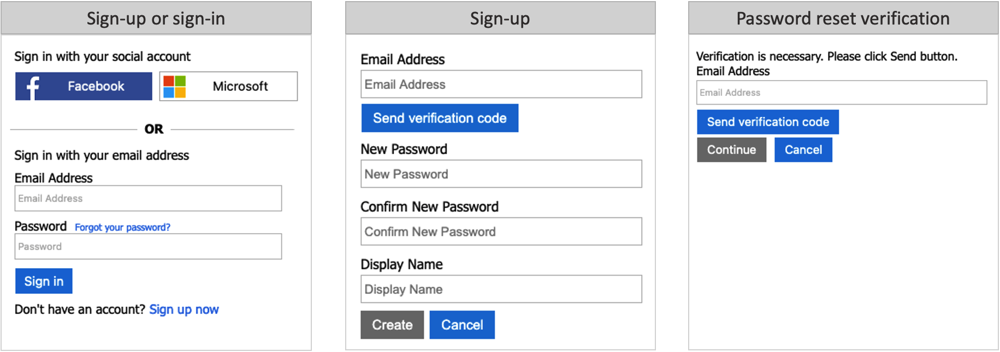
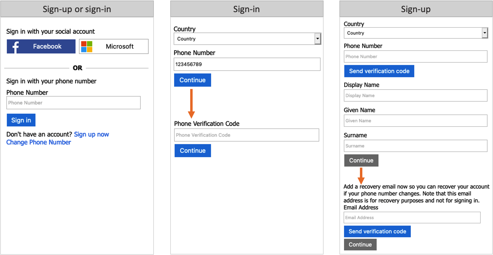
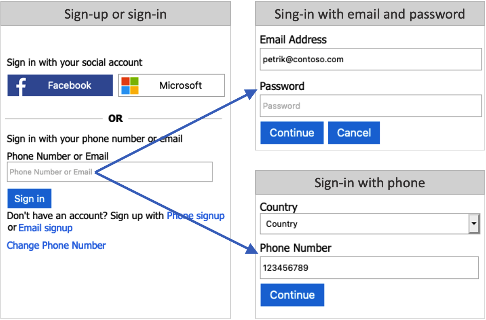

# Set up the local account identity provider

[!INCLUDE [active-directory-b2c-choose-user-flow-or-custom-policy](../../includes/active-directory-b2c-choose-user-flow-or-custom-policy.md)]

Azure AD B2C provides various ways in which users can authenticate a user. Users can sign-in to a local account, by using username and password, phone verification (also known as password less authentication), or social identity providers. Email sign-up is enabled by default in your local account identity provider settings. 

This article describes how users create their accounts local to this Azure AD B2C tenant. For social or enterprise identities, where the identity of the user is managed by a federated identity provider like Facebook, and Google, see [Add an identity provider](add-identity-provider.md).

## Email sign-in

With the email option, users can sign in/up with their email address and password:

- **Sign-in**, users are prompted to provide their email and password.
- **Sign-up**, users will be prompted for an email address, which will be verified at sign-up (optional) and become their login ID. The user then enters any other information requested on the sign-up page, for example, Display Name, Given Name, and Surname. Then select Continue to create the account.
- **Password reset**, Users must enter and verify their email, after which, the user can reset the password

## Username sign-in

With the user option, users can sign in/up with a username and password:

- **Sign-in**: Users are prompted to provide their username and password.
- **Sign-up**: Users will be prompted for a username, which will become their login ID. Users will also be prompted for an email address, which will be verified at sign-up. The email address will be used during a password reset flow. The user enters any other information requested on the sign-up page, for example, Display Name, Given Name, and Surname. The user then selects Continue to create the account.
- **Password reset**: Users must enter their username, and associated email address. The email address must be verified, after which, the user can reset the password.

## Phone sign-in (Preview)

Passwordless authentication is a type of authentication where a user doesn't need to sign-in with their password. With phone sign-up and sign-in, the user can sign up for the app using a phone number as their primary login identifier. The user will have the following experience during sign-up and sign-in:

- **Sign-in**: If the user has an existing account with phone number as their identifier, the user enters their phone number and selects *Sign in*. They confirm the country and phone number by selecting *Continue*, and a one-time verification code is sent to their phone. The user enters the verification code and selects *Continue* to sign in.
- **Sign-up**: If the user doesn't already have an account for your application, they can create one by clicking on the *Sign up now* link. 
    1. A sign-up page appears, where the user selects their *Country*, enters their phone number, and selects *Send Code*. 
    1. A one-time verification code is sent to the user's phone number. The user enters the *Verification Code* on the sign-up page, and then selects *Verify Code*. (If the user can't retrieve the code, they can select *Send New Code*). 
    1. The user enters any other information requested on the sign-up page, for example, Display Name, Given Name, and Surname. Then select Continue.
    1. Next, the user is asked to provide a **recovery email**. The user enters their email address, and then selects *Send verification code*. A code is sent to the user's email inbox, which they can retrieve and enter in the Verification code box. Then the user selects Verify code.
    1. Once the code is verified, the user selects *Create* to create their account. 

### Pricing

One-time passwords are sent to your users by using SMS text messages. Depending on your mobile network operator, you may be charged for each message sent. For pricing information, see the **Separate Charges** section of [Azure Active Directory B2C pricing](https://azure.microsoft.com/pricing/details/active-directory-b2c/).

> [!NOTE]
> Multi-factor authentication (MFA) is disabled by default when you configure a user flow with phone sign-up. You can enable MFA in user flows with phone sign-up, but because a phone number is used as the primary identifier, email one-time passcode is the only option available for the second authentication factor.

### Phone recovery

When you enable phone sign-up and sign-in for your user flows, it's also a good idea to enable the recovery email feature. With this feature, a user can provide an email address that can be used to recover their account when they don't have their phone. This email address is used for account recovery only. It can't be used for signing in.

- When the recovery email prompt is **On**, a user signing up for the first time is prompted to verify a backup email. A user who hasn't provided a recovery email before is asked to verify a backup email during next sign in.

- When recovery email is **Off**, a user signing up or signing in isn't shown the recovery email prompt.
 
The following screenshots demonstrate the phone recovery flow:

## Phone or email sign-in (Preview)

You can choose to combine the [phone sign-in](#phone-sign-in-preview), and the [email sign-in](#email-sign-in). In the sign-up or sign-in page, user can type a phone number, or email address. Based on the user input, Azure AD B2C takes the user to the corresponding flow. 

::: zone pivot="b2c-user-flow"

## Configure local account identity provider settings

You can configure the local identity providers available to be used within a User Flow by enabling or disabling the providers (email, username, or phone number).  You can have more than one local identity provider enabled at the tenant level.

A User Flow can only be configured to use one of the local account identity providers at any one time. Each User Flow can have a different local account identity provider set, if more than one has been enabled at the tenant level.

1. Sign in to the [Azure portal](https://portal.azure.com).
1. Make sure you're using the directory that contains your Azure AD B2C tenant by selecting the **Directory + subscription** filter in the top menu and choosing the directory that contains your Azure AD tenant.
1. Choose **All services** in the top-left corner of the Azure portal, and then search for and select **Azure AD B2C**.
1. Under **Manage**, select **Identity providers**.
1. In the identity provider list, select **Local account**.
1. In the **Configure local IDP** page, selected at least one of the allowable identity types consumers can use to create their local accounts in your Azure AD B2C tenant.
1. Select **Save**.

## Configure your User Flow

1. In the left menu of the Azure portal, select **Azure AD B2C**.
1. Under **Policies**, select **User flows (policies)**.
1. Select the user flow for which you'd like to configure the sign-up and sign-in experience.
1. Select **Identity providers**
1. Under the **Local accounts**, select one of the following: **Email signup**,  **User ID signup**, **Phone signup**, **Phone/Email signup**, or **None**.

### Enable the recovery email prompt

If you choose the **Phone signup**, **Phone/Email signup** option, enable the recovery email prompt.

1. Sign in to the [Azure portal](https://portal.azure.com).
1. Select the **Directory + Subscription** icon in the portal toolbar, and then select the directory that contains your Azure AD B2C tenant.
1. In the Azure portal, search for and select **Azure AD B2C**.
1. In Azure AD B2C, under **Policies**, select **User flows**.
1. Select the user flow from the list.
1. Under **Settings**, select **Properties**.
1. Next to **Enable recovery email prompt for phone number signup and sign in (preview)**, select:
   - **On** to show the recovery email prompt during both sign-up and sign-in.
   - **Off** to hide the recovery email prompt.
1. Select **Save**.

::: zone-end

::: zone pivot="b2c-custom-policy"

## Get the starter pack

Custom policies are a set of XML files you upload to your Azure AD B2C tenant to define user journeys. We provide starter packs with several pre-built policies. Download the relevant starter-pack: 

- [Email sign-in](https://github.com/Azure-Samples/active-directory-b2c-custom-policy-starterpack/tree/master/SocialAndLocalAccounts)
- [Username sign-in](https://github.com/azure-ad-b2c/samples/tree/master/policies/username-signup-or-signin)
- [Phone sign-in](https://github.com/Azure-Samples/active-directory-b2c-custom-policy-starterpack/tree/master/scenarios/phone-number-passwordless). Select the [SignUpOrSignInWithPhone.xml](https://github.com/Azure-Samples/active-directory-b2c-custom-policy-starterpack/blob/master/scenarios/phone-number-passwordless/SignUpOrSignInWithPhone.xml) relying party policy. 
- [Phone or email sign-in](https://github.com/Azure-Samples/active-directory-b2c-custom-policy-starterpack/tree/master/scenarios/phone-number-passwordless). Select the [SignUpOrSignInWithPhone.xml](https://github.com/Azure-Samples/active-directory-b2c-custom-policy-starterpack/blob/master/scenarios/phone-number-passwordless/SignUpOrSignInWithPhoneOrEmail.xml) relying party policy.

After you download the starter pack.

1. In each file, replace the string `yourtenant` with the name of your Azure AD B2C tenant. For example, if the name of your B2C tenant is *contosob2c*, all instances of `yourtenant.onmicrosoft.com` become `contosob2c.onmicrosoft.com`.

1. Complete the steps in the [Add application IDs to the custom policy](custom-policy-get-started.md#add-application-ids-to-the-custom-policy) section of [Get started with custom policies in Azure Active Directory B2C](custom-policy-get-started.md). For example, update `/phone-number-passwordless/`**`Phone_Email_Base.xml`** with the **Application (client) IDs** of the two applications you registered when completing the prerequisites, *IdentityExperienceFramework* and *ProxyIdentityExperienceFramework*.
1. Upload the policy files

::: zone-end

## Next steps

- [Add external identity providers](add-identity-provider.md)
- [Create a user flow](tutorial-create-user-flows.md)
