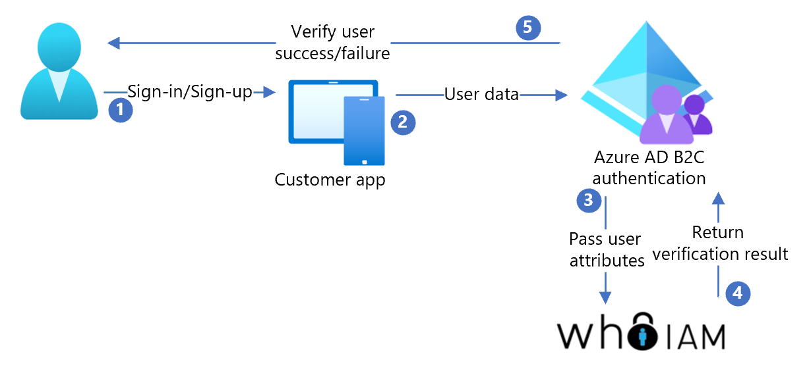

# Tutorial for configuring WhoIAM with Azure Active Directory B2C

In this sample tutorial, we provide guidance on how to configure [WhoIAM](https://www.whoiam.ai/brims/) Branded Identity Management System (BRIMS) in your environment and integrate it with Active Directory B2C (Azure AD B2C).

BRIMS is a set of apps and services that's deployed in your environment. It provides voice, SMS, and email verification of your user base. BRIMS works in conjunction with your existing identity and access management solution and is platform agnostic.

## Prerequisites

To get started, you'll need:

- An Azure AD subscription. If you don't have a subscription, you can get a [free account](https://azure.microsoft.com/free/).

- [An Azure AD B2C tenant](./tutorial-create-tenant.md) that's linked to your Azure subscription.

- A WhoIAM [trial account](https://www.whoiam.ai/contact-us/).

## Scenario description

The WhoIAM integration includes the following components:

- An Azure AD B2C tenant. It's the authorization server that verifies the user's credentials based on custom policies defined in it. It's also known as the identity provider.

- An administration portal for managing clients and their configurations.

- An API service that exposes various features through endpoints.  

- Azure Cosmos DB, which acts as the back end for both the BRIMS administration portal and the API service.

The following architecture diagram shows the implementation.

|Step | Description |
|:-----| :-----------|
| 1. | The user arrives at a page to start the sign-up or sign-in request to an app that uses Azure AD B2C as its identity provider.
| 2. | As part of authentication, the user requests to either verify ownership of their email or phone or use their voice as a biometric verification factor.  
| 3. | Azure AD B2C makes a call to the BRIMS API service and passes on the user's email address, phone number, and voice recording.
| 4. | BRIMS uses predefined configurations such as fully customizable email and SMS templates to interact with the user in their respective language in a way that's consistent with the app's style.
| 5. | After a user's identity verification is complete, BRIMS returns a token to Azure AD B2C to indicate the outcome of the verification. Azure AD B2C then either grants the user access to the app or fails their authentication attempt.  

## Sign up with WhoIAM

1. Contact [WhoIAM](https://www.whoiam.ai/contact-us/) and create a BRIMS account.

2. Use the sign-up guidelines made available to you and configure the following Azure services:

    - [Azure Key Vault](https://azure.microsoft.com/services/key-vault/): Used for secure storage of passwords, such as mail service passwords.

    - [Azure App Service](https://azure.microsoft.com/services/app-service/): Used to host the BRIMS API and admin portal services.

    - [Azure Active Directory](https://azure.microsoft.com/services/active-directory/): Used to authenticate administrative users for the admin portal.

    - [Azure Cosmos DB](https://azure.microsoft.com/services/cosmos-db/): Used to store and retrieve settings.

    - [Application Insights](../azure-monitor/app/app-insights-overview.md) (optional): Used to log in to both the API and the admin portal.

3. Deploy the BRIMS API and the BRIMS administration portal in your Azure environment.

4. Azure AD B2C custom policy samples are available in your BRIMS sign-up documentation. Follow the documentation to configure your app and use the BRIMS platform for user identity verification.  

For more information about WhoIAM's BRIMS, see the [product documentation](https://www.whoiam.ai/brims/).

## Test the user flow

1. Open the Azure AD B2C tenant. Under **Policies**, select **Identity Experience Framework**.

2. Select your previously created **SignUpSignIn**.

3. Select **Run user flow** and then:

   a. For **Application**, select the registered app (the sample is JWT).

   b. For **Reply URL**, select the **redirect URL**.

   c. Select **Run user flow**.

4. Go through the sign-up flow and create an account.

5. The BRIMS service will be called during the flow, after the user attribute is created. If the flow is incomplete, check that the user isn't saved in the directory.

## Next steps

For additional information, review the following articles:

- [Custom policies in Azure AD B2C](./custom-policy-overview.md)

- [Get started with custom policies in Azure AD B2C](./custom-policy-get-started.md?tabs=applications)