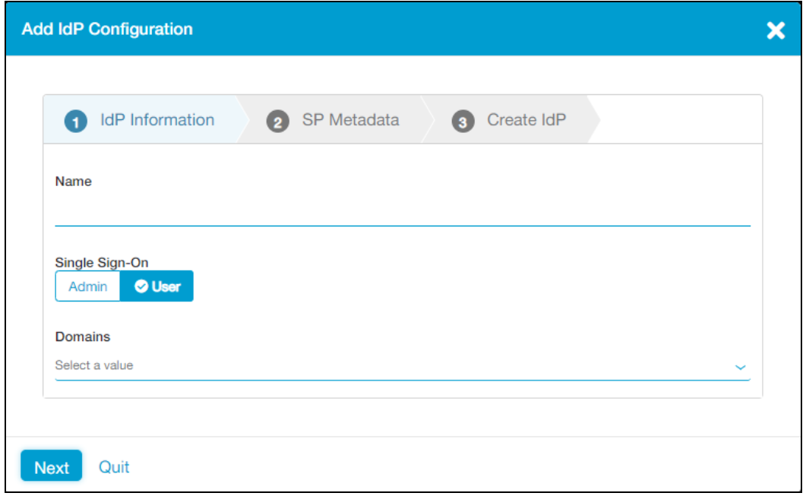
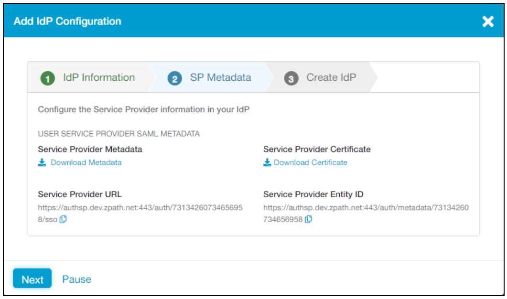
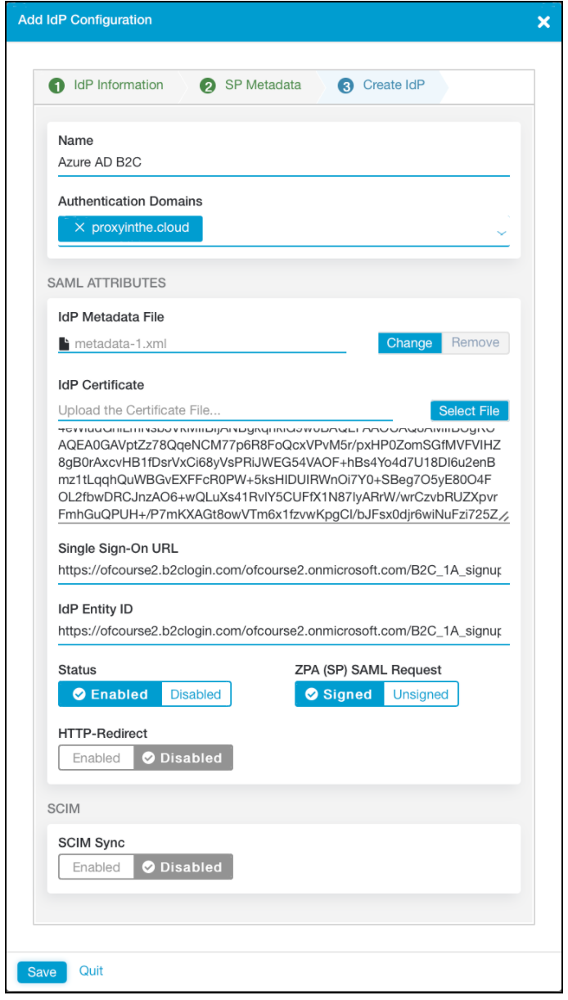

# Tutorial: Configure Zscaler Private Access with Azure Active Directory B2C

In this tutorial, you'll learn how to integrate Azure Active Directory B2C (Azure AD B2C) authentication with [Zscaler Private Access (ZPA)](https://www.zscaler.com/products/zscaler-private-access). ZPA delivers policy-based, secure access to private applications and assets without the cost, hassle, or security risks of a virtual private network (VPN). The Zscaler secure hybrid access offering enables a zero-attack surface for consumer-facing applications when it's combined with Azure AD B2C.

## Prerequisites

Before you begin, you’ll need:

- An Azure subscription. If you don't have a subscription, you can get a [free account](https://azure.microsoft.com/free/).  
- [An Azure AD B2C tenant](./tutorial-create-tenant.md) that's linked to your Azure subscription.  
- [A ZPA subscription](https://azuremarketplace.microsoft.com/marketplace/apps/aad.zscalerprivateaccess?tab=Overview).

## Scenario description

ZPA integration includes the following components:

- **Azure AD B2C**: The identity provider (IdP) that's responsible for verifying the user’s credentials. It's also responsible for signing up a new user.  
- **ZPA**: The service that's responsible for securing the web application by enforcing [zero-trust access](https://www.microsoft.com/security/blog/2018/12/17/zero-trust-part-1-identity-and-access-management/#:~:text=Azure%20Active%20Directory%20%28Azure%20AD%29%20provides%20the%20strong%2C,to%20express%20their%20access%20requirements%20in%20simple%20terms.).  
- **The web application**: Hosts the service that the user is trying to access.

The following diagram shows how ZPA integrates with Azure AD B2C.


The sequence is described in the following table:

|Step | Description |
| :-----:| :-----------|
| 1 | A user arrives at a ZPA user portal or a ZPA browser-access application.
| 2 | ZPA requires user context information before it can decide whether to allow the user to access the web application. To authenticate the user, ZPA performs a SAML redirect to the Azure AD B2C login page.  
| 3 | The user arrives at the Azure AB B2C login page. New users sign up to create an account, and existing users log in with their existing credentials. Azure AD B2C validates the user's identity.
| 4 | Upon successful authentication, Azure AD B2C redirects the user back to ZPA along with the SAML assertion. ZPA verifies the SAML assertion and sets the user context.
| 5 | ZPA evaluates access policies for the user. If the user is allowed to access the web application, the connection is allowed to pass through.

## Onboard to ZPA

This tutorial assumes that you already have a working ZPA setup. If you're getting started with ZPA, refer to the [step-by-step configuration guide for ZPA](https://help.zscaler.com/zpa/step-step-configuration-guide-zpa).

## Integrate ZPA with Azure AD B2C

### Step 1: Configure Azure AD B2C as an IdP on ZPA

To configure Azure AD B2C as an [IdP on ZPA](https://help.zscaler.com/zpa/configuring-idp-single-sign), do the following:

1. Log in to the [ZPA Admin Portal](https://admin.private.zscaler.com).

1. Go to **Administration** > **IdP Configuration**.

1. Select **Add IdP Configuration**.

   The **Add IdP Configuration** pane opens.

   

1. Select the **IdP Information** tab, and then do the following:

   a. In the **Name** box, enter **Azure AD B2C**.  
   b. Under **Single Sign-On**, select **User**.  
   c. In the **Domains** drop-down list, select the authentication domains that you want to associate with this IdP.

1. Select **Next**.

1. Select the **SP Metadata** tab, and then do the following:

   a. Under **Service Provider URL**, copy or note the value for later use.  
   b. Under **Service Provider Entity ID**, copy or note the value for later use.

   

1. Select **Pause**.

After you've configured Azure AD B2C, the rest of the IdP configuration resumes.

### Step 2: Configure custom policies in Azure AD B2C

>[!Note]
>This step is required only if you haven’t already configured custom policies. If you already have one or more custom policies, you can skip this step.

To configure custom policies on your Azure AD B2C tenant, see [Get started with custom policies in Azure Active Directory B2C](./tutorial-create-user-flows.md?pivots=b2c-custom-policy).

### Step 3: Register ZPA as a SAML application in Azure AD B2C

To configure a SAML application in Azure AD B2C, see [Register a SAML application in Azure AD B2C](./saml-service-provider.md). 

In step ["Upload your policy"](./saml-service-provider.md#upload-your-policy), copy or note the IdP SAML metadata URL that's used by Azure AD B2C. You'll need it later.

Follow the instructions through step ["Configure your application in Azure AD B2C"](./saml-service-provider.md#configure-your-application-in-azure-ad-b2c). In step 4.2, update the app manifest properties as follows:

- For **identifierUris**: Use the Service Provider Entity ID that you copied or noted earlier in "Step 1.6.b".  
- For **samlMetadataUrl**: Skip this property, because ZPA doesn't host a SAML metadata URL.  
- For **replyUrlsWithType**: Use the Service Provider URL that you copied or noted earlier in "Step 1.6.a".  
- For **logoutUrl**: Skip this property, because ZPA doesn't support a logout URL.

The rest of the steps aren't relevant to this tutorial.

### Step 4: Extract the IdP SAML metadata from Azure AD B2C

Next, you need to obtain a SAML metadata URL in the following format:

```https://<tenant-name>.b2clogin.com/<tenant-name>.onmicrosoft.com/<policy-name>/Samlp/metadata```

Note that `<tenant-name>` is the name of your Azure AD B2C tenant, and `<policy-name>` is the name of the custom SAML policy that you created in the preceding step.

For example, the URL might be `https://safemarch.b2clogin.com/safemarch.onmicrosoft.com/B2C_1A_signup_signin_saml//Samlp/metadata`.

Open a web browser and go to the SAML metadata URL. Right-click anywhere on the page, select **Save as**, and then save the file to your computer for use in the next step.

### Step 5: Complete the IdP configuration on ZPA

Complete the [IdP configuration in the ZPA Admin Portal](https://help.zscaler.com/zpa/configuring-idp-single-sign) that you partially configured earlier in "Step 1: Configure Azure AD B2C as an IdP on ZPA".

1. In the [ZPA Admin Portal](https://admin.private.zscaler.com), go to **Administration** > **IdP Configuration**.

1. Select the IdP that you configured in "Step 1", and then select **Resume**.

1. On the **Add IdP Configuration** pane, select the **Create IdP** tab, and then do the following:

   a. Under **IdP Metadata File**, upload the metadata file that you saved earlier in "Step 4: Extract the IdP SAML metadata from Azure AD B2C".  
   b. Verify that the **Status** for the IdP configuration is **Enabled**.  
   c. Select **Save**.

   

## Test the solution

Go to a ZPA user portal or a browser-access application, and test the sign-up or sign-in process. The test should result in a successful SAML authentication.

## Next steps

For more information, review the following articles:

- [Get started with custom policies in Azure AD B2C](./tutorial-create-user-flows.md?pivots=b2c-custom-policy)
- [Register a SAML application in Azure AD B2C](./saml-service-provider.md)
- [Step-by-step configuration guide for ZPA](https://help.zscaler.com/zpa/step-step-configuration-guide-zpa)
- [Configure an IdP for single sign-on](https://help.zscaler.com/zpa/configuring-idp-single-sign)