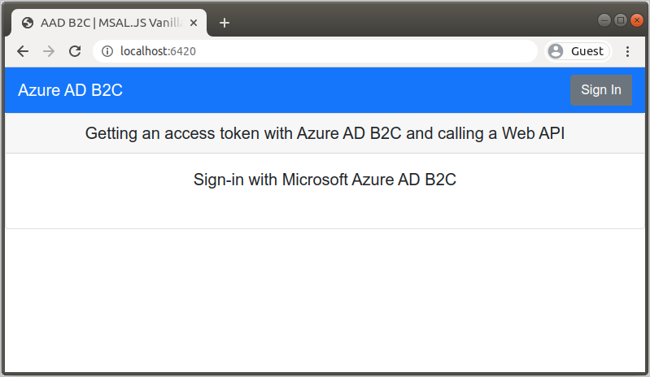
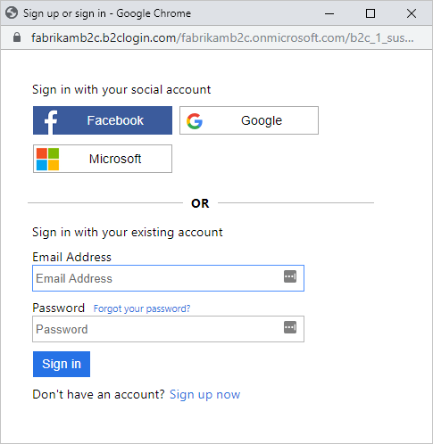
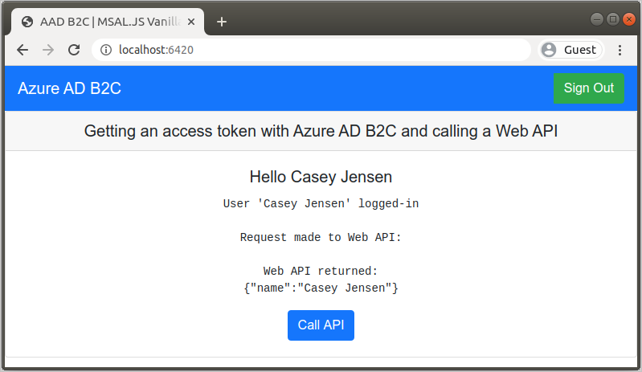

# Quickstart: Set up sign-in for a single-page app using Azure Active Directory B2C

Azure Active Directory B2C (Azure AD B2C) provides cloud identity management to keep your application, business, and customers protected. Azure AD B2C enables your applications to authenticate to social accounts, and enterprise accounts using open standard protocols. In this quickstart, you use a single-page application to sign in using a social identity provider and call an Azure AD B2C protected web API.

[!INCLUDE [quickstarts-free-trial-note](../../includes/quickstarts-free-trial-note.md)]

## Prerequisites

- [Visual Studio Code](https://code.visualstudio.com/)
- [Node.js](https://nodejs.org/en/download/)
- Social account from Facebook, Google, or Microsoft
- Code sample from GitHub: [active-directory-b2c-javascript-msal-singlepageapp](https://github.com/Azure-Samples/active-directory-b2c-javascript-msal-singlepageapp)

    You can [download the zip archive](https://github.com/Azure-Samples/active-directory-b2c-javascript-msal-singlepageapp/archive/master.zip) or clone the repository:

    ```console
    git clone https://github.com/Azure-Samples/active-directory-b2c-javascript-msal-singlepageapp.git
    ```

## Run the application

1. Start the server by running the following commands from the Node.js command prompt:

    ```console
    cd active-directory-b2c-javascript-msal-singlepageapp
    npm install && npm update
    npm start
    ```

    The server started by *server.js* displays the port it's listening on:

    ```console
    Listening on port 6420...
    ```

1. Browse to the URL of the application. For example, `http://localhost:6420`.

    

## Sign in using your account

1. Select **Sign In** to start the user journey.
1. Azure AD B2C presents a sign-in page for a fictitious company called Fabrikam for the sample web application. To sign up using a social identity provider, select the button of the identity provider you want to use.

    

    You authenticate (sign in) using your social account credentials and authorize the application to read information from your social account. By granting access, the application can retrieve profile information from the social account such as your name and city.

1. Finish the sign-in process for the identity provider.

## Access a protected API resource

Select **Call API** to have your display name returned from the web API as a JSON object.



The sample single-page application includes an access token in the request to the protected web API resource.

## Clean up resources

You can use your Azure AD B2C tenant if you plan to try other Azure AD B2C quickstarts or tutorials. When no longer needed, you can [delete your Azure AD B2C tenant](faq.md#how-do-i-delete-my-azure-ad-b2c-tenant).

## Next steps

In this quickstart, you used a sample single-page application to:

- Sign in with a social identity provider
- Create an Azure AD B2C user account (created automatically at sign-in)
- Call a web API protected by Azure AD B2C

Get started creating your own Azure AD B2C tenant.

> [!div class="nextstepaction"]
> [Create an Azure Active Directory B2C tenant in the Azure portal](tutorial-create-tenant.md)
