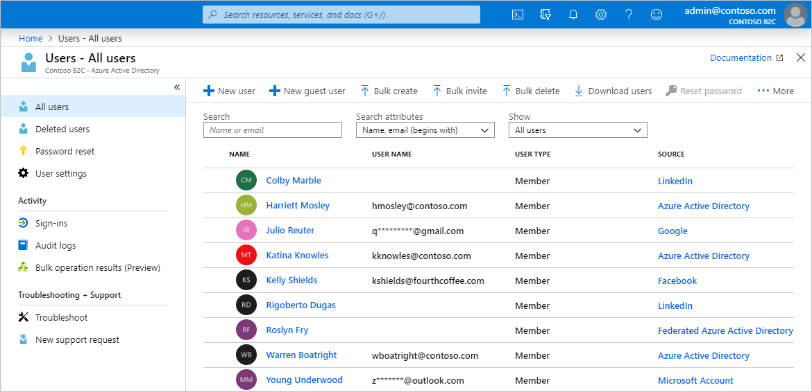
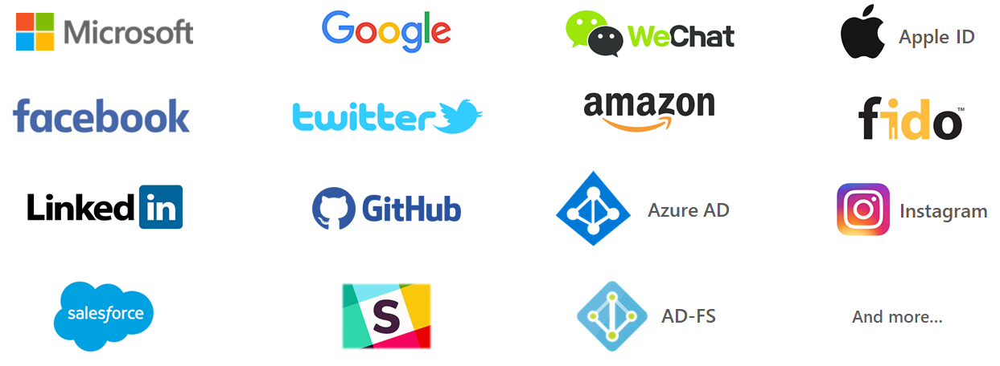
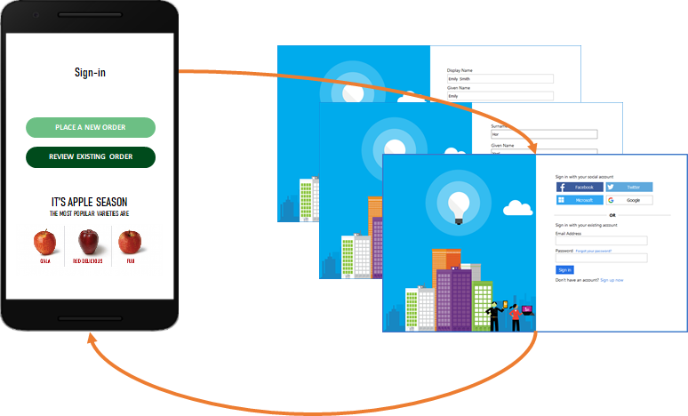
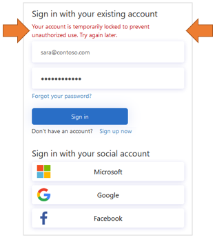

# Technical and feature overview of Azure Active Directory B2C

A companion to [About Azure Active Directory B2C](overview.md), this article provides a more in-depth introduction to the service. Discussed here are the primary resources you work with in the service, its features, and how these enable you to provide a fully custom identity experience for your customers in your applications.

## Azure AD B2C tenant

In Azure Active Directory B2C (Azure AD B2C), a *tenant* represents your organization and is a directory of users. Each Azure AD B2C tenant is distinct and separate from other Azure AD B2C tenants. An Azure AD B2C tenant is different than an Azure Active Directory tenant, which you may already have.

The primary resources you work with in an Azure AD B2C tenant are:

* **Directory** - The *directory* is where Azure AD B2C stores your users' credentials and profile data, as well as your application registrations.
* **Application registrations** - You register your web, mobile, and native applications with Azure AD B2C to enable identity management. Also, any APIs you want to protect with Azure AD B2C.
* **User flows** and **custom policies** - The built-in (user flows) and fully customizable (custom policies) identity experiences for your applications.
  * Use *user flows* for quick configuration and enablement of common identity tasks like sign up, sign in, and profile editing.
  * Use *custom policies* to enable user experiences not only for the common identity tasks, but also for crafting support for complex identity workflows unique to your organization, customers, employees, partners, and citizens.
* **Identity providers** - Federation settings for:
  * *Social* identity providers like Facebook, LinkedIn, or Twitter that you want to support in your applications.
  * *External* identity providers that support standard identity protocols like OAuth 2.0, OpenID Connect, and more.
  * *Local* accounts that enable users to sign up and sign in with a username (or email address or other ID) and password.
* **Keys** - Add and manage encryption keys for signing and validating tokens, client secrets, certificates, and passwords.

An Azure AD B2C tenant is the first resource you need to create to get started with Azure AD B2C. Learn how in [Tutorial: Create an Azure Active Directory B2C tenant](tutorial-create-tenant.md).

## Accounts in Azure AD B2C

Azure AD B2C defines several types of user accounts. Azure Active Directory, Azure Active Directory B2B, and Azure Active Directory B2C share these account types.

* **Work account** - Users with work accounts can manage resources in a tenant, and with an administrator role, can also manage tenants. Users with work accounts can create new consumer accounts, reset passwords, block/unblock accounts, and set permissions or assign an account to a security group.
* **Guest account** - External users you invite to your tenant as guests. A typical scenario for inviting a guest user to your Azure AD B2C tenant is to share administration responsibilities.
* **Consumer account** - Consumer accounts are the accounts created in your Azure AD B2C directory when users complete the sign-up user journey in an application you've registered in your tenant.

 *Figure: User directory within an Azure AD B2C tenant in the Azure portal*

### Consumer accounts

With a *consumer* account, users can sign in to the applications that you've secured with Azure AD B2C. Users with consumer accounts can't, however, access Azure resources, for example the Azure portal.

A consumer account can be associated with these identity types:

* **Local** identity, with the username and password stored locally in the Azure AD B2C directory. We often refer to these identities as "local accounts."
* **Social** or **enterprise** identities, where the identity of the user is managed by a federated identity provider like Facebook, Microsoft, ADFS, or Salesforce.

A user with a consumer account can sign in with multiple identities, for example username, email, employee ID, government ID, and others. A single account can have multiple identities, both local and social.

 *Figure: A single consumer account with multiple identities in Azure AD B2C*

Azure AD B2C lets you manage common attributes of consumer account profiles like display name, surname, given name, city, and others. You can also extend the Azure AD schema to store additional information about your users. For example, their country/region or residency, preferred language, and preferences like whether they want to subscribe to a newsletter or enable multi-factor authentication.

Learn more about the user account types in Azure AD B2C in [Overview of user accounts in Azure Active Directory B2C](user-overview.md).

## External identity providers

You can configure Azure AD B2C to allow users to sign in to your application with credentials from external social or enterprise identity providers (IdP). Azure AD B2C supports external identity providers like Facebook, Microsoft account, Google, Twitter, and any identity provider that supports OAuth 1.0, OAuth 2.0, OpenID Connect, and SAML protocols.

With external identity provider federation, you can offer your consumers the ability to sign in with their existing social or enterprise accounts, without having to create a new account just for your application.

On the sign-up or sign-in page, Azure AD B2C presents a list of external identity providers the user can choose for sign-in. Once they select one of the external identity providers, they're taken (redirected) to the selected provider's website to complete the sign in process. After the user successfully signs in, they're returned to Azure AD B2C for authentication of the account in your application.

To see how to add identity providers in Azure AD B2C, see [Tutorial: Add identity providers to your applications in Azure Active Directory B2C](tutorial-add-identity-providers.md).

## Identity experiences: user flows or custom policies

The extensible policy framework of Azure AD B2C is its core strength. Policies describe your users' identity experiences such as sign up, sign in, and profile editing.

In Azure AD B2C, there are two primary paths you can take to provide these identity experiences: user flows and custom policies.

* **User flows** are predefined, built-in, configurable policies that we provide so you can create sign-up, sign-in, and policy editing experiences in minutes.

* **Custom policies** enable you to create your own user journeys for complex identity experience scenarios.

Both user flows and custom policies are powered by the *Identity Experience Framework*, Azure AD B2C's policy orchestration engine.

### User flow

To help you quickly set up the most common identity tasks, the Azure portal includes several predefined and configurable policies called *user flows*.

You can configure user flow settings like these to control identity experience behaviors in your applications:

* Account types used for sign-in, such as social accounts like a Facebook, or local accounts that use an email address and password for sign-in
* Attributes to be collected from the consumer, such as first name, postal code, or country/region of residency
* Azure Multi-Factor Authentication (MFA)
* Customization of the user interface
* Set of claims in a token that your application receives after the user completes the user flow
* Session management
* ...and more.

Most common identity scenarios for the majority of mobile, web, and single-page applications can be defined and implemented effectively with user flows. We recommend that you use the built-in user flows unless you have complex user journey scenarios that require the full flexibility of custom policies.

Learn more about user flows in [User flows in Azure Active Directory B2C](user-flow-overview.md).

### Custom policy

Custom policies unlock access to the full power of the Identity Experience Framework (IEF) orchestration engine. With custom policies, you can leverage IEF to build almost any authentication, user registration, or profile editing experience that you can imagine.

The Identity Experience Framework gives you the ability to construct user journeys with any combination of steps. For example:

* Federate with other identity providers
* First- and third-party multi-factor authentication (MFA) challenges
* Collect any user input
* Integrate with external systems using REST API communication

Each such user journey is defined by a policy, and you can build as many or as few policies as you need to enable the best user experience for your organization.

A custom policy is defined by several XML files that refer to each other in a hierarchical chain. The XML elements define the claims schema, claims transformations, content definitions, claims providers, technical profiles, user journey orchestration steps, and other aspects of the identity experience.

The powerful flexibility of custom policies is most appropriate for when you need to build complex identity scenarios. Developers configuring custom policies must define the trusted relationships in careful detail to include metadata endpoints, exact claims exchange definitions, and configure secrets, keys, and certificates as needed by each identity provider.

Learn more about custom policies in [Custom policies in Azure Active Directory B2C](custom-policy-overview.md).

## Protocols and tokens

- For applications, Azure AD B2C supports the [OAuth 2.0](protocols-overview.md), [OpenID Connect](openid-connect.md), and [SAML protocols](connect-with-saml-service-providers.md) for user journeys. Your application starts the user journey by issuing authentication requests to Azure AD B2C. The result of a request to Azure AD B2C is a security token, such as an [ID token, access token](tokens-overview.md), or SAML token. This security token defines the user's identity within the application.

- For external identities, Azure AD B2C supports federation with any OAuth 1.0, OAuth 2.0, OpenID Connect, and SAML identity providers.

The following diagram shows how Azure AD B2C can communicate using a variety of protocols within the same authentication flow:

1. The relying party application initiates an authorization request to Azure AD B2C using OpenID Connect.
1. When a user of the application chooses to sign in using an external identity provider that uses the SAML protocol, Azure AD B2C invokes the SAML protocol to communicate with that identity provider.
1. After the user completes the sign-in operation with the external identity provider, Azure AD B2C then returns the token to the relying party application using OpenID Connect.

## Application integration

When a user wants to sign in to your application, whether it's a web, mobile, desktop, or single-page application (SPA), the application initiates an authorization request to a user flow- or custom policy-provided endpoint. The user flow or custom policy defines and controls the user's experience. When they complete a user flow, for example the *sign-up or sign-in* flow, Azure AD B2C generates a token, then redirects the user back to your application.

Multiple applications can use the same user flow or custom policy. A single application can use multiple user flows or custom policies.

For example, to sign in to an application, the application uses the *sign up or sign in* user flow. After the user has signed in, they may want to edit their profile, so the application initiates another authorization request, this time using the *profile edit* user flow.

## Seamless user experiences

In Azure AD B2C, you can craft your users' identity experiences so that the pages they're shown blend seamlessly with the look and feel of your brand. You get nearly full control of the HTML and CSS content presented to your users when they proceed through your application's identity journeys. With this flexibility, you can maintain brand and visual consistency between your application and Azure AD B2C.

For information on UI customization, see [About user interface customization in Azure Active Directory B2C](customize-ui-overview.md).

## Localization

Language customization in Azure AD B2C allows you to accommodate different languages to suit your customer needs. Microsoft provides the translations for 36 languages, but you can also provide your own translations for any language. Even if your experience is provided for only a single language, you can customize any text on the pages.

See how localization works in [Language customization in Azure Active Directory B2C](user-flow-language-customization.md).

## Add your own business logic

If you choose to use custom policies, you can integrate with a RESTful API in a user journey to add your own business logic to the journey. For example, Azure AD B2C can exchange data with a RESTful service to:

* Display custom user-friendly error messages.
* Validate user input to prevent malformed data from persisting in your user directory. For example, you can modify the data entered by the user, such as capitalizing their first name if they entered it in all lowercase.
* Enrich user data by further integrating with your corporate line-of-business application.
* Using RESTful calls, you can send push notifications, update corporate databases, run a user migration process, manage permissions, audit databases, and more.

Loyalty programs are another scenario enabled by Azure AD B2C's support for calling REST APIs. For example, your RESTful service can receive a user's email address, query your customer database, then return the user's loyalty number to Azure AD B2C. The return data can be stored in the user's directory account in Azure AD B2C, then be further evaluated in subsequent steps in the policy, or be included in the access token.

You can add a REST API call at any step in the user journey defined by a custom policy. For example, you can call a REST API:

* During sign-in, just before Azure AD B2C validates the credentials
* Immediately after sign-in
* Before Azure AD B2C creates a new account in the directory
* After Azure AD B2C creates a new account in the directory
* Before Azure AD B2C issues an access token

To see how to use custom policies for RESTful API integration in Azure AD B2C, see [Integrate REST API claims exchanges in your Azure AD B2C custom policy](custom-policy-rest-api-intro.md).

## Protect customer identities

Azure AD B2C complies with the security, privacy, and other commitments described in the [Microsoft Azure Trust Center](https://www.microsoft.com/trustcenter/cloudservices/azure).

Sessions are modeled as encrypted data, with the decryption key known only to the Azure AD B2C Security Token Service. A strong encryption algorithm, AES-192, is used. All communication paths are protected with TLS for confidentiality and integrity. Our Security Token Service uses an Extended Validation (EV) certificate for TLS. In general, the Security Token Service mitigates cross-site scripting (XSS) attacks by not rendering untrusted input.

### Access to user data

Azure AD B2C tenants share many characteristics with enterprise Azure Active Directory tenants used for employees and partners. Shared aspects include mechanisms for viewing administrative roles, assigning roles, and auditing activities.

You can assign roles to control who can perform certain administrative actions in Azure AD B2C, including:

* Create and manage all aspects of user flows
* Create and manage the attribute schema available to all user flows
* Configure identity providers for use in direct federation
* Create and manage trust framework policies in the Identity Experience Framework (custom policies)
* Manage secrets for federation and encryption in the Identity Experience Framework (custom policies)

For more information about Azure AD roles, including Azure AD B2C administration role support, see [Administrator role permissions in Azure Active Directory](../active-directory/users-groups-roles/directory-assign-admin-roles.md).

### Multi-factor authentication (MFA)

Azure AD B2C multi-factor authentication (MFA) helps safeguard access to data and applications while maintaining simplicity for your users. It provides additional security by requiring a second form of authentication, and delivers strong authentication by offering a range of easy-to-use authentication methods. Your users may or may not be challenged for MFA based on configuration decisions that you can make as an administrator.

See how to enable MFA in user flows in [Enable multi-factor authentication in Azure Active Directory B2C](custom-policy-multi-factor-authentication.md).

### Smart account lockout

To prevent brute-force password guessing attempts, Azure AD B2C uses a sophisticated strategy to lock accounts based on the IP of the request, the passwords entered, and several other factors. The duration of the lockout is automatically increased based on risk and the number of attempts.

For more information about managing password protection settings, see [Manage threats to resources and data in Azure Active Directory B2C](threat-management.md).

### Password complexity

During sign up or password reset, your users must supply a password that meets complexity rules. By default, Azure AD B2C enforces a strong password policy. Azure AD B2C also provides configuration options for specifying the complexity requirements of the passwords your customers use.

You can configure password complexity requirements in both [user flows](user-flow-password-complexity.md) and [custom policies](custom-policy-password-complexity.md).

## Auditing and logs

Azure AD B2C emits audit logs containing activity information about its resources, issued tokens, and administrator access. You can use these audit logs to understand platform activity and  diagnose issues. Audit log entries are available soon after the activity that generated the event occurs.

In an audit log, which is available for your Azure AD B2C tenant or for a particular user, you can find information including:

* Activities concerning the authorization of a user to access B2C resources (for example, an administrator accessing a list of B2C policies)
* Activities related to directory attributes retrieved when an administrator signs in using the Azure portal
* Create, read, update, and delete (CRUD) operations on B2C applications
* CRUD operations on keys stored in a B2C key container
* CRUD operations on B2C resources (for example, policies and identity providers)
* Validation of user credentials and token issuance

For additional details on audit logs, see [Accessing Azure AD B2C audit logs](view-audit-logs.md).

### Usage insights

Azure AD B2C allows you to discover when people sign up or sign in to your web app, where your users are located, and what browsers and operating systems they use. By integrating Azure Application Insights into Azure AD B2C by using custom policies, you can gain insight into how people sign up, sign in, reset their password or edit their profile. With such knowledge, you can make data-driven decisions for your upcoming development cycles.

Find out more about usage analytics in [Track user behavior in Azure Active Directory B2C using Application Insights](analytics-with-application-insights.md).

## Next steps

Now that you have deeper view into the features and technical aspects of Azure Active Directory B2C, get started with the service by creating a B2C tenant:

> [!div class="nextstepaction"]
> [Tutorial: Create an Azure Active Directory B2C tenant >](tutorial-create-tenant.md)
