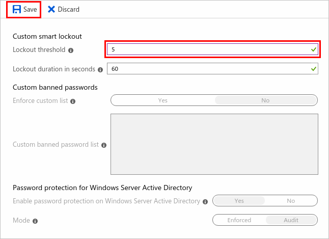

# Manage threats to resources and data in Azure Active Directory B2C

Azure Active Directory B2C (Azure AD B2C) has built-in features that can help you protect against threats to your resources and data. These threats include denial-of-service attacks and password attacks. Denial-of-service attacks might make resources unavailable to intended users. Password attacks lead to unauthorized access to resources.

## Denial-of-service attacks

Azure AD B2C defends against SYN flood attacks using a SYN cookie. Azure AD B2C also protects against denial-of-service attacks by using limits for rates and connections.

## Password attacks

Passwords that are set by users are required to be reasonably complex. Azure AD B2C has mitigation techniques in place for password attacks. Mitigation includes detection of brute-force password attacks and dictionary password attacks. By using various signals, Azure AD B2C analyzes the integrity of requests. Azure AD B2C is designed to intelligently differentiate intended users from hackers and botnets.

Azure AD B2C uses a sophisticated strategy to lock accounts. The accounts are locked based on the IP of the request and the passwords entered. The duration of the lockout also increases based on the likelihood that it's an attack. After a password is tried 10 times unsuccessfully (the default attempt threshold), a one-minute lockout occurs. The next time a login is unsuccessful after the account is unlocked (that is, after the account has been automatically unlocked by the service once the lockout period expires), another one-minute lockout occurs and continues for each unsuccessful login. Entering the same password repeatedly doesn't count as multiple unsuccessful logins.

The first 10 lockout periods are one minute long. The next 10 lockout periods are slightly longer and increase in duration after every 10 lockout periods. The lockout counter resets to zero after a successful login when the account isn’t locked. Lockout periods can last up to five hours.

## Manage password protection settings

To manage password protection settings, including the lockout threshold:

1. Sign in to the [Azure portal](https://portal.azure.com)
1. Use the **Directory + subscription** filter in the top menu to select the directory that contains your Azure AD B2C tenant.
1. In the left menu, select **Azure AD B2C**. Or, select **All services** and search for and select **Azure AD B2C**.
1. Under **Security**, select **Authentication methods (Preview)**, then select **Password protection**.
1. Enter your desired password protection settings, then select **Save**.

    
     *Setting the lockout threshold to 5 in **Password protection** settings*.

## View locked-out accounts

To obtain information about locked-out accounts, you can check the Active Directory [sign-in activity report](../active-directory/reports-monitoring/concept-sign-ins.md). Under **Status**, select **Failure**. Failed sign-in attempts with a **Sign-in error code** of `50053` indicate a locked account:

To learn about viewing the sign-in activity report in Azure Active Directory, see [Sign-in activity report error codes](../active-directory/reports-monitoring/concept-sign-ins.md).