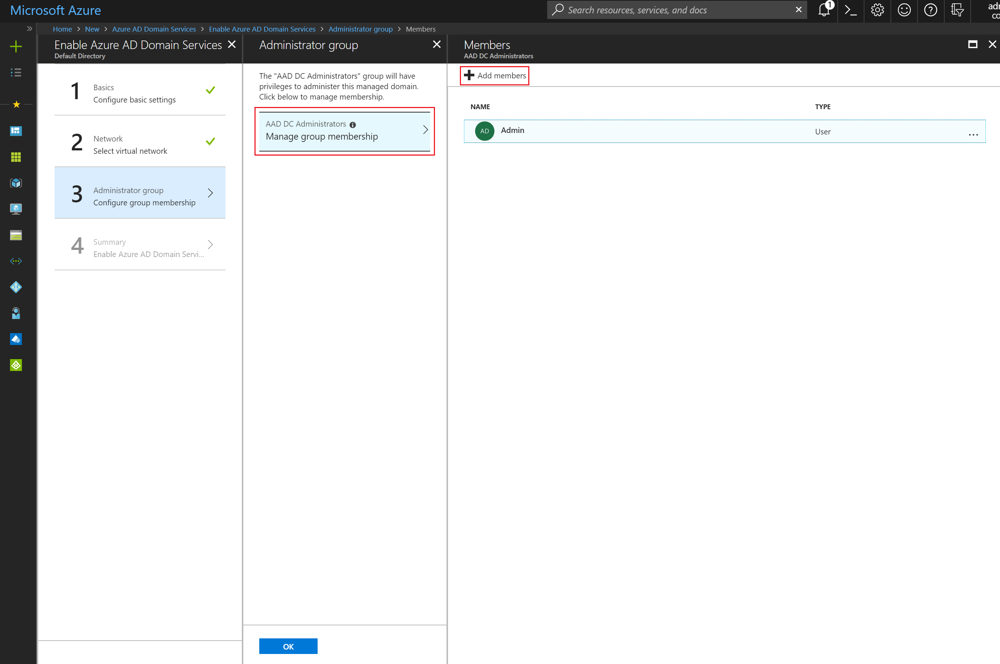
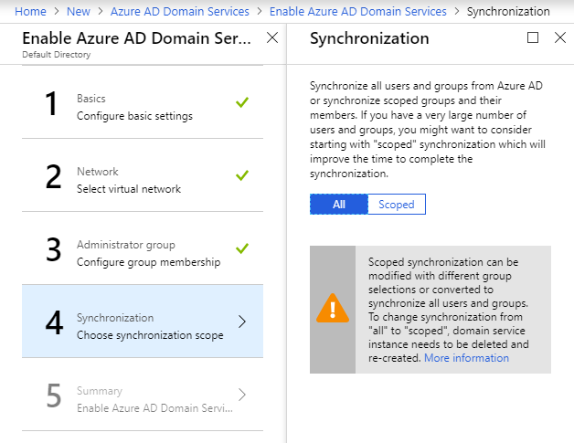
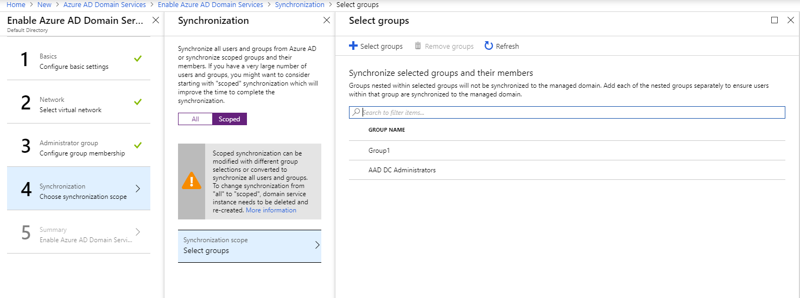
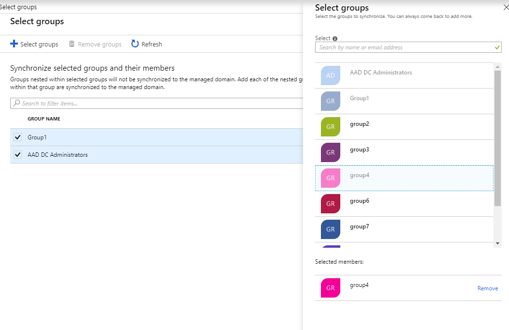
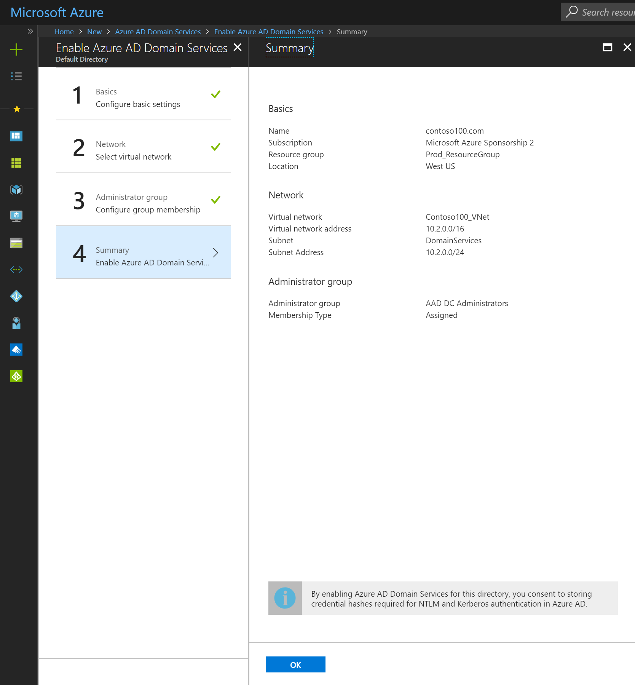
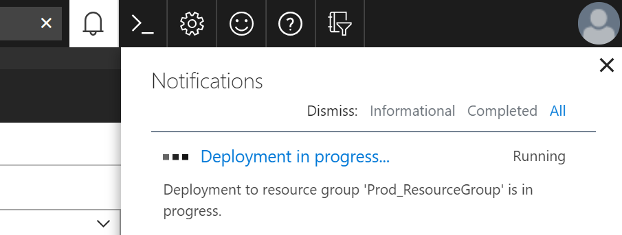
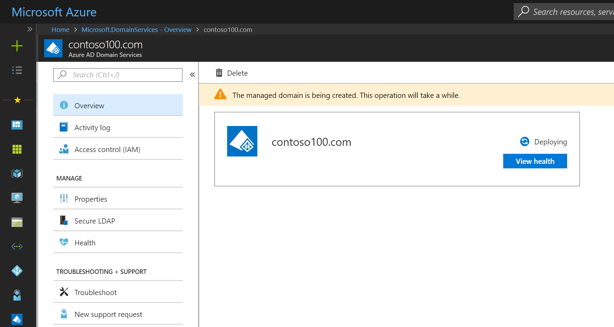
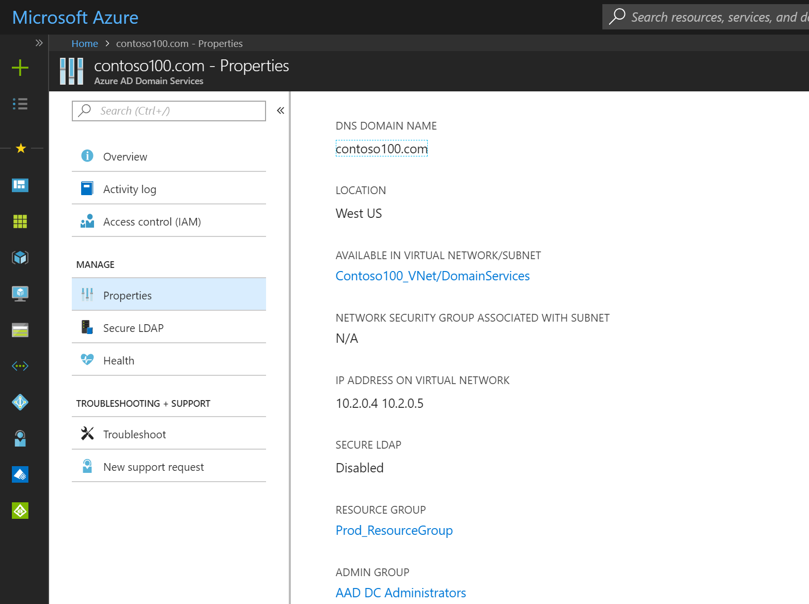

# Enable Azure Active Directory Domain Services using the Azure portal

## Task 3: configure administrative group

In this configuration task, you create an administrative group in your Azure AD directory. This special administrative group is called *AAD DC Administrators*. Members of this group are granted administrative permissions on machines that are domain-joined to the managed domain. On domain-joined machines, this group is added to the administrators group. Additionally, members of this group can use Remote Desktop to connect remotely to domain-joined machines.

> [!NOTE]
> You do not have Domain Administrator or Enterprise Administrator permissions on the managed domain that you created by using Azure Active Directory Domain Services. On managed domains, these permissions are reserved by the service and are not made available to users within the tenant. However, you can use the special administrative group created in this configuration task to perform some privileged operations. These operations include joining computers to the domain, belonging to the administration group on domain-joined machines, and configuring Group Policy.
>

The wizard automatically creates the administrative group in your Azure AD directory. This group is called 'AAD DC Administrators'. If you have an existing group with this name in your Azure AD directory, the wizard selects this group. You can configure group membership using the **Administrator group** wizard page.

1. To configure group membership, click **AAD DC Administrators**.

    

2. Click the **Add members** button to add users from your Azure AD directory to the administrator group.

3. When you are done, click **OK** to move on to the **Summary** page of the wizard.

## Configure synchronization

Azure AD Domain Services allows for either full synchronization of all users and groups available in Azure AD, or you can select scoped synchronization to synchronize only specific groups. If you choose the full synchronization, you will **not** be able to choose scoped synchronization at a later time. To learn more about scoped synchronization, visit the [Azure AD Domain Services scoped synchronization article](scoped-synchronization.md).

### Full synchronization

1. For full synchronization, just click "OK" on the bottom of the screen, as full is already chosen.
    

### Scoped synchronization

1. Toggle the synchronization button to "Scoped" and a select groups page will appear. From this, you can see what groups are already selected to be synchronized to your managed domain.
    
2. Click **Select groups** in the top navigation bar. From here, a group picker will pop up on the side. Use this to select any additional groups to synchronize to Azure AD Domain Services. When finished, click **Select** to close the group picker and add those groups to the selected list.
    
3. Click **OK** to move to the summary page.

## Deploy your managed domain

1. On the **Summary** page of the wizard, review the configuration settings for the managed domain. You can go back to any step of the wizard to make changes, if necessary. When you are done, click **OK** to create the new managed domain.

    

2. You see a notification that shows the progress of your Azure AD Domain Services deployment. Click the notification to see detailed progress for the deployment.

    

## Check the deployment status of your managed domain

The process of provisioning your managed domain can take up to an hour.

1. While your deployment is in progress, you can search for 'domain services' in the **Search resources** search box. Select **Azure AD Domain Services** from the search result. The **Azure AD Domain Services** blade lists the managed domain that is being provisioned.

    

2. Click the name of the managed domain (for example, 'contoso100.com') to see more details about the managed domain.

    

3. The **Overview** tab shows that the managed domain is currently being provisioned. You cannot configure the managed domain until it is fully provisioned. It may take up to an hour for your managed domain to be fully provisioned.

    

4. When the managed domain is fully provisioned, the **Overview** tab shows the domain status as **Running**.

    
    >[!NOTE]
    >During the provisioning process, Azure AD Domain Services creates Enterprise Applications named "Domain Controller Services" and "AzureActiveDirectoryDomainControllerServices" within your directory. These Enterprise Applications are needed to service your managed domain. It is imperative that these are not deleted at any time.
    >

5. On the **Properties** tab, you see two IP addresses at which domain controllers are available for the virtual network.

    

## Need help?

It may take an hour or two for both domain controllers for your managed domain to be provisioned. If your deployment failed or is stuck in the 'Pending' state for more than a couple of hours, feel free to [contact the product team for help](contact-us.md).

## Next step

[Task 4: update the DNS settings for the Azure virtual network](active-directory-ds-getting-started-dns.md)
