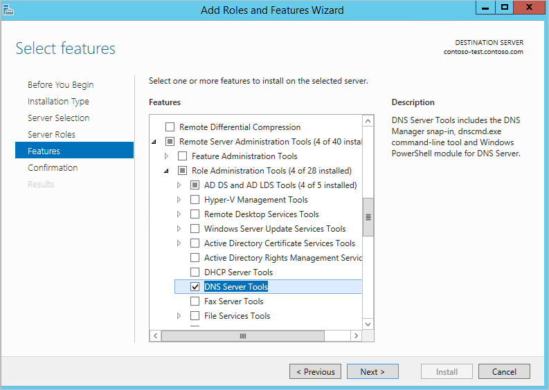
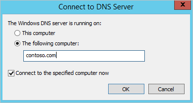
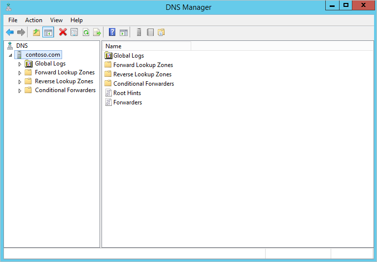

# Administer DNS in an Azure AD Domain Services managed domain

In Azure Active Directory Domain Services (Azure AD DS), a key component is DNS (Domain Name Resolution). Azure AD DS includes a DNS server that provides name resolution for the managed domain. This DNS server includes built-in DNS records and updates for the key components that allow the service to run.

As you run your own applications and services, you may need to create DNS records for machines that aren't joined to the domain, configure virtual IP addresses for load balancers, or set up external DNS forwarders. Users who belong to the *AAD DC Administrators* group are granted DNS administration privileges on the Azure AD DS managed domain and can create and edit custom DNS records.

In a hybrid environment, DNS zones and records configured in an on-premises AD DS environment aren't synchronized to Azure AD DS. To define and use your own DNS entries, create records in the Azure AD DS DNS server or use conditional forwarders that point to existing DNS servers in your environment.

This article shows you how to install the DNS Server tools then use the DNS console to manage records in Azure AD DS.

[!INCLUDE [active-directory-ds-prerequisites.md](../../includes/active-directory-ds-prerequisites.md)]

## Before you begin

To complete this article, you need the following resources and privileges:

* An active Azure subscription.
    * If you don’t have an Azure subscription, [create an account](https://azure.microsoft.com/free/?WT.mc_id=A261C142F).
* An Azure Active Directory tenant associated with your subscription, either synchronized with an on-premises directory or a cloud-only directory.
    * If needed, [create an Azure Active Directory tenant][create-azure-ad-tenant] or [associate an Azure subscription with your account][associate-azure-ad-tenant].
* An Azure Active Directory Domain Services managed domain enabled and configured in your Azure AD tenant.
    * If needed, complete the tutorial to [create and configure an Azure Active Directory Domain Services instance][create-azure-ad-ds-instance].
* A Windows Server management VM that is joined to the Azure AD DS managed domain.
    * If needed, complete the tutorial to [create a Windows Server VM and join it to a managed domain][create-join-windows-vm].
* A user account that's a member of the *Azure AD DC administrators* group in your Azure AD tenant.

## Install DNS Server tools

To create and modify DNS records in Azure AD DS, you need to install the DNS Server tools. These tools can be installed as a feature in Windows Server. For more information on how to install the administrative tools on a Windows client, see install [Remote Server Administration Tools (RSAT)][install-rsat].

1. Sign in to your management VM. For steps on how to connect using the Azure portal, see [Connect to a Windows Server VM][connect-windows-server-vm].
1. If **Server Manager** doesn't open by default when you sign in to the VM, select the **Start** menu, then choose **Server Manager**.
1. In the *Dashboard* pane of the **Server Manager** window, select **Add Roles and Features**.
1. On the **Before You Begin** page of the *Add Roles and Features Wizard*, select **Next**.
1. For the *Installation Type*, leave the **Role-based or feature-based installation** option checked and select **Next**.
1. On the **Server Selection** page, choose the current VM from the server pool, such as *myvm.aaddscontoso.com*, then select **Next**.
1. On the **Server Roles** page, click **Next**.
1. On the **Features** page, expand the **Remote Server Administration Tools** node, then expand the **Role Administration Tools** node. Select **DNS Server Tools** feature from the list of role administration tools.

    

1. On the **Confirmation** page, select **Install**. It may take a minute or two to install the Group Policy Management tools.
1. When feature installation is complete, select **Close** to exit the **Add Roles and Features** wizard.

## Open the DNS management console to administer DNS

With the DNS Server tools installed, you can administer DNS records on the Azure AD DS managed domain.

> [!NOTE]
> To administer DNS in an Azure AD DS managed domain, you must be signed in to a user account that's a member of the *AAD DC Administrators* group.

1. From the Start screen, select **Administrative Tools**. A list of available management tools is shown, including **DNS** installed in the previous section. Select **DNS** to launch the DNS Management console.
1. In the **Connect to DNS Server** dialog, select **The following computer**, then enter the DNS domain name of the managed domain, such as *aaddscontoso.com*:

    

1. The DNS Console connects to the specified Azure AD DS managed domain. Expand the **Forward Lookup Zones** or **Reverse Lookup Zones** to create your required DNS entries or edit existing records as needed.

    

> [!WARNING]
> When you manage records using the DNS Server tools, make sure that you don't delete or modify the built-in DNS records that are used by Azure AD DS. Built-in DNS records include domain DNS records, name server records, and other records used for DC location. If you modify these records, domain services are disrupted on the virtual network.

## Next steps

For more information about managing DNS, see the [DNS tools article on Technet](https://technet.microsoft.com/library/cc753579.aspx).

<!-- INTERNAL LINKS -->
[create-azure-ad-tenant]: ../active-directory/fundamentals/sign-up-organization.md
[associate-azure-ad-tenant]: ../active-directory/fundamentals/active-directory-how-subscriptions-associated-directory.md
[create-azure-ad-ds-instance]: tutorial-create-instance.md
[create-join-windows-vm]: join-windows-vm.md
[tutorial-create-management-vm]: tutorial-create-management-vm.md
[connect-windows-server-vm]: join-windows-vm.md#connect-to-the-windows-server-vm

<!-- EXTERNAL LINKS -->
[install-rsat]: /windows-server/remote/remote-server-administration-tools#BKMK_Thresh
