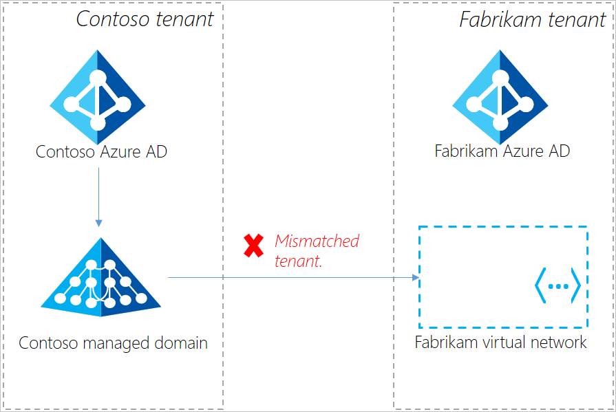

# Resolve mismatched directory errors for existing Azure AD Domain Services managed domains

If an Azure Active Directory Domain Services (Azure AD DS) managed domain shows a mismatched tenant error, you can't administer the managed domain until resolved. This error occurs if the underlying Azure virtual network is moved to a different Azure AD directory.

This article explains why the error occurs and how to resolve it.

## What causes this error?

A mismatched directory error happens when an Azure AD DS managed domain and virtual network belong to two different Azure AD tenants. For example, you may have an Azure AD DS managed domain called *contoso.com* that runs in Contoso's Azure AD tenant. However, the Azure virtual network for managed domain is part of the Fabrikam Azure AD tenant.

Azure uses role-based access control (RBAC) to limit access to resources. When you enable Azure AD DS in an Azure AD tenant, credential hashes are synchronized to the managed domain. This operation requires you to be a tenant admin for the Azure AD directory, and access to the credentials must be controlled. To deploy resources to an Azure virtual network and control traffic, you must have administrative privileges on the virtual network in which you deploy Azure AD DS.

For RBAC to work consistently and secure access to all the resources Azure AD DS uses, the managed domain and the virtual network must belong to the same Azure AD tenant.

The following rules apply in the Resource Manager environment:

- An Azure AD directory may have multiple Azure subscriptions.
- An Azure subscription may have multiple resources such as virtual networks.
- A single Azure AD Domain Services managed domain is enabled for an Azure AD directory.
- An Azure AD Domain Services managed domain can be enabled on a virtual network belonging to any of the Azure subscriptions within the same Azure AD tenant.

### Valid configuration

In the following example deployment scenario, the Contoso Azure AD DS managed domain is enabled in the Contoso Azure AD tenant. The managed domain is deployed in a virtual network that belongs to an Azure subscription owned by the Contoso Azure AD tenant. Both the managed domain and the virtual network belong to the same Azure AD tenant. This example configuration is valid and fully supported.

### Mismatched tenant configuration

In this example deployment scenario, the Contoso Azure AD DS managed domain is enabled in the Contoso Azure AD tenant. However, the managed domain is deployed in a virtual network that belongs to an Azure subscription owned by the Fabrikam Azure AD tenant. The managed domain and the virtual network belong to two different Azure AD tenants. This example configuration is a mismatched tenant and isn't supported. The virtual network must be moved to the same Azure AD tenant as the managed domain.

## Resolve mismatched tenant error

The following two options resolve the mismatched directory error:

* [Delete the Azure AD DS managed domain](delete-aadds.md) from your existing Azure AD directory. [Create a replacement Azure AD DS managed domain](tutorial-create-instance.md) in the same Azure AD directory as the virtual network you wish to use. When ready, join all machines previously joined to the deleted domain to the recreated managed domain.
* [Move the Azure subscription](../billing/billing-subscription-transfer.md) containing the virtual network to the same Azure AD directory as the Azure AD DS managed domain.

## Next steps

For more information on troubleshooting issues with Azure AD DS, see the [troubleshooting guide](troubleshoot.md).
