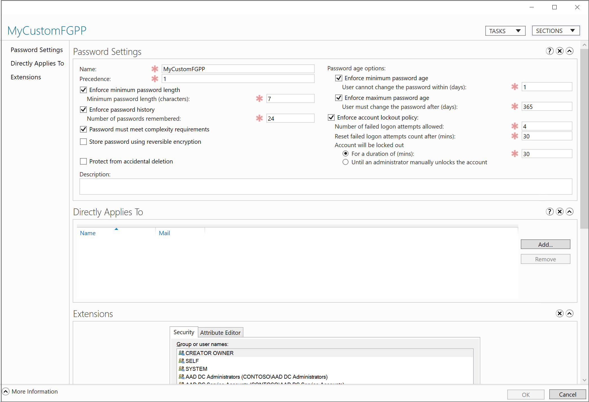
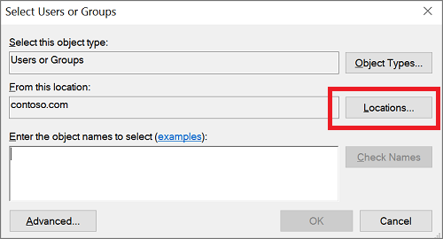
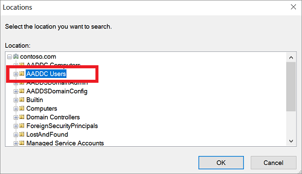
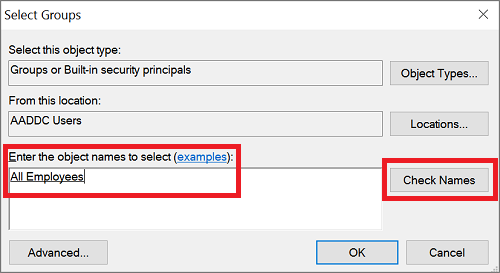

# Password and account lockout policies on managed domains

To manage account security in Azure Active Directory Domain Services (Azure AD DS), you can define fine-grained password policies that control settings such as minimum password length, password expiration time, or password complexity. A default password policy is applied to all users in an Azure AD DS managed domain. To provide granular control and meet specific business or compliance needs, additional policies can be created and applied to specific groups of users.

This article shows you how to create and configure a fine-grained password policy using the Active Directory Administrative Center.

## Before you begin

To complete this article, you need the following resources and privileges:

* An active Azure subscription.
  * If you don’t have an Azure subscription, [create an account](https://azure.microsoft.com/free/?WT.mc_id=A261C142F).
* An Azure Active Directory tenant associated with your subscription, either synchronized with an on-premises directory or a cloud-only directory.
  * If needed, [create an Azure Active Directory tenant][create-azure-ad-tenant] or [associate an Azure subscription with your account][associate-azure-ad-tenant].
* An Azure Active Directory Domain Services managed domain enabled and configured in your Azure AD tenant.
  * If needed, complete the tutorial to [create and configure an Azure Active Directory Domain Services instance][create-azure-ad-ds-instance].
* A Windows Server management VM that is joined to the Azure AD DS managed domain.
  * If needed, complete the tutorial to [create a management VM][tutorial-create-management-vm].
* A user account that's a member of the *Azure AD DC administrators* group in your Azure AD tenant.

## Fine-grained password policies (FGPP) overview

Fine-grained password policies (FGPPs) let you apply specific restrictions for password and account lockout policies to different users in a domain. For example, to secure privileged accounts you can apply stricter password settings than regular non-privileged accounts. You can create multiple FGPPs to specify password policies within an Azure AD DS managed domain.

The following password settings can be configured using FGPP:

* Minimum password length
* Password history
* Passwords must meet complexity requirements
* Minimum password age
* Maximum password age
* Account lockout policy
  * Account lockout duration
  * Number of failed logon attempts allowed
  * Reset failed logon attempts count after

FGPP only affects users created in Azure AD DS. Cloud users and domain users synchronized into the Azure AD DS managed domain from Azure AD aren't affected by the password policies.

Policies are distributed through group association in the Azure AD DS managed domain, and any changes you make are applied at the next user sign-in. Changing the policy doesn't unlock a user account that's already locked out.

## Default fine-grained password policy settings

In an Azure AD DS managed domain, the following password policies are configured by default and applied to all users:

* **Minimum password length (characters):** 7
* **Maximum password age (lifetime):** 90 days
* **Passwords must meet complexity requirements**

The following account lockout policies are then configured by default:

* **Account lockout duration:** 30
* **Number of failed logon attempts allowed:** 5
* **Reset failed logon attempts count after:** 30 minutes

With these default settings, user accounts are locked out for 30 minutes if five invalid passwords are used within 2 minutes. Accounts are automatically unlocked after 30 minutes.

You can't modify or delete the default built-in fine-grained password policy. Instead, members of the *AAD DC Administrators* group can a create custom FGPP and configure it to override (take precedence over) the default built-in FGPP, as shown in the next section.

## Create a custom fine-grained password policy

As you build and applications in Azure, you may want to configure a custom FGPP. Some examples of the need to create a custom FGPP include to set a different account lockout policy, or to configure a default password lifetime setting for the managed domain.

You can create a custom FGPP and apply it to specific groups in your Azure AD DS managed domain. This configuration effectively overrides the default FGPP. You can also create custom fine-grained password policies and apply them to any custom OUs you create in the Azure AD DS managed domain.

To create a fine-grained password policy, you use the Active Directory Administrative Tools from a domain-joined VM. The Active Directory Administrative Center lets you view, edit, and create resources in an Azure AD DS managed domain, including OUs.

> [!NOTE]
> To create a fine-grained password policy in an Azure AD DS managed domain, you must be signed in to a user account that's a member of the *AAD DC Administrators* group.

1. From the Start screen, select **Administrative Tools**. A list of available management tools is shown that were installed in the tutorial to [create a management VM][tutorial-create-management-vm].
1. To create and manage OUs, select **Active Directory Administrative Center** from the list of administrative tools.
1. In the left pane, choose your Azure AD DS managed domain, such as *contoso.com*.
1. Open the **System** container, then the **Password Settings** container.

    A built-in FGPP for the Azure AD DS managed domain is shown. You can't modify this built-in FGPP. Instead, create a new custom FGPP to override the default FGPP.
1. In the **Tasks** panel on the right, select **New > Password Settings**.
1. In the **Create Password Settings** dialog, enter a name for the policy, such as *MyCustomFGPP*. Set the precedence to appropriately to override the default FGPP (which is *200*), such as *1*.

    Edit other password policy settings as desired, such as **Enforce password history** to require the user to create a password that's different from the previous *24* passwords.

    

1. Uncheck **Protect from accidental deletion**. If this option is selected, you can't save the FGPP.
1. In the **Directly Applies To** section, select the **Add** button. In the **Select Users or Groups** dialog, click the **Locations** button.

    

1. Fine-grained password policies can only be applied to groups. In the **Locations** dialog, expand the domain name, such as *contoso.com*, then select an OU, such as **AADDC Users**. If you have a custom OU that contains a group of users you wish to apply, select that OU.

    

1. Type the name of the group you wish to apply the policy to, then select **Check Names** to validate that the group exists.

    

1. With the name of the group you selected now displayed in **Directly Applies To** section, select **OK** to save your custom password policy.

## Next steps

For more information about fine-grained password policies and using the Active Directory Administration Center, see the following articles:

* [Learn about fine-grained password policies](/previous-versions/windows/it-pro/windows-server-2008-R2-and-2008/cc770394(v=ws.10))
* [Configure fine-grained password policies using AD Administration Center](/windows-server/identity/ad-ds/get-started/adac/introduction-to-active-directory-administrative-center-enhancements--level-100-#fine_grained_pswd_policy_mgmt)

<!-- INTERNAL LINKS -->
[create-azure-ad-tenant]: ../active-directory/fundamentals/sign-up-organization.md
[associate-azure-ad-tenant]: ../active-directory/fundamentals/active-directory-how-subscriptions-associated-directory.md
[create-azure-ad-ds-instance]: tutorial-create-instance.md
[tutorial-create-management-vm]: tutorial-create-management-vm.md
