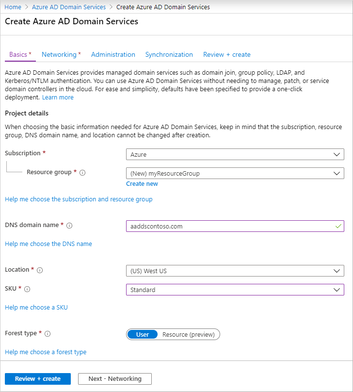
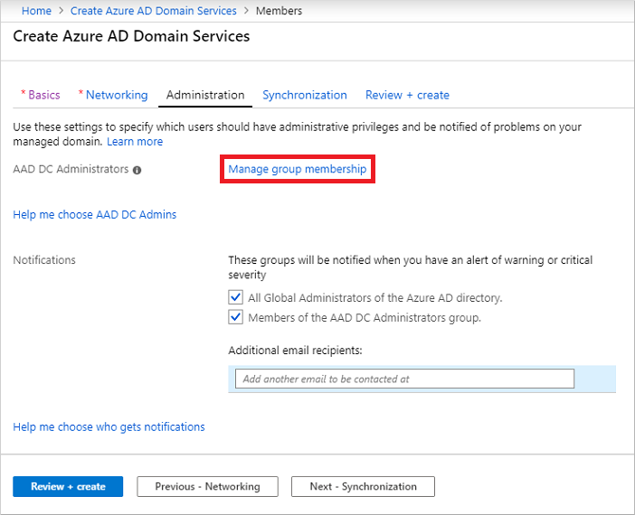
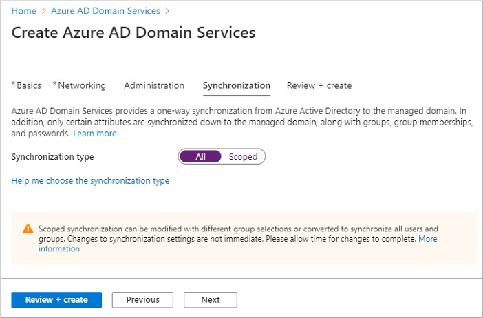
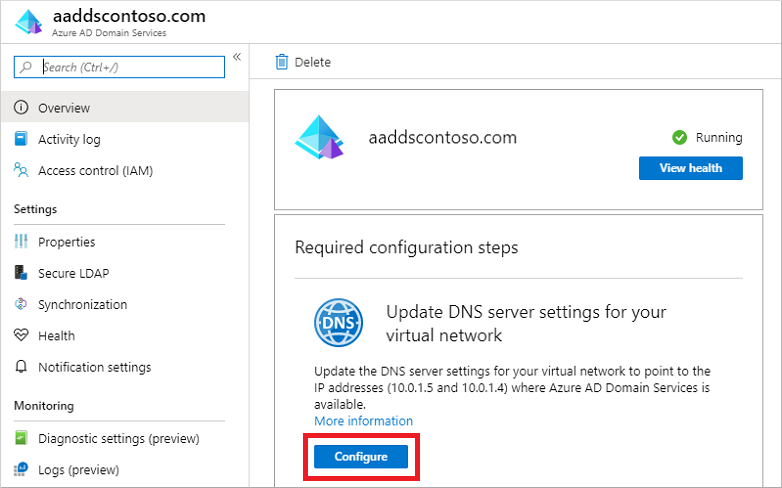

# Tutorial: Create and configure an Azure Active Directory Domain Services instance with advanced configuration options

Azure Active Directory Domain Services (Azure AD DS) provides managed domain services such as domain join, group policy, LDAP, Kerberos/NTLM authentication that is fully compatible with Windows Server Active Directory. You consume these domain services without deploying, managing, and patching domain controllers yourself. Azure AD DS integrates with your existing Azure AD tenant. This integration lets users sign in using their corporate credentials, and you can use existing groups and user accounts to secure access to resources.

You can [create a managed domain using default configuration options][tutorial-create-instance] for networking and synchronization, or manually define these settings. This tutorial shows you how to define those advanced configuration options to create and configure an Azure AD DS instance using the Azure portal.

In this tutorial, you learn how to:

> [!div class="checklist"]
> * Configure DNS and virtual network settings for a managed domain
> * Create an Azure AD DS instance
> * Add administrative users to domain management
> * Enable password hash synchronization

If you don't have an Azure subscription, [create an account](https://azure.microsoft.com/free/?WT.mc_id=A261C142F) before you begin.

## Prerequisites

To complete this tutorial, you need the following resources and privileges:

* An active Azure subscription.
    * If you don't have an Azure subscription, [create an account](https://azure.microsoft.com/free/?WT.mc_id=A261C142F).
* An Azure Active Directory tenant associated with your subscription, either synchronized with an on-premises directory or a cloud-only directory.
    * If needed, [create an Azure Active Directory tenant][create-azure-ad-tenant] or [associate an Azure subscription with your account][associate-azure-ad-tenant].
* You need *global administrator* privileges in your Azure AD tenant to enable Azure AD DS.
* You need *Contributor* privileges in your Azure subscription to create the required Azure AD DS resources.

Although not required for Azure AD DS, it's recommended to [configure self-service password reset (SSPR)][configure-sspr] for the Azure AD tenant. Users can change their password without SSPR, but SSPR helps if they forget their password and need to reset it.

> [!IMPORTANT]
> After you create an Azure AD DS managed domain, you can't then move the instance to a different resource group, virtual network, subscription, etc. Take care to select the most appropriate subscription, resource group, region, and virtual network when you deploy the Azure AD DS instance.

## Sign in to the Azure portal

In this tutorial, you create and configure the Azure AD DS instance using the Azure portal. To get started, first sign in to the [Azure portal](https://portal.azure.com).

## Create an instance and configure basic settings

To launch the **Enable Azure AD Domain Services** wizard, complete the following steps:

1. On the Azure portal menu or from the **Home** page, select **Create a resource**.
1. Enter *Domain Services* into the search bar, then choose *Azure AD Domain Services* from the search suggestions.
1. On the Azure AD Domain Services page, select **Create**. The **Enable Azure AD Domain Services** wizard is launched.
1. Select the Azure **Subscription** in which you would like to create the managed domain.
1. Select the **Resource group** to which the managed domain should belong. Choose to **Create new** or select an existing resource group.

When you create an Azure AD DS instance, you specify a DNS name. There are some considerations when you choose this DNS name:

* **Built-in domain name:** By default, the built-in domain name of the directory is used (a *.onmicrosoft.com* suffix). If you wish to enable secure LDAP access to the managed domain over the internet, you can't create a digital certificate to secure the connection with this default domain. Microsoft owns the *.onmicrosoft.com* domain, so a Certificate Authority (CA) won't issue a certificate.
* **Custom domain names:** The most common approach is to specify a custom domain name, typically one that you already own and is routable. When you use a routable, custom domain, traffic can correctly flow as needed to support your applications.
* **Non-routable domain suffixes:** We generally recommend that you avoid a non-routable domain name suffix, such as *contoso.local*. The *.local* suffix isn't routable and can cause issues with DNS resolution.

> [!TIP]
> If you create a custom domain name, take care with existing DNS namespaces. It's recommended to use a domain name separate from any existing Azure or on-premises DNS name space.
>
> For example, if you have an existing DNS name space of *contoso.com*, create an Azure AD DS managed domain with the custom domain name of *aaddscontoso.com*. If you need to use secure LDAP, you must register and own this custom domain name to generate the required certificates.
>
> You may need to create some additional DNS records for other services in your environment, or conditional DNS forwarders between existing DNS name spaces in your environment. For example, if you run a webserver that hosts a site using the root DNS name, there can be naming conflicts that require additional DNS entries.
>
> In these tutorials and how-to articles, the custom domain of *aaddscontoso.com* is used as a short example. In all commands, specify your own domain name.

The following DNS name restrictions also apply:

* **Domain prefix restrictions:** You can't create a managed domain with a prefix longer than 15 characters. The prefix of your specified domain name (such as *aaddscontoso* in the *aaddscontoso.com* domain name) must contain 15 or fewer characters.
* **Network name conflicts:** The DNS domain name for your managed domain shouldn't already exist in the virtual network. Specifically, check for the following scenarios that would lead to a name conflict:
    * If you already have an Active Directory domain with the same DNS domain name on the Azure virtual network.
    * If the virtual network where you plan to enable the managed domain has a VPN connection with your on-premises network. In this scenario, ensure you don't have a domain with the same DNS domain name on your on-premises network.
    * If you have an existing Azure cloud service with that name on the Azure virtual network.

Complete the fields in the *Basics* window of the Azure portal to create an Azure AD DS instance:

1. Enter a **DNS domain name** for your managed domain, taking into consideration the previous points.
1. Choose the Azure **Location** in which the managed domain should be created. If you choose a region that supports Availability Zones, the Azure AD DS resources are distributed across zones for additional redundancy.

    Availability Zones are unique physical locations within an Azure region. Each zone is made up of one or more datacenters equipped with independent power, cooling, and networking. To ensure resiliency, there's a minimum of three separate zones in all enabled regions.

    There's nothing for you to configure for Azure AD DS to be distributed across zones. The Azure platform automatically handles the zone distribution of resources. For more information and to see region availability, see [What are Availability Zones in Azure?][availability-zones]

1. The **SKU** determines the performance, backup frequency, and maximum number of forest trusts you can create. You can change the SKU after the managed domain has been created if your business demands or requirements change. For more information, see [Azure AD DS SKU concepts][concepts-sku].

    For this tutorial, select the *Standard* SKU.
1. A *forest* is a logical construct used by Active Directory Domain Services to group one or more domains. By default, an Azure AD DS managed domain is created as a *User* forest. This type of forest synchronizes all objects from Azure AD, including any user accounts created in an on-premises AD DS environment. A *Resource* forest only synchronizes users and groups created directly in Azure AD. Resource forests are currently in preview. For more information on *Resource* forests, including why you may use one and how to create forest trusts with on-premises AD DS domains, see [Azure AD DS resource forests overview][resource-forests].

    For this tutorial, choose to create a *User* forest.

    

1. To manually configure additional options, choose **Next - Networking**. Otherwise, select **Review + create** to accept the default configuration options, then skip to the section to [Deploy your managed domain](#deploy-the-managed-domain). The following defaults are configured when you choose this create option:

    * Creates a virtual network named *aadds-vnet* that uses the IP address range of *10.0.1.0/24*.
    * Creates a subnet named *aadds-subnet* using the IP address range of *10.0.1.0/24*.
    * Synchronizes *All* users from Azure AD into the Azure AD DS managed domain.

## Create and configure the virtual network

To provide connectivity, an Azure virtual network and a dedicated subnet are needed. Azure AD DS is enabled in this virtual network subnet. In this tutorial, you create a virtual network, though you could instead choose to use an existing virtual network. In either approach, you must create a dedicated subnet for use by Azure AD DS.

Some considerations for this dedicated virtual network subnet include the following areas:

* The subnet must have at least 3-5 available IP addresses in its address range to support the Azure AD DS resources.
* Don't select the *Gateway* subnet for deploying Azure AD DS. It's not supported to deploy Azure AD DS into a *Gateway* subnet.
* Don't deploy any other virtual machines to the subnet. Applications and VMs often use network security groups to secure connectivity. Running these workloads in a separate subnet lets you apply those network security groups without disrupting connectivity to your managed domain.
* You can't move your managed domain to a different virtual network after you enable Azure AD DS.

For more information on how to plan and configure the virtual network, see [networking considerations for Azure Active Directory Domain Services][network-considerations].

Complete the fields in the *Network* window as follows:

1. On the **Network** page, choose a virtual network to deploy Azure AD DS into from the drop-down menu, or select **Create new**.
    1. If you choose to create a virtual network, enter a name for the virtual network, such as *myVnet*, then provide an address range, such as *10.0.1.0/24*.
    1. Create a dedicated subnet with a clear name, such as *DomainServices*. Provide an address range, such as *10.0.1.0/24*.

    

    Make sure to pick an address range that is within your private IP address range. IP address ranges you don't own that are in the public address space cause errors within Azure AD DS.

1. Select a virtual network subnet, such as *DomainServices*.
1. When ready, choose **Next - Administration**.

## Configure an administrative group

A special administrative group named *AAD DC Administrators* is used for management of the Azure AD DS domain. Members of this group are granted administrative permissions on VMs that are domain-joined to the managed domain. On domain-joined VMs, this group is added to the local administrators group. Members of this group can also use Remote Desktop to connect remotely to domain-joined VMs.

You don't have *Domain Administrator* or *Enterprise Administrator* permissions on a managed domain using Azure AD DS. These permissions are reserved by the service and aren't made available to users within the tenant. Instead, the *AAD DC Administrators* group lets you perform some privileged operations. These operations include belonging to the administration group on domain-joined VMs, and configuring Group Policy.

The wizard automatically creates the *AAD DC Administrators* group in your Azure AD directory. If you have an existing group with this name in your Azure AD directory, the wizard selects this group. You can optionally choose to add additional users to this *AAD DC Administrators* group during the deployment process. These steps can be completed later.

1. To add additional users to this *AAD DC Administrators* group, select **Manage group membership**.

    

1. Select the **Add members** button, then search for and select users from your Azure AD directory. For example, search for your own account, and add it to the *AAD DC Administrators* group.
1. If desired, change or add additional recipients for notifications when there are alerts in the Azure AD DS managed domain that require attention.
1. When ready, choose **Next - Synchronization**.

## Configure synchronization

Azure AD DS lets you synchronize *all* users and groups available in Azure AD, or a *scoped* synchronization of only specific groups. If you choose to synchronize *all* users and groups, you can't later choose to only perform a scoped synchronization. For more information about scoped synchronization, see [Azure AD Domain Services scoped synchronization][scoped-sync].

1. For this tutorial, choose to synchronize **All** users and groups. This synchronization choice is the default option.

    

1. Select **Review + create**.

## Deploy the managed domain

On the **Summary** page of the wizard, review the configuration settings for the managed domain. You can go back to any step of the wizard to make changes. To redeploy an Azure AD DS managed domain to a different Azure AD tenant in a consistent way using these configuration options, you can also **Download a template for automation**.

1. To create the managed domain, select **Create**. A note is displayed that certain configuration options like DNS name or virtual network can't be changed once the Azure AD DS managed has been created. To continue, select **OK**.
1. The process of provisioning your managed domain can take up to an hour. A notification is displayed in the portal that shows the progress of your Azure AD DS deployment. Select the notification to see detailed progress for the deployment.

    

1. Select your resource group, such as *myResourceGroup*, then choose your Azure AD DS instance from the list of Azure resources, such as *aaddscontoso.com*. The **Overview** tab shows that the managed domain is currently *Deploying*. You can't configure the managed domain until it's fully provisioned.

    

1. When the managed domain is fully provisioned, the **Overview** tab shows the domain status as *Running*.

    

The managed domain is associated with your Azure AD tenant. During the provisioning process, Azure AD DS creates two Enterprise Applications named *Domain Controller Services* and *AzureActiveDirectoryDomainControllerServices* in the Azure AD tenant. These Enterprise Applications are needed to service your managed domain. Don't delete these applications.

## Update DNS settings for the Azure virtual network

With Azure AD DS successfully deployed, now configure the virtual network to allow other connected VMs and applications to use the managed domain. To provide this connectivity, update the DNS server settings for your virtual network to point to the two IP addresses where Azure AD DS is deployed.

1. The **Overview** tab for your managed domain shows some **Required configuration steps**. The first configuration step is to update DNS server settings for your virtual network. Once the DNS settings are correctly configured, this step is no longer shown.

    The addresses listed are the domain controllers for use in the virtual network. In this example, those addresses are *10.1.0.4* and *10.1.0.5*. You can later find these IP addresses on the **Properties** tab.

    

1. To update the DNS server settings for the virtual network, select the **Configure** button. The DNS settings are automatically configured for your virtual network.

> [!TIP]
> If you selected an existing virtual network in the previous steps, any VMs connected to the network only get the new DNS settings after a restart. You can restart VMs using the Azure portal, Azure PowerShell, or the Azure CLI.

## Enable user accounts for Azure AD DS

To authenticate users on the managed domain, Azure AD DS needs password hashes in a format that's suitable for NT LAN Manager (NTLM) and Kerberos authentication. Azure AD doesn't generate or store password hashes in the format that's required for NTLM or Kerberos authentication until you enable Azure AD DS for your tenant. For security reasons, Azure AD also doesn't store any password credentials in clear-text form. Therefore, Azure AD can't automatically generate these NTLM or Kerberos password hashes based on users' existing credentials.

> [!NOTE]
> Once appropriately configured, the usable password hashes are stored in the Azure AD DS managed domain. If you delete the Azure AD DS managed domain, any password hashes stored at that point are also deleted. Synchronized credential information in Azure AD can't be re-used if you later create an Azure AD DS managed domain - you must reconfigure the password hash synchronization to store the password hashes again. Previously domain-joined VMs or users won't be able to immediately authenticate - Azure AD needs to generate and store the password hashes in the new Azure AD DS managed domain. For more information, see [Password hash sync process for Azure AD DS and Azure AD Connect][password-hash-sync-process].

The steps to generate and store these password hashes are different for cloud-only user accounts created in Azure AD versus user accounts that are synchronized from your on-premises directory using Azure AD Connect. A cloud-only user account is an account that was created in your Azure AD directory using either the Azure portal or Azure AD PowerShell cmdlets. These user accounts aren't synchronized from an on-premises directory. In this tutorial, let's work with a basic cloud-only user account. For more information on the additional steps required to use Azure AD Connect, see [Synchronize password hashes for user accounts synced from your on-premises AD to your managed domain][on-prem-sync].

> [!TIP]
> If your Azure AD tenant has a combination of cloud-only users and users from your on-premises AD, you need to complete both sets of steps.

For cloud-only user accounts, users must change their passwords before they can use Azure AD DS. This password change process causes the password hashes for Kerberos and NTLM authentication to be generated and stored in Azure AD. The account isn't synchronized from Azure AD to Azure AD DS until the password is changed. Either expire the passwords for all cloud users in the tenant who need to use Azure AD DS, which forces a password change on next sign-in, or instruct cloud users to manually change their passwords. For this tutorial, let's manually change a user password.

Before a user can reset their password, the Azure AD tenant must be [configured for self-service password reset][configure-sspr].

To change the password for a cloud-only user, the user must complete the following steps:

1. Go to the Azure AD Access Panel page at [https://myapps.microsoft.com](https://myapps.microsoft.com).
1. In the top-right corner, select your name, then choose **Profile** from the drop-down menu.

    

1. On the **Profile** page, select **Change password**.
1. On the **Change password** page, enter your existing (old) password, then enter and confirm a new password.
1. Select **Submit**.

It takes a few minutes after you've changed your password for the new password to be usable in Azure AD DS and to successfully sign in to computers joined to the managed domain.

## Next steps

In this tutorial, you learned how to:

> [!div class="checklist"]
> * Configure DNS and virtual network settings for a managed domain
> * Create an Azure AD DS instance
> * Add administrative users to domain management
> * Enable user accounts for Azure AD DS and generate password hashes

To see this managed domain in action, create and join a virtual machine to the domain.

> [!div class="nextstepaction"]
> [Join a Windows Server virtual machine to your managed domain](join-windows-vm.md)

<!-- INTERNAL LINKS -->
[tutorial-create-instance]: tutorial-create-instance.md
[create-azure-ad-tenant]: ../active-directory/fundamentals/sign-up-organization.md
[associate-azure-ad-tenant]: ../active-directory/fundamentals/active-directory-how-subscriptions-associated-directory.md
[network-considerations]: network-considerations.md
[create-dedicated-subnet]: ../virtual-network/virtual-network-manage-subnet.md#add-a-subnet
[scoped-sync]: scoped-synchronization.md
[on-prem-sync]: tutorial-configure-password-hash-sync.md
[configure-sspr]: ../active-directory/authentication/quickstart-sspr.md
[password-hash-sync-process]: ../active-directory/hybrid/how-to-connect-password-hash-synchronization.md#password-hash-sync-process-for-azure-ad-domain-services
[resource-forests]: concepts-resource-forest.md
[availability-zones]: ../availability-zones/az-overview.md
[concepts-sku]: administration-concepts.md#azure-ad-ds-skus

<!-- EXTERNAL LINKS -->
