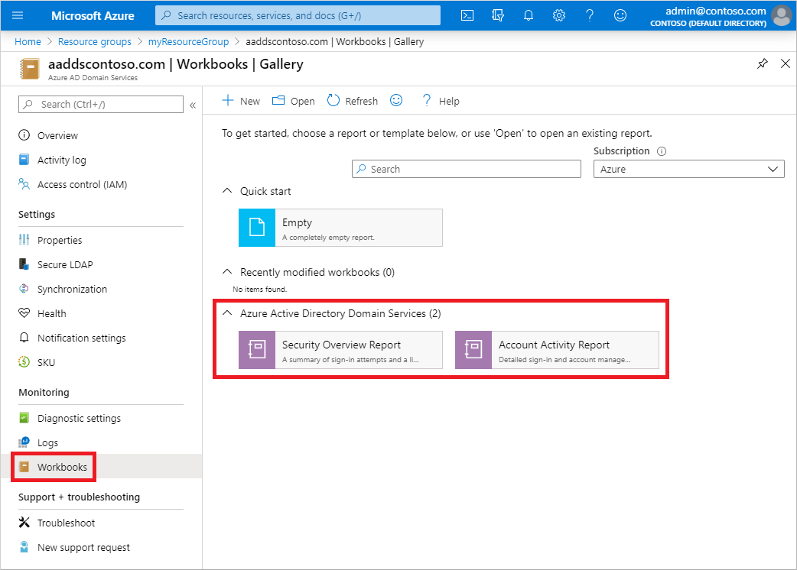
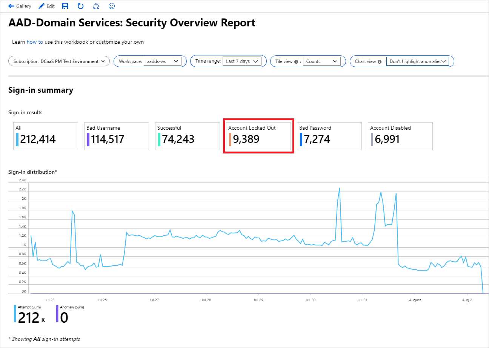
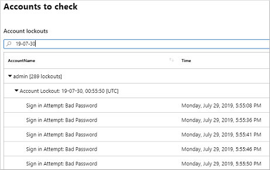
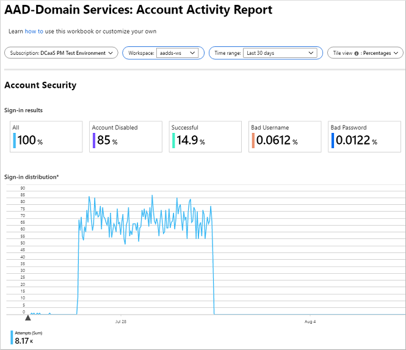

# Review security audit events in Azure AD Domain Services using Azure Monitor Workbooks

To help you understand the state of your Azure Active Directory Domain Services (Azure AD DS) managed domain, you can enable security audit events. These security audit events can then be reviewed using Azure Monitor Workbooks that combine text, analytics queries, and parameters into rich interactive reports. Azure AD DS includes workbook templates for security overview and account activity that let you dig into audit events and manage your environment.

This article shows you how to use Azure Monitor Workbooks to review security audit events in Azure AD DS.

## Before you begin

To complete this article, you need the following resources and privileges:

* An active Azure subscription.
    * If you don't have an Azure subscription, [create an account](https://azure.microsoft.com/free/?WT.mc_id=A261C142F).
* An Azure Active Directory tenant associated with your subscription, either synchronized with an on-premises directory or a cloud-only directory.
    * If needed, [create an Azure Active Directory tenant][create-azure-ad-tenant] or [associate an Azure subscription with your account][associate-azure-ad-tenant].
* An Azure Active Directory Domain Services managed domain enabled and configured in your Azure AD tenant.
    * If needed, complete the tutorial to [create and configure an Azure Active Directory Domain Services instance][create-azure-ad-ds-instance].
* Security audit events enabled for your Azure Active Directory Domain Services managed domain that stream data to a Log Analytics workspace.
    * If needed, [enable security audits for Azure Active Directory Domain Services][enable-security-audits].

## Azure Monitor Workbooks overview

When security audit events are turned on in Azure AD DS, it can be hard to analyze and identify issues in the managed domain. Azure Monitor lets you aggregate these security audit events and query the data. With Azure Monitor Workbooks, you can visualize this data to make it quicker and easier to identify issues.

Workbook templates are curated reports that are designed for flexible reuse by multiple users and teams. When you open a workbook template, the data from your Azure Monitor environment is loaded. You can use templates without an impact on other users in your organization, and can save your own workbooks based on the template.

Azure AD DS includes the following two workbook templates:

* Security overview report
* Account activity report

For more information about how to edit and manage workbooks, see [Azure Monitor Workbooks overview](../azure-monitor/platform/workbooks-overview.md).

## Use the security overview report workbook

To help you better understand usage and identify potential security threats, the security overview report summarizes sign-in data and identifies accounts you might want to check on. You can view events in a particular date range, and drill down into specific sign-in events, such as bad password attempts or where the account was disabled.

To access the workbook template for the security overview report, complete the following steps:

1. Search for and select **Azure Active Directory Domain Services** in the Azure portal.
1. Select your managed domain, such as *aaddscontoso.com*
1. From the menu on the left-hand side, choose **Monitoring > Workbooks**

    

1. Choose the **Security Overview Report**.
1. From the drop-down menus at the top of the workbook, select your Azure subscription and then Azure Monitor workspace. Choose a **Time range**, such as *Last 7 days*.

    

    The **Tile view** and **Chart view** options can also be changed to analyze and visualize the data as desired

1. To drill down into a specific event type, select the one of the **Sign-in result** cards such as *Account Locked Out*, as shown in the following example:

    

1. The lower part of the security overview report below the chart then breaks down the activity type selected. You can filter by usernames involved on the right-hand side, as shown in the following example report:

    

## Use the account activity report workbook

To help you troubleshoot issues for a specific user account, the account activity report breaks down detailed audit event log information. You can review when a bad username or password was provided during sign-in, and the source of the sign-in attempt.

To access the workbook template for the account activity report, complete the following steps:

1. Search for and select **Azure Active Directory Domain Services** in the Azure portal.
1. Select your managed domain, such as *aaddscontoso.com*
1. From the menu on the left-hand side, choose **Monitoring > Workbooks**
1. Choose the **Account Activity Report**.
1. From the drop-down menus at the top of the workbook, select your Azure subscription and then Azure Monitor workspace. Choose a **Time range**, such as *Last 30 days*, then how you want the **Tile view** to represent the data. You can filter by **Account username**, such as *felix*, as shown in the following example report:

    

    The area below the chart shows individual sign-in events along with information such as the activity result and source workstation. This information can help determine repeated sources of sign-in events that may cause account lockouts or indicate a potential attack.

As with the security overview report, you can drill down into the different tiles at the top of the report to visualize and analyze the data as needed.

## Save and edit workbooks

The two template workbooks provided by Azure AD DS are a good place to start with your own data analysis. If you need to get more granular in the data queries and investigations, you can save your own workbooks and edit the queries.

1. To save a copy of one of the workbook templates, select **Edit > Save as > Shared reports**, then provide a name and save it.
1. From your own copy of the template, select **Edit** to enter the edit mode. You can choose the blue **Edit** button next to any part of the report and change it.

All of the charts and tables in Azure Monitor Workbooks are generated using Kusto queries. For more information on creating your own queries, see [Azure Monitor log queries][azure-monitor-queries] and [Kusto queries tutorial][kusto-queries].

## Next steps

If you need to adjust password and lockout policies, see [Password and account lockout policies on managed domains][password-policy].

For problems with users, learn how to troubleshoot [account sign-in problems][troubleshoot-sign-in] or [account lockout problems][troubleshoot-account-lockout].

<!-- INTERNAL LINKS -->
[create-azure-ad-tenant]: ../active-directory/fundamentals/sign-up-organization.md
[associate-azure-ad-tenant]: ../active-directory/fundamentals/active-directory-how-subscriptions-associated-directory.md
[create-azure-ad-ds-instance]: tutorial-create-instance.md
[enable-security-audits]: security-audit-events.md
[password-policy]: password-policy.md
[troubleshoot-sign-in]: troubleshoot-sign-in.md
[troubleshoot-account-lockout]: troubleshoot-account-lockout.md
[azure-monitor-queries]: ../azure-monitor/log-query/query-language.md
[kusto-queries]: https://docs.microsoft.com/azure/kusto/query/tutorial?pivots=azuredataexplorer
