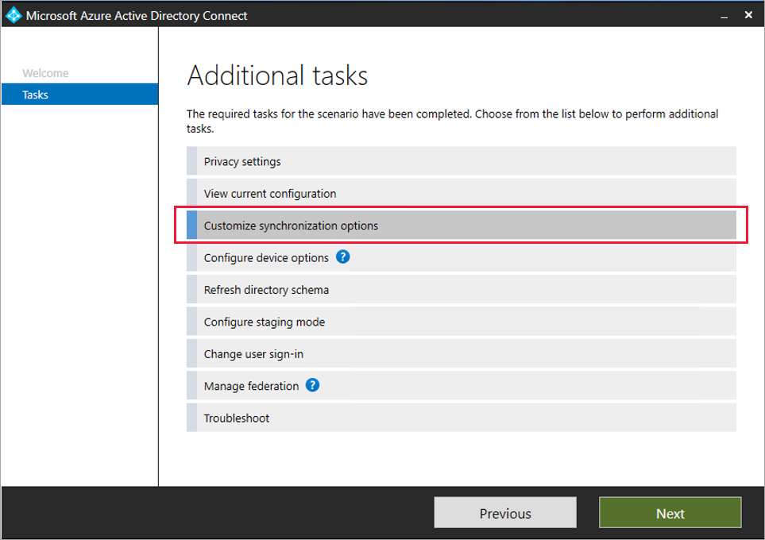
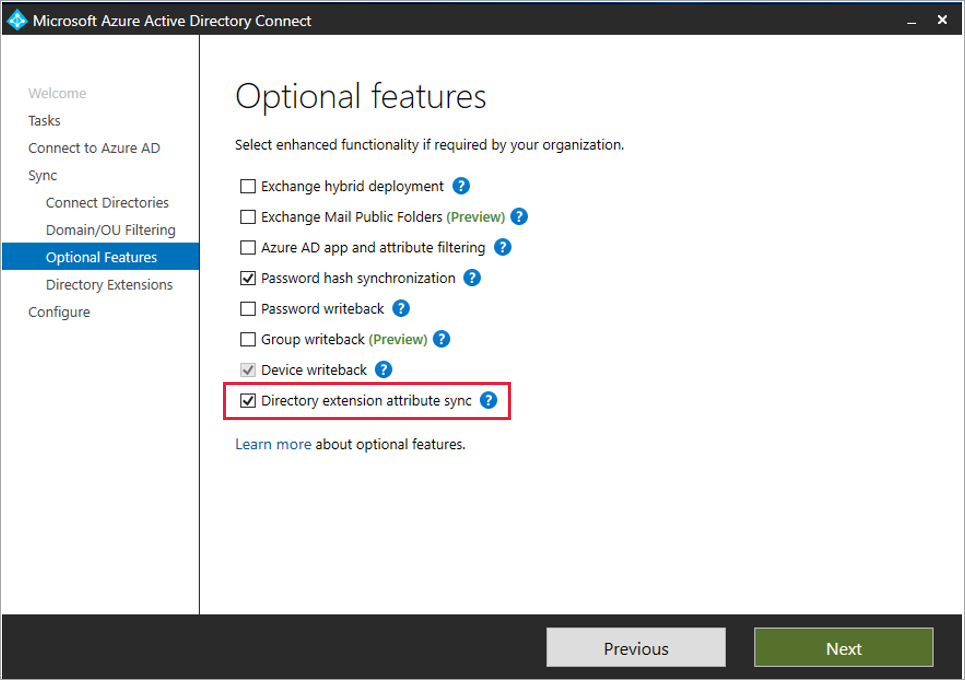
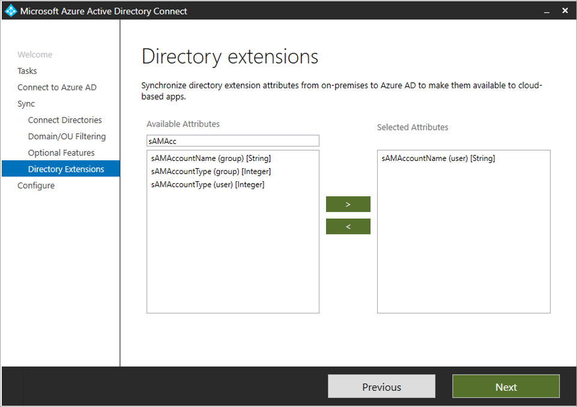
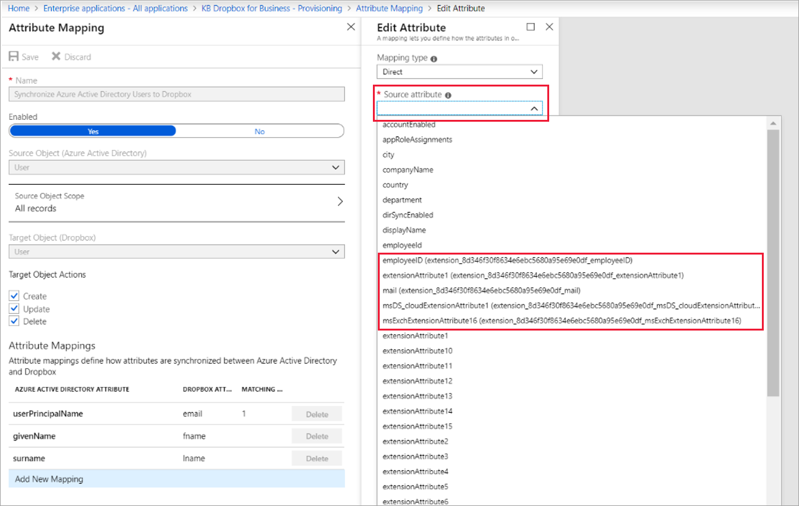

# Sync an attribute from your on-premises Active Directory to Azure AD for provisioning to an application

When customizing attribute mappings for user provisioning, you might find that the attribute you want to map doesn't appear in the **Source attribute** list. This article shows you how to add the missing attribute by synchronizing it from your on-premises Active Directory (AD) to Azure Active Directory (Azure AD).

Azure AD must contain all the data required to create a user profile when provisioning user accounts from Azure AD to a SaaS app. In some cases, to make the data available you might need synchronize attributes from your on-premises AD to Azure AD. Azure AD Connect automatically synchronizes certain attributes to Azure AD, but not all attributes. Furthermore, some attributes (such as SAMAccountName) that are synchronized by default might not be exposed using the Microsoft Graph API. In these cases, you can use the Azure AD Connect directory extension feature to synchronize the attribute to Azure AD. That way, the attribute will be visible to the Microsoft Graph API and the Azure AD provisioning service.

If the data you need for provisioning is in Active Directory but isn't available for provisioning because of the reasons described above, follow these steps.
 
## Sync an attribute 

1. Open the Azure AD Connect wizard, choose Tasks, and then choose **Customize synchronization options**.

   
 
2. Sign in as an Azure AD Global Administrator. 

3. On the **Optional Features** page, select **Directory extension attribute sync**.
 
   

4. Select the attribute(s) you want to extend to Azure AD.
   > [!NOTE]
   > The search under **Available Attributes** is case sensitive.

   

5. Finish the Azure AD Connect wizard and allow a full synchronization cycle to run. When the cycle is complete, the schema is extended and the new values are synchronized between your on-premises AD and Azure AD.
 
6. In the Azure portal, while you’re [editing user attribute mappings](customize-application-attributes.md), the **Source attribute** list will now contain the added attribute in the format `<attributename> (extension_<appID>_<attributename>)`. Select the attribute and map it to the target application for provisioning.

   

> [!NOTE]
> The ability to provision reference attributes from on-premises AD, such as **managedby** or **DN/DistinguishedName**, is not supported today. You can request this feature on [User Voice](https://feedback.azure.com/forums/169401-azure-active-directory). 

## Next steps

* [Define who is in scope for provisioning](../app-provisioning/define-conditional-rules-for-provisioning-user-accounts.md)
