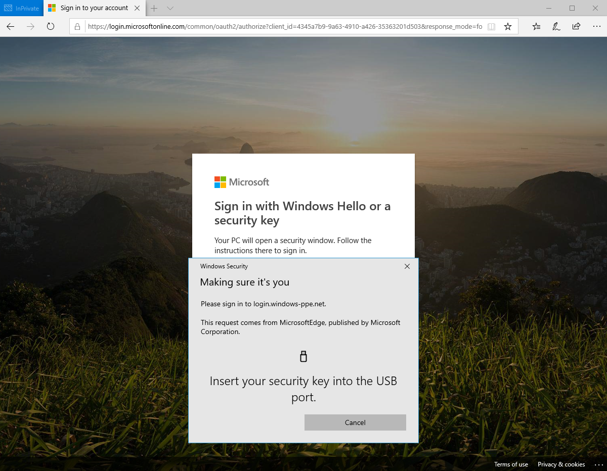

# Enable passwordless security key sign-in 

For enterprises that use passwords today and have a shared PC environment, security keys provide a seamless way for workers to authenticate without entering a username or password. Security keys provide improved productivity for workers, and have better security.

This document focuses on enabling security key based passwordless authentication. At the end of this article, you will be able to sign in to web-based applications with your Azure AD account using a FIDO2 security key.

## Requirements

- [Azure AD Multi-Factor Authentication](howto-mfa-getstarted.md)
- Enable [Combined security information registration](concept-registration-mfa-sspr-combined.md)
- Compatible [FIDO2 security keys](concept-authentication-passwordless.md#fido2-security-keys)
- WebAuthN requires Windows 10 version 1903 or higher**

To use security keys for logging in to web apps and services, you must have a browser that supports the WebAuthN protocol. These include Microsoft Edge, Chrome, Firefox, and Safari.

## Prepare devices

For Azure AD joined devices the best experience is on Windows 10 version 1903 or higher.

Hybrid Azure AD joined devices must run Windows 10 version 2004 or higher.

## Enable passwordless authentication method

### Enable the combined registration experience

Registration features for passwordless authentication methods rely on the combined registration feature. Follow the steps in the article [Enable combined security information registration](howto-registration-mfa-sspr-combined.md), to enable combined registration.

### Enable FIDO2 security key method

1. Sign in to the [Azure portal](https://portal.azure.com).
1. Browse to **Azure Active Directory** > **Security** > **Authentication methods** > **Authentication method policy**.
1. Under the method **FIDO2 Security Key**, choose the following options:
   1. **Enable** - Yes or No
   1. **Target** - All users or Select users
1. **Save** the configuration.

## User registration and management of FIDO2 security keys

1. Browse to [https://myprofile.microsoft.com](https://myprofile.microsoft.com).
1. Sign in if not already.
1. Click **Security Info**.
   1. If the user already has at least one Azure AD Multi-Factor Authentication method registered, they can immediately register a FIDO2 security key.
   1. If they don't have at least one Azure AD Multi-Factor Authentication method registered, they must add one.
1. Add a FIDO2 Security key by clicking **Add method** and choosing **Security key**.
1. Choose **USB device** or **NFC device**.
1. Have your key ready and choose **Next**.
1. A box will appear and ask the user to create/enter a PIN for your security key, then perform the required gesture for the key, either biometric or touch.
1. The user will be returned to the combined registration experience and asked to provide a meaningful name for the key so the user can identify which one if they have multiple. Click **Next**.
1. Click **Done** to complete the process.

## Sign in with passwordless credential

In the example below a user has already provisioned their FIDO2 security key. The user can choose to sign in on the web with their FIDO2 security key inside of a supported browser on Windows 10 version 1903 or higher.

## Troubleshooting and feedback

If you'd like to share feedback or encounter issues with this feature, share via the Windows Feedback Hub app using the following steps:

1. Launch **Feedback Hub** and make sure you're signed in.
1. Submit feedback under the following categorization:
   - Category: Security and Privacy
   - Subcategory: FIDO
1. To capture logs, use the option to **Recreate my Problem**.

## Known issues

### Security key provisioning

Administrator provisioning and de-provisioning of security keys is not available.

### UPN changes

We are working on supporting a feature that allows UPN change on hybrid Azure AD joined and Azure AD joined devices. If a user's UPN changes, you can no longer modify FIDO2 security keys to account for the change. The resolution is to reset the device and the user has to re-register.

## Next steps

[FIDO2 security key Windows 10 sign in](howto-authentication-passwordless-security-key-windows.md)

[Enable FIDO2 authentication to on-premises resources](howto-authentication-passwordless-security-key-on-premises.md)

[Learn more about device registration](../devices/overview.md)

[Learn more about Azure AD Multi-Factor Authentication](../authentication/howto-mfa-getstarted.md)
