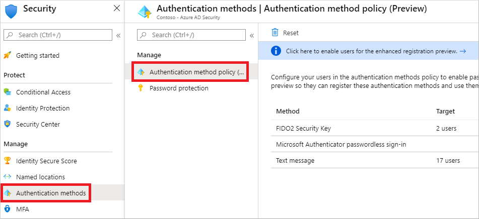
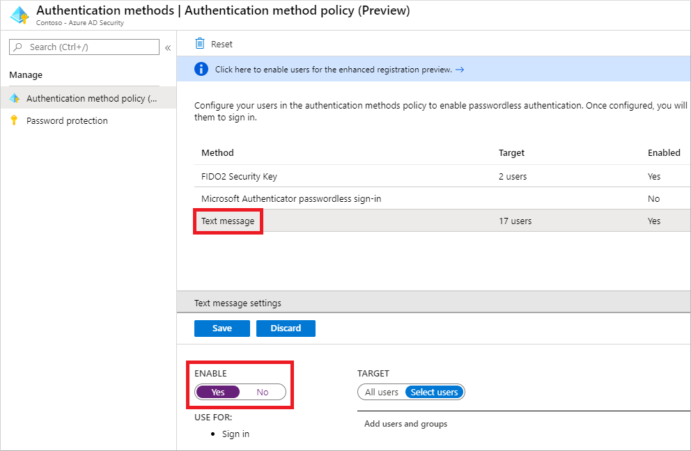
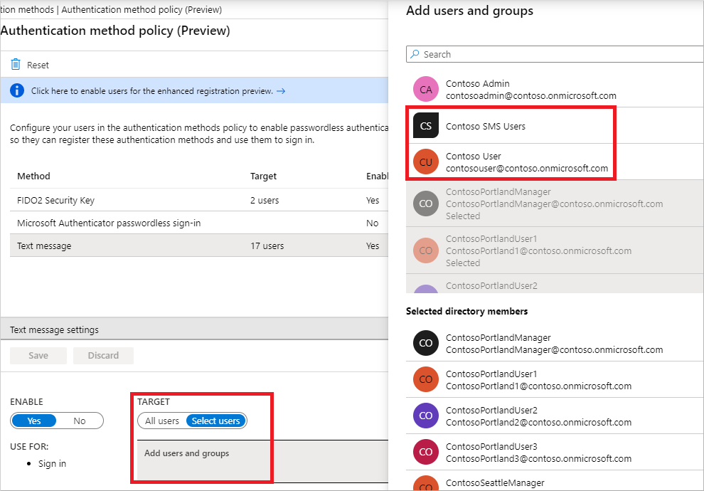
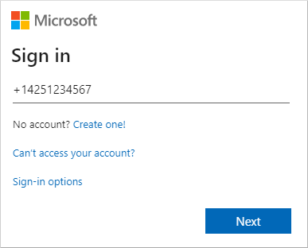
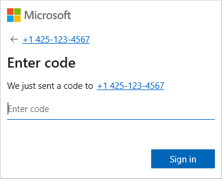

# Configure and enable users for SMS-based authentication using Azure Active Directory 

To simplify and secure sign in to applications and services, Azure Active Directory (Azure AD) provides multiple authentication options. SMS-based authentication lets users sign in without providing, or even knowing, their user name and password. After their account is created by an identity administrator, they can enter their phone number at the sign-in prompt. They receive an authentication code via text message that they can provide to complete the sign in. This authentication method simplifies access to applications and services, especially for Frontline workers.

This article shows you how to enable SMS-based authentication for select users or groups in Azure AD.

## Before you begin

To complete this article, you need the following resources and privileges:

* An active Azure subscription.
    * If you don't have an Azure subscription, [create an account](https://azure.microsoft.com/free/?WT.mc_id=A261C142F).
* An Azure Active Directory tenant associated with your subscription.
    * If needed, [create an Azure Active Directory tenant][create-azure-ad-tenant] or [associate an Azure subscription with your account][associate-azure-ad-tenant].
* You need *global administrator* privileges in your Azure AD tenant to enable SMS-based authentication.
* Each user that's enabled in the text message authentication method policy must be licensed, even if they don't use it. Each enabled user must have one of the following Azure AD, EMS, Microsoft 365 licenses:
    * [Microsoft 365 (M365) F1 or F3][m365-firstline-workers-licensing]
    * [Enterprise Mobility + Security (EMS) E3 or E5][ems-licensing] or [Microsoft 365 (M365) E3 or E5][m365-licensing]
    * [Office 365 F3][o365-f3]

## Limitations

The following limitations apply to SMS-based authentication:

* SMS-based authentication isn't currently compatible with Azure AD Multi-Factor Authentication.
* Except for Teams, SMS-based authentication isn't compatible with native Office applications.
* SMS-based authentication isn't recommended for B2B accounts.
* Federated users won't authenticate in the home tenant. They only authenticate in the cloud.

## Enable the SMS-based authentication method

There are three main steps to enable and use SMS-based authentication in your organization:

* Enable the authentication method policy.
* Select users or groups that can use the SMS-based authentication method.
* Assign a phone number for each user account.
    * This phone number can be assigned in the Azure portal (which is shown in this article), and in *My Staff* or *My Account*.

First, let's enable SMS-based authentication for your Azure AD tenant.

1. Sign in to the [Azure portal][azure-portal] as a *global administrator*.
1. Search for and select **Azure Active Directory**.
1. From the navigation menu on the left-hand side of the Azure Active Directory window, select **Security > Authentication methods > Authentication method policy**.

    

1. From the list of available authentication methods, select **Text message**.
1. Set **Enable** to *Yes*.

    

    You can choose to enable SMS-based authentication for *All users* or *Select users* and groups. In the next section, you enable SMS-based authentication for a test user.

## Assign the authentication method to users and groups

With SMS-based authentication enabled in your Azure AD tenant, now select some users or groups to be allowed to use this authentication method.

1. In the text message authentication policy window, set **Target** to *Select users*.
1. Choose to **Add users or groups**, then select a test user or group, such as *Contoso User* or *Contoso SMS Users*.

    

1. When you've selected your users or groups, choose **Select**, then **Save** the updated authentication method policy.

Each user that's enabled in the text message authentication method policy must be licensed, even if they don't use it. Make sure you have the appropriate licenses for the users you enable in the authentication method policy, especially when you enable the feature for large groups of users.

## Set a phone number for user accounts

Users are now enabled for SMS-based authentication, but their phone number must be associated with the user profile in Azure AD before they can sign in. The user can [set this phone number themselves](../user-help/sms-sign-in-explainer.md) in *My Account*, or you can assign the phone number using the Azure portal. Phone numbers can be set by *global admins*, *authentication admins*, or *privileged authentication admins*.

When a phone number is set for SMS-sign, it's also then available for use with [Azure AD Multi-Factor Authentication][tutorial-azure-mfa] and [self-service password reset][tutorial-sspr].

1. Search for and select **Azure Active Directory**.
1. From the navigation menu on the left-hand side of the Azure Active Directory window, select **Users**.
1. Select the user you enabled for SMS-based authentication in the previous section, such as *Contoso User*, then select **Authentication methods**.
1. Select **+ Add authentication method**, then in the *Choose method* drop-down menu, choose **Phone number**.

    Enter the user's phone number, including the country code, such as *+1 xxxxxxxxx*. The Azure portal validates the phone number is in the correct format.

    Then, from the *Phone type* drop-down menu, select *Mobile*, *Alternate mobile*, or *Other* as needed.

    :::image type="content" source="media/howto-authentication-sms-signin/set-user-phone-number.png" alt-text="Set a phone number for a user in the Azure portal to use with SMS-based authentication":::

    The phone number must be unique in your tenant. If you try to use the same phone number for multiple users, an error message is shown.

1. To apply the phone number to a user's account, select **Add**.

When successfully provisioned, a check mark appears for *SMS Sign-in enabled*.

## Test SMS-based sign-in

To test the user account that's now enabled for SMS-based sign-in, complete the following steps:

1. Open a new InPrivate or Incognito web browser window to [https://www.office.com][office]
1. In the top right-hand corner, select **Sign in**.
1. At the sign-in prompt, enter the phone number associated with the user in the previous section, then select **Next**.

    

1. A text message is sent to the phone number provided. To complete the sign-in process, enter the 6-digit code provided in the text message at the sign-in prompt.

    

1. The user is now signed in without the need to provide a username or password.

## Troubleshoot SMS-based sign-in

The following scenarios and troubleshooting steps can used if you have problems with enabling and using SMS-based sign in.

### Phone number already set for a user account

If a user has already registered for Azure AD Multi-Factor Authentication and / or self-service password reset (SSPR), they already have a phone number associated with their account. This phone number is not automatically available for use with SMS-based sign-in.

A user that has a phone number already set for their account is displayed a button to *Enable for SMS sign-in* in their **My Profile** page. Select this button, and the account is enabled for use with SMS-based sign-in and the previous Azure AD Multi-Factor Authentication or SSPR registration.

For more information on the end-user experience, see [SMS sign-in user experience for phone number](../user-help/sms-sign-in-explainer.md).

### Error when trying to set a phone number on a user's account

If you receive an error when you try to set a phone number for a user account in the Azure portal, review the following troubleshooting steps:

1. Make sure that you're enabled for the SMS-based sign-in.
1. Confirm that the user account is enabled in the *Text message* authentication method policy.
1. Make sure you set the phone number with the proper formatting, as validated in the Azure portal (such as *+1 4251234567*).
1. Make sure that the phone number isn't used elsewhere in your tenant.
1. Check there's no voice number set on the account. If a voice number is set, delete and try to the phone number again.

## Next steps

For additional ways to sign in to Azure AD without a password, such as the Microsoft Authenticator App or FIDO2 security keys, see [Passwordless authentication options for Azure AD][concepts-passwordless].

You can also use the Microsoft Graph REST API beta to [enable][rest-enable] or [disable][rest-disable] SMS-based sign-in.

<!-- INTERNAL LINKS -->
[create-azure-ad-tenant]: ../fundamentals/sign-up-organization.md
[associate-azure-ad-tenant]: ../fundamentals/active-directory-how-subscriptions-associated-directory.md
[concepts-passwordless]: concept-authentication-passwordless.md
[tutorial-azure-mfa]: tutorial-enable-azure-mfa.md
[tutorial-sspr]: tutorial-enable-sspr.md
[rest-enable]: /graph/api/phoneauthenticationmethod-enablesmssignin?view=graph-rest-beta&tabs=http
[rest-disable]: /graph/api/phoneauthenticationmethod-disablesmssignin?view=graph-rest-beta&tabs=http

<!-- EXTERNAL LINKS -->
[azure-portal]: https://portal.azure.com
[office]: https://www.office.com
[m365-firstline-workers-licensing]: https://www.microsoft.com/licensing/news/m365-firstline-workers
[azuread-licensing]: https://azure.microsoft.com/pricing/details/active-directory/
[ems-licensing]: https://www.microsoft.com/microsoft-365/enterprise-mobility-security/compare-plans-and-pricing
[m365-licensing]: https://www.microsoft.com/microsoft-365/compare-microsoft-365-enterprise-plans
[o365-f1]: https://www.microsoft.com/microsoft-365/business/office-365-f1?market=af
[o365-f3]: https://www.microsoft.com/microsoft-365/business/office-365-f3?activetab=pivot%3aoverviewtab
