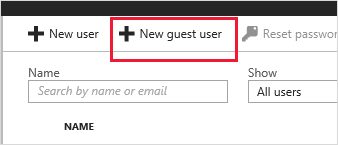
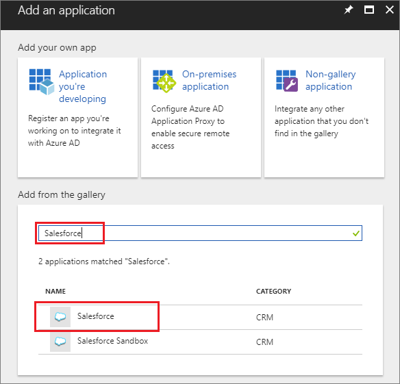
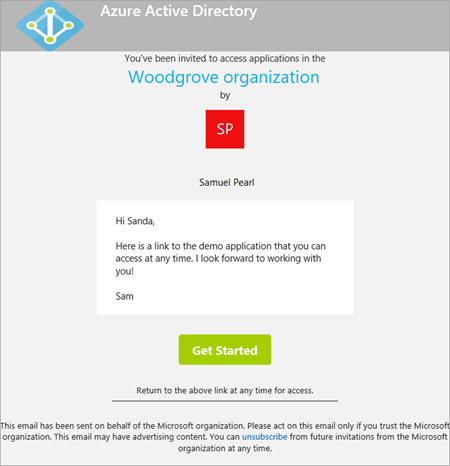
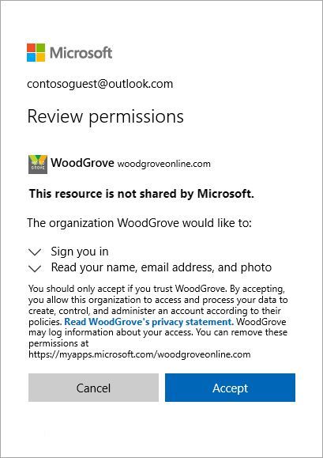

# Quickstart: Add guest users to your directory in the Azure portal

You can invite anyone to collaborate with your organization by adding them to your directory as a guest user. Then you can either send an invitation email that contains a redemption link or send a direct link to an app you want to share. Guest users can sign in with their own work, school, or social identities.

In this quickstart, you'll add a new guest user to Azure AD, send an invitation, and see what the guest user's invitation redemption process looks like.

If you don’t have an Azure subscription, create a [free account](https://azure.microsoft.com/free/?WT.mc_id=A261C142F) before you begin.

## Prerequisites

To complete the scenario in this tutorial, you need:

 - A role that allows you to create users in your tenant directory, like the Global Administrator role or any of the limited administrator directory roles.
 - A valid email account that you can add to your tenant directory, and that you can use to receive the test invitation email.

## Add a new guest user in Azure AD

1. Sign in to the [Azure portal](https://portal.azure.com/) as an Azure AD administrator.
2. In the left pane, select **Azure Active Directory**.
3.	Under **Manage**, select **Users**.

    

4.	Select **New guest user**.

    

5. On the **New user** page, select **Invite user** and then add the guest user's information. 

   - **Name.** The first and last name of the guest user.
   - **Email address (required)**. The email address of the guest user.
   - **Personal message (optional)** Include a personal welcome message to the guest user.
   - **Groups**: You can add the guest user to one or more existing groups, or you can do it later.
   - **Directory role**: If you require Azure AD administrative permissions for the user, you can add them to an Azure AD role. 

6. Select **Invite** to automatically send the invitation to the guest user. A notification appears in the upper right with the message **Successfully invited user**. 
7.	After you send the invitation, the user account is automatically added to the directory as a guest.

## Assign an app to the guest user
Add the Salesforce app to your test tenant and assign the test guest user to the app.
1.	Sign in to the Azure portal as an Azure AD administrator.
2.	In the left pane, select **Enterprise applications**.
3.	Select **New application**.
4. Under **Add from the gallery**, search for **Salesforce**, and then select it.

    
5. Select **Add**.
6. Under **Manage**, select **Single sign-on**, and under **Single Sign-on Mode**, select **Password-based Sign-on**, and click **Save**.
7. Under **Manage**, select **Users and groups** > **Add user** > **Users and groups**.
8. Use the search box to search for the test user (if necessary) and select the test user in the list. Then click **Select**.
9. Select **Assign**. 

## Accept the invitation
Now sign in as the guest user to see the invitation.
1.	Sign in to your test guest user's email account.
2.	In your inbox, find the "You're invited" email.

    

3.	In the email body, select **Get Started**. A **Review permissions** page opens in the browser. 

    

4. Select **Accept**. The Access Panel opens, which lists the applications the guest user can access.

## Clean up resources
When no longer needed, delete the test guest user and the test app.
1.	Sign in to the Azure portal as an Azure AD administrator.
2.	In the left pane, select **Azure Active Directory**.
3.	Under **Manage**, select **Enterprise applications**.
4.	Open the application **Salesforce**, and then select **Delete**.
5.	In the left pane, select **Azure Active Directory**.
6.	Under **Manage**, select **Users**.
7.	Select the test user, and then select **Delete user**.

## Next steps
In this tutorial, you created a guest user in the Azure portal, and sent an invitation to share apps. Then you viewed the redemption process from the guest user's perspective and verified that the app appeared on the guest user's Access Panel. To learn more about adding guest users for collaboration, see [Add Azure Active Directory B2B collaboration users in the Azure portal](add-users-administrator.md).
