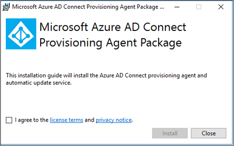
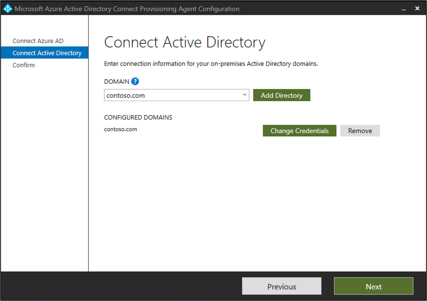
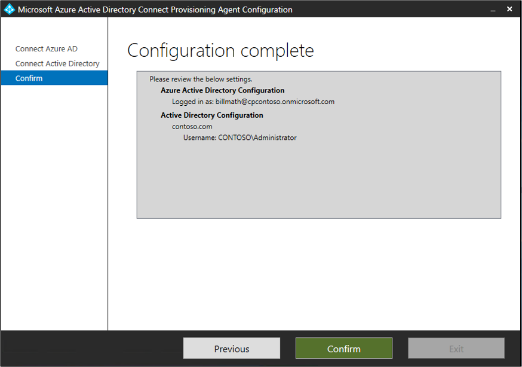

# Install the Azure AD Connect cloud provisioning agent
This document walks you through the installation process for the Azure Active Directory (Azure AD) Connect provisioning agent and how to initially configure it in the Azure portal.

>[!IMPORTANT]
>The following installation instructions assume that all of the [Prerequisites](how-to-prerequisites.md) have been met.

Installing and configuring Azure AD Connect provisioning is accomplished in the following steps:
	
- [Install the agent](#install-the-agent)
- [Verify agent installation](#verify-agent-installation)

## Install the agent
To install the agent, follow these steps.

1. Sign in to the server you'll use with enterprise admin permissions.
1. Go to the Azure portal. On the left, select **Azure Active Directory**.
1. Select **Manage provisioning (preview)** > **Review all agents**.
1. Download the Azure AD Connect provisioning agent from the Azure portal.

    
1. Run the Azure AD Connect provisioning installer (AADConnectProvisioningAgent.Installer).
1. On the **Microsoft Azure AD Connect Provisioning Agent Package** screen, accept the licensing terms and select **Install**.

    

1. After this operation finishes, the configuration wizard starts. Sign in with your Azure AD global administrator account.
1. On the **Connect Active Directory** screen, select **Add Directory**. Then sign in with your Active Directory administrator account. This operation adds your on-premises directory. Select **Next**.

    

1. On the **Configuration complete** screen, select **Confirm**. This operation registers and restarts the agent.

    

1. After this operation finishes, you should see the notice **Your agent configuration was successfully verified.** Select **Exit**.

    
1. If you still see the initial **Microsoft Azure AD Connect Provisioning Agent Package** screen, select **Close**.

## Verify agent installation
Agent verification occurs in the Azure portal and on the local server that's running the agent.

### Azure portal agent verification
To verify the agent is being seen by Azure, follow these steps.

1. Sign in to the Azure portal.
1. On the left, select **Azure Active Directory** > **Azure AD Connect**. In the center, select **Manage provisioning (preview)**.

    

1.  On the **Azure AD Provisioning (preview)** screen, select **Review all agents**.

     
 
1. On the **On-premises provisioning agents** screen, you see the agents you installed. Verify that the agent in question is there and is marked *active*.

    

### Verify the port
To verify that Azure is listening on port 443 and that your agent can communicate with it, follow these steps.

https://aadap-portcheck.connectorporttest.msappproxy.net/ 

This test verifies that your agents can communicate with Azure over port 443. Open a browser, and go to the previous URL from the server where the agent is installed.

### On the local server
To verify that the agent is running, follow these steps.

1.  Sign in to the server with an administrator account.
1.  Open **Services** by either navigating to it or by going to **Start** > **Run** > **Services.msc**.
1.  Under **Services**, make sure **Microsoft Azure AD Connect Agent Updater** and **Microsoft Azure AD Connect Provisioning Agent** are there and their status is *Running*.

    

>[!IMPORTANT]
>The agent has been installed but it must be configured and enabled before it will start synchronizing users. To configure a new agent, see [Create a new configuration for Azure AD Connect cloud-based provisioning](how-to-configure.md).

## Next steps 

- [What is provisioning?](what-is-provisioning.md)
- [What is Azure AD Connect cloud provisioning?](what-is-cloud-provisioning.md)
 
