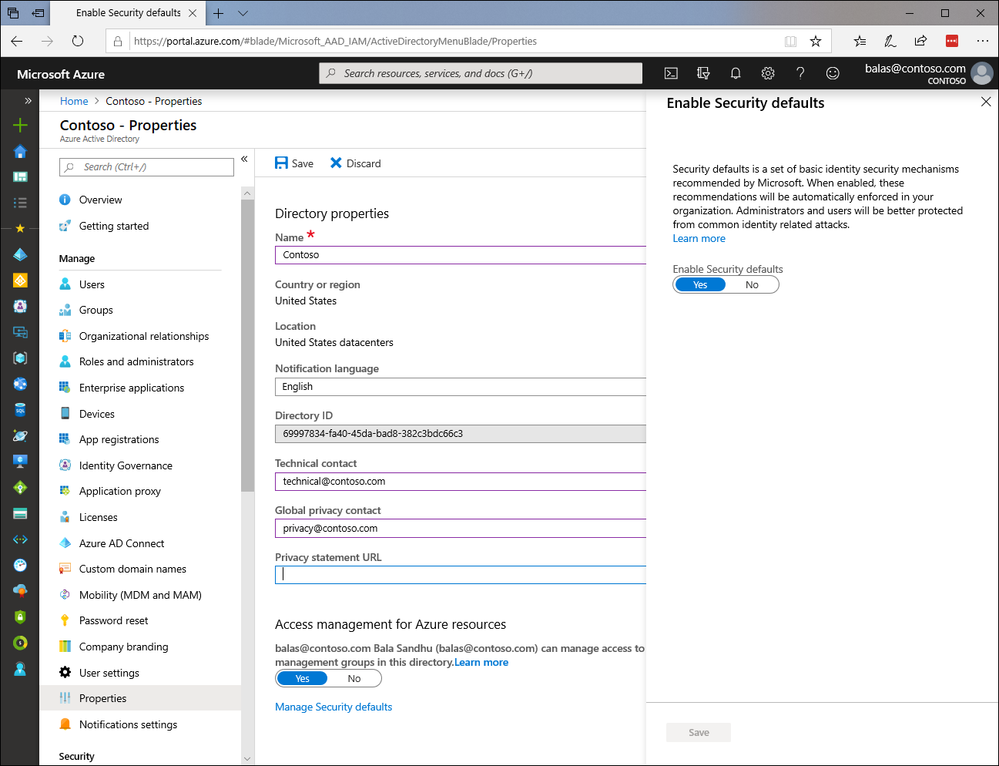
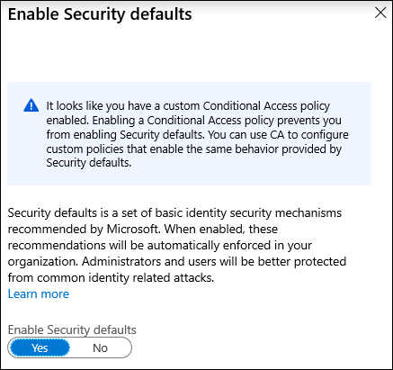

# What are security defaults?

Managing security can be difficult when common identity-related attacks are becoming more and more popular. These attacks include password spray, replay, and phishing.

Security defaults in Azure Active Directory (Azure AD) make it easier to be secure and help protect your organization. Security defaults contain preconfigured security settings for common attacks. 

Microsoft is making security defaults available to everyone. The goal is to ensure that all organizations have a basic level of security enabled at no extra cost. You turn on security defaults in the Azure portal.

 
The following security configurations will be turned on in your tenant. 

## Unified Multi-Factor Authentication registration

All users in your tenant must register for multi-factor authentication (MFA) in the form of the Azure Multi-Factor Authentication service. Users have 14 days to register for Multi-Factor Authentication by using the Microsoft Authenticator app. After the 14 days have passed, the user won't be able to sign in until Multi-Factor Authentication registration is finished.

We understand that some users might be out of office or won't sign in during the 14 days immediately after enabling security defaults. To ensure that every user has ample time to register for Multi-Factor Authentication, the 14-day period is unique for each user. A user's 14-day period begins after their first successful interactive sign-in after you enable security defaults.

## Multi-Factor Authentication enforcement

### Protecting administrators

Users with access to privileged accounts have increased access to your environment. Due to the power these accounts have, you should treat them with special care. One common method to improve the protection of privileged accounts is to require a stronger form of account verification for sign-in. In Azure AD, you can get a stronger account verification by requiring Multi-Factor Authentication.

After registration with Multi-Factor Authentication is finished, the following nine Azure AD administrator roles will be required to perform additional authentication every time they sign in:

- Global administrator
- SharePoint administrator
- Exchange administrator
- Conditional Access administrator
- Security administrator
- Helpdesk administrator or password administrator
- Billing administrator
- User administrator
- Authentication administrator

### Protecting all users

We tend to think that administrator accounts are the only accounts that need extra layers of authentication. Administrators have broad access to sensitive information and can make changes to subscription-wide settings. But attackers tend to target end users. 

After these attackers gain access, they can request access to privileged information on behalf of the original account holder. They can even download the entire directory to perform a phishing attack on your whole organization. 

One common method to improve protection for all users is to require a stronger form of account verification, such as Multi-Factor Authentication, for everyone. After users finish Multi-Factor Authentication registration, they'll be prompted for additional authentication whenever necessary.

### Blocking legacy authentication

To give your users easy access to your cloud apps, Azure AD supports a variety of authentication protocols, including legacy authentication. *Legacy authentication* is a term that refers to an authentication request made by:

- Older Office clients that don't use modern authentication (for example, an Office 2010 client).
- Any client that uses older mail protocols such as IMAP, SMTP, or POP3.

Today, the majority of compromising sign-in attempts come from legacy authentication. Legacy authentication does not support Multi-Factor Authentication. Even if you have a Multi-Factor Authentication policy enabled on your directory, an attacker can authenticate by using an older protocol and bypass Multi-Factor Authentication. 

After security defaults are enabled in your tenant, all authentication requests made by an older protocol will be blocked. Security defaults don't block Exchange ActiveSync.

### Protecting privileged actions

Organizations use a variety of Azure services managed through the Azure Resource Manager API, including:

- Azure portal 
- Azure PowerShell 
- Azure CLI

Using Azure Resource Manager to manage your services is a highly privileged action. Azure Resource Manager can alter tenant-wide configurations, such as service settings and subscription billing. Single-factor authentication is vulnerable to a variety of attacks like phishing and password spray. 

It's important to verify the identity of users who want to access Azure Resource Manager and update configurations. You verify their identity by requiring additional authentication before you allow access.

After you enable security defaults in your tenant, any user who's accessing the Azure portal, Azure PowerShell, or the Azure CLI will need to complete additional authentication. This policy applies to all users who are accessing Azure Resource Manager, whether they're an administrator or a user. 

If the user isn't registered for Multi-Factor Authentication, the user will be required to register by using the Microsoft Authenticator app in order to proceed. No 14-day Multi-Factor Authentication registration period will be provided.

## Deployment considerations

The following additional considerations are related to deployment of security defaults for your tenant.

### Older protocols

Mail clients use older authentication protocols (like IMAP, SMTP, and POP3) to make authentication requests. These protocols don't support Multi-Factor Authentication. Most of the account compromises that Microsoft sees are from attacks against older protocols that are trying to bypass Multi-Factor Authentication. 

To ensure that Multi-Factor Authentication is required for signing in to an administrative account and that attackers can't bypass it, security defaults block all authentication requests made to administrator accounts from older protocols.

> [!WARNING]
> Before you enable this setting, make sure your administrators aren't using older authentication protocols. For more information, see [How to move away from legacy authentication](concept-conditional-access-block-legacy-authentication.md).

### Conditional Access

You can use Conditional Access to configure policies that provide the same behavior enabled by security defaults. If you're using Conditional Access and have Conditional Access policies enabled in your environment, security defaults won't be available to you. If you have a license that provides Conditional Access but don't have any Conditional Access policies enabled in your environment, you are welcome to use security defaults until you enable Conditional Access policies.

Here are step-by-step guides on how you can use Conditional Access to configure equivalent policies:

- [Require MFA for administrators](howto-conditional-access-policy-admin-mfa.md)
- [Require MFA for Azure management](howto-conditional-access-policy-azure-management.md)
- [Block legacy authentication](howto-conditional-access-policy-block-legacy.md)
- [Require MFA for all users](howto-conditional-access-policy-all-users-mfa.md)
- [Require Azure MFA registration](../identity-protection/howto-identity-protection-configure-mfa-policy.md) - Requires Azure AD Identity Protection

## Enabling security defaults

To enable security defaults in your directory:

1. Sign in to the [Azure portal](https://portal.azure.com) as a security administrator, Conditional Access administrator, or global administrator.
1. Browse to **Azure Active Directory** > **Properties**.
1. Select **Manage security defaults**.
1. Set the **Enable security defaults** toggle to **Yes**.
1. Select **Save**.

## Next steps

[Common Conditional Access policies](concept-conditional-access-policy-common.md)

[What is Conditional Access?](overview.md)
