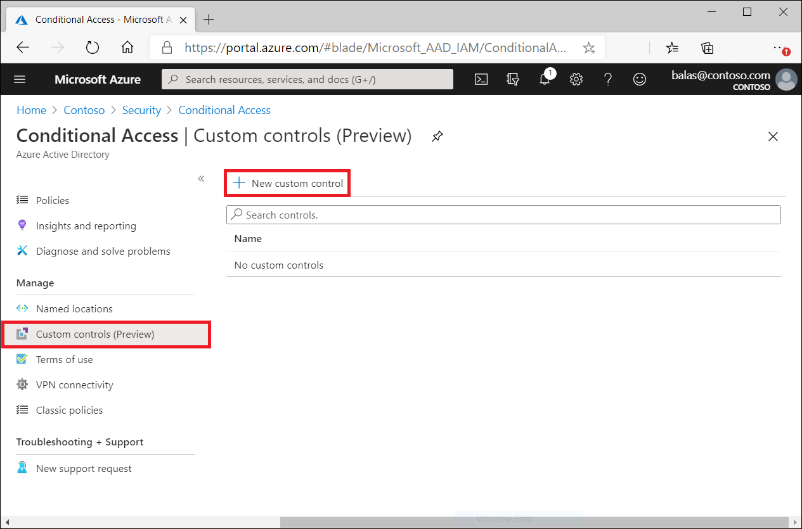

# Custom controls (preview)

Custom controls is a preview capability of the Azure Active Directory. When using custom controls, your users are redirected to a compatible service to satisfy authentication requirements outside of Azure Active Directory. To satisfy this control, a user's browser is redirected to the external service, performs any required authentication, and is then redirected back to Azure Active Directory. Azure Active Directory verifies the response and, if the user was successfully authenticated or validated, the user continues in the Conditional Access flow.

> [!NOTE]
> For more information about changes we are planning to the Custom Control capability, see the February 2020 [Archive for What's new](../fundamentals/whats-new-archive.md#upcoming-changes-to-custom-controls).

## Creating custom controls

Custom Controls works with a limited set of approved authentication providers. To create a custom control, you should first contact the provider that you wish to utilize. Each non-Microsoft provider has its own process and requirements to sign up, subscribe, or otherwise become a part of the service, and to indicate that you wish to integrate with Conditional Access. At that point, the provider will provide you with a block of data in JSON format. This data allows the provider and Conditional Access to work together for your tenant, creates the new control and defines how Conditional Access can tell if your users have successfully performed verification with the provider.

Copy the JSON data and then paste it into the related textbox. Do not make any changes to the JSON unless you explicitly understand the change you're making. Making any change could break the connection between the provider and Microsoft and potentially lock you and your users out of your accounts.

The option to create a custom control is in the **Manage** section of the **Conditional Access** page.

Clicking **New custom control**, opens a blade with a textbox for the JSON data of your control.  

## Deleting custom controls

To delete a custom control, you must first ensure that it isn't being used in any Conditional Access policy. Once complete:

1. Go to the Custom controls list
1. Click …  
1. Select **Delete**.

## Editing custom controls

To edit a custom control, you must delete the current control and create a new control with the updated information.

## Known limitations

Custom controls cannot be used with Identity Protection's automation requiring Azure AD Multi-Factor Authentication, Azure AD self-service password reset (SSPR), satisfying multi-factor authentication claim requirements, to elevate roles in Privileged Identity Manager (PIM), as part of Intune device enrollment, or when joining devices to Azure AD.

## Next steps

- [Conditional Access common policies](concept-conditional-access-policy-common.md)

- [Report-only mode](concept-conditional-access-report-only.md)

- [Simulate sign in behavior using the Conditional Access What If tool](troubleshoot-conditional-access-what-if.md)
