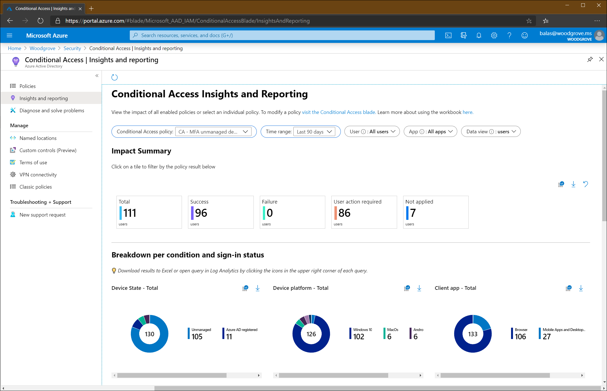
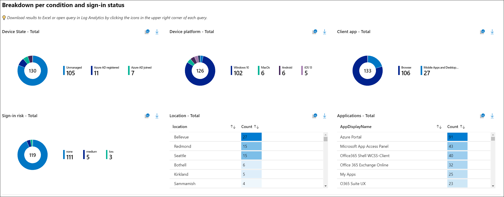
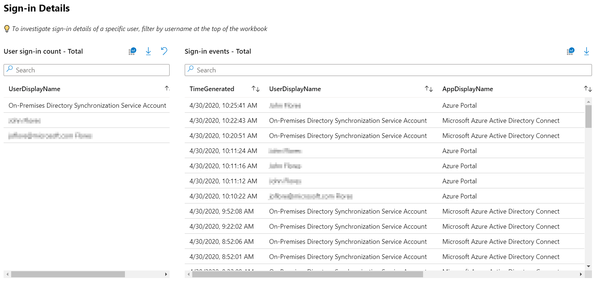

# Conditional Access insights and reporting

The Conditional Access insights and reporting workbook enables you to understand the impact of Conditional Access policies in your organization over time. During sign-in, one or more Conditional Access policies may apply, granting access if certain grant controls are satisfied or denying access otherwise. Because multiple Conditional Access policies may be evaluated during each sign-in, the insights and reporting workbook lets you examine the impact of an individual policy or a subset of all policies.  

## Prerequisites

To enable the insights and reporting workbook, your tenant must have a Log Analytics workspace to retain sign-in logs data. Users must have Azure AD Premium P1 or P2 licenses to use Conditional Access.

The following roles can access insights and reporting:  

- Conditional Access administrator 
- Security reader 
- Security administrator 
- Global reader 
- Global administrator 

Users also need one of the following Log Analytics workspace roles:  

- Reader 
- Monitoring reader 
- Log Analytics reader 
- Contributor  
- Owner 

### Stream sign-in logs from Azure AD to Azure Monitor logs 

If you have not integrated Azure AD logs with Azure Monitor logs, you will need to take the following steps before the workbook will load:  

1. [Create a Log Analytics workspace in Azure Monitor](../../azure-monitor/learn/quick-create-workspace.md).
1. [Integrate Azure AD logs with Azure Monitor logs](../reports-monitoring/howto-integrate-activity-logs-with-log-analytics.md).

## How it works 

To access the insights and reporting workbook:  

1. Sign in to the **Azure portal**.
1. Browse to **Azure Active Directory** > **Security** > **Conditional Access** > **Insights and reporting**.

### Get started: Select parameters 

The insights and reporting dashboard lets you see the impact of one or more Conditional Access policies over a specified period. Start by setting each of the parameters at the top of the workbook. 

**Conditional Access policy**: Select one or more Conditional Access policies to view their combined impact. Policies are separated into two groups: Enabled and Report-only policies. By default, all Enabled policies are selected. These enabled policies are the policies currently enforced in your tenant.  

**Time range**: Select a time range from 4 hours to as far back as 90 days. If you select a time range further back than when you integrated the Azure AD logs with Azure Monitor, only sign-ins after the time of integration will appear.  

**User**: By default, the dashboard shows the impact of the selected policies for all users. To filter by an individual user, type the name of the user into the text field. To filter by all users, type “All users” into the text field or leave the parameter empty. 

**App**: By default, the dashboard shows the impact of the selected policies for all apps. To filter by an individual app, type the name of the app into the text field. To filter by all apps, type “All apps” into the text field or leave the parameter empty. 

**Data view**: Select whether you want the dashboard to show results in terms of the number of users or number of sign-ins. An individual user may have hundreds of sign-ins to many apps with many different outcomes during a given time range. If you select the data view to be users, a user could be included in both the Success and Failure counts (for example, if there are 10 users, 8 of them could have had a result of success in the past 30 days and 9 of them could have had a result of failure in the past 30 days).

## Impact summary 

Once the parameters have been set, the impact summary loads. The summary shows how many users or sign-ins during the time range resulted in “Success”, “Failure”, ”User action required” or “Not applied” when the selected policies were evaluated.  

**Total**: The number of users or sign-ins during the time period where at least one of the selected policies was evaluated.

**Success**: The number of users or sign-ins during the time period where the combined result of the selected policies was “Success” or “Report-only: Success”.

**Failure**: The number of users or sign-ins during the time period where the result of at least one of the selected policies was “Failure” or “Report-only: Failure”.

**User action required**: The number of users or sign-ins during the time period where the combined result of the selected policies was “Report-only: User action required”. User action is required when an interactive grant control, such as multi-factor authentication is required by a report-only Conditional Access policy. Since interactive grant controls are not enforced by report-only policies, success or failure cannot be determined.  

**Not applied**: The number of users or sign-ins during the time period where none of the selected policies applied.

### Understanding the impact 

View the breakdown of users or sign-ins for each of the conditions. You can filter the sign-ins of a particular result (for example, Success or Failure) by selecting on of the summary tiles at the top of the workbook. You can see the breakdown of sign-ins for each of the Conditional Access conditions: device state, device platform, client app, location, application, and sign-in risk.  

## Sign-in details 

You can also investigate the sign-ins of a specific user by searching for sign-ins at the bottom of the dashboard. The query on the left displays the most frequent users. Selecting a user will filter the query to the right.  

## Troubleshooting

### Why is the workbook taking a long time to load?  

Depending on the time range selected and the size of your tenant, the workbook may be evaluating an extraordinarily large number of sign-in events. For large tenants, the volume of sign-ins may exceed the query capacity of Log Analytics. Try shortening the time range to 4 hours to see if the workbook loads.  

### After loading for a few minutes, why is the workbook returning zero results? 

When the volume of sign-ins exceeds the query capacity of Log Analytics, the workbook will return zero results. Try shortening the time range to 4 hours to see if the workbook loads.  

### Can I save my parameter selections?  

You can save your parameter selections at the top of the workbook by going to **Azure Active Directory** > **Workbooks** > **Conditional Access Insights and reporting**. Here you will find the workbook template, where you can edit the workbook and save a copy to your workspace, including the parameter selections, in **My reports** or **Shared reports**. 

### Can I edit and customize the workbook with additional queries? 

You can edit and customize the workbook by going to **Azure Active Directory** > **Workbooks** > **Conditional Access Insights and reporting**. Here you will find the workbook template, where you can edit the workbook and save a copy to your workspace, including the parameter selections, in **My reports** or **Shared reports**. To start editing the queries, click **Edit** at the top of the workbook.  
 
## Next steps

[Conditional Access report-only mode](concept-conditional-access-report-only.md)
