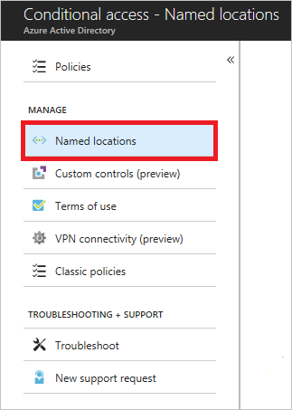
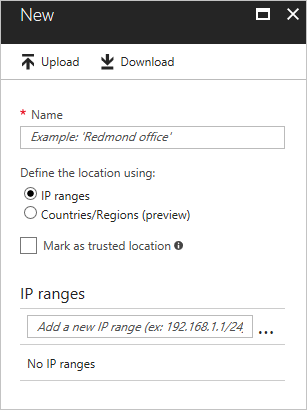
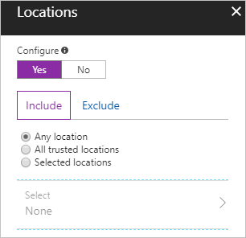

# What is the location condition in Azure Active Directory Conditional Access? 

With [Azure Active Directory (Azure AD) Conditional Access](../active-directory-conditional-access-azure-portal.md), you can control how authorized users can access your cloud apps. The location condition of a Conditional Access policy enables you to tie access controls settings to the network locations of your users.

This article provides you with the information you need to configure the location condition.

## Locations

Azure AD enables single sign-on to devices, apps, and services from anywhere on the public internet. With the location condition, you can control access to your cloud apps based on the network location of a user. Common use cases for the location condition are:

- Requiring multi-factor authentication for users accessing a service when they are off the corporate network.
- Blocking access for users accessing a service from specific countries or regions.

A location is a label for a network location that either represents a named location or multi-factor authentication Trusted IPs.

## Named locations

With named locations, you can create logical groupings of IP address ranges or countries and regions.

You can access your named locations in the **Manage** section of the Conditional Access page.

A named location has the following components:

- **Name** - The display name of a named location.
- **IP ranges** - One or more IPv4 address ranges in CIDR format. Specifying an IPv6 address range is not supported.

   > [!NOTE]
   > IPv6 address ranges cannot currently be included in a named location. This means IPv6 ranges cannot be excluded from a Conditional Access policy.

- **Mark as trusted location** - A flag you can set for a named location to indicate a trusted location. Typically, trusted locations are network areas that are controlled by your IT department. In addition to Conditional Access, trusted named locations are also used by Azure Identity Protection and Azure AD security reports to reduce [false positives](../reports-monitoring/concept-risk-events.md#impossible-travel-to-atypical-locations-1).
- **Countries/Regions** - This option enables you to select one or more country or region to define a named location.
- **Include unknown areas** - Some IP addresses are not mapped to a specific country or region. This option allows you to choose if these IP addresses should be included in the named location. Use this setting when the policy using the named location should apply to unknown locations.

The number of named locations you can configure is constrained by the size of the related object in Azure AD. You can configure locations based on of the following limitations:

- One named location with up to 1200 IP ranges.
- A maximum of 90 named locations with one IP range assigned to each of them.

Conditional Access policy applies to IPv4 and IPv6 traffic. Currently named locations do not allow IPv6 ranges to be configured. This limitation causes the following situations:

- Conditional Access policy cannot be targeted to specific IPv6 ranges
- Conditional Access policy cannot exclude specific IPV6 ranges

If a policy is configured to apply to “Any location”, it will apply to IPv4 and IPv6 traffic. Named locations configured for specified countries and regions only support IPv4 addresses. IPv6 traffic is only included if the option to “include unknown areas” selected.

## Trusted IPs

You can also configure IP address ranges representing your organization's local intranet in the [multi-factor authentication service settings](https://account.activedirectory.windowsazure.com/usermanagement/mfasettings.aspx). This feature enables you to configure up to 50 IP address ranges. The IP address ranges are in CIDR format. For more information, see [Trusted IPs](../authentication/howto-mfa-mfasettings.md#trusted-ips).  

If you have Trusted IPs configured, they show up as **MFA Trusted IPS** in the list of locations for the location condition.

### Skipping multi-factor authentication

On the multi-factor authentication service settings page, you can identify corporate intranet users by selecting  **Skip multi-factor authentication for requests from federated users on my intranet**. This setting indicates that the inside corporate network claim, which is issued by AD FS, should be trusted and used to identify the user as being on the corporate network. For more information, see [Enable the Trusted IPs feature by using Conditional Access](../authentication/howto-mfa-mfasettings.md#enable-the-trusted-ips-feature-by-using-conditional-access).

After checking this option, including the named location **MFA Trusted IPS** will apply to any policies with this option selected.

For mobile and desktop applications, which have long lived session lifetimes, Conditional Access is periodically reevaluated. The default is once an hour. When the inside corporate network claim is only issued at the time of the initial authentication, Azure AD may not have a list of trusted IP ranges. In this case, it is more difficult to determine if the user is still on the corporate network:

1. Check if the user’s IP address is in one of the trusted IP ranges.
2. Check whether the first three octets of the user’s IP address match the first three octets of the IP address of the initial authentication. The IP address is compared with the initial authentication when the inside corporate network claim was originally issued and the user location was validated.

If both steps fail, a user is considered to be no longer on a trusted IP.

## Location condition configuration

When you configure the location condition, you have the option to distinguish between:

- Any location
- All trusted locations
- Selected locations

### Any location

By default, selecting **Any location** causes a policy to be applied to all IP addresses, which means any address on the Internet. This setting is not limited to IP addresses you have configured as named location. When you select **Any location**, you can still exclude specific locations from a policy. For example, you can apply a policy to all locations except trusted locations to set the scope to all locations, except the corporate network.

### All trusted locations

This option applies to:

- All locations that have been marked as trusted location
- **MFA Trusted IPS** (if configured)

### Selected locations

With this option, you can select one or more named locations. For a policy with this setting to apply, a user needs to connect from any of the selected locations. When you click **Select** the named network selection control that shows the list of named networks opens. The list also shows if the network location has been marked as trusted. The named location called **MFA Trusted IPs** is used to include the IP settings that can be configured in the multi-factor authentication service setting page.

## What you should know

### When is a location evaluated?

Conditional Access policies are evaluated when:

- A user initially signs in to a web app, mobile or desktop application.
- A mobile or desktop application that uses modern authentication, uses a refresh token to acquire a new access token. By default this check is once an hour.

This check means for mobile and desktop applications using modern authentication, a change in location would be detected within an hour of changing the network location. For mobile and desktop applications that don’t use modern authentication, the policy is applied on each token request. The frequency of the request can vary based on the application. Similarly, for web applications, the policy is applied at initial sign-in and is good for the lifetime of the session at the web application. Due to differences in session lifetimes across applications, the time between policy evaluation will also vary. Each time the application requests a new sign-in token, the  policy is applied.

By default, Azure AD issues a token on an hourly basis. After moving off the corporate network, within an hour the policy is enforced for applications using modern authentication.

### User IP address

The IP address that is used in policy evaluation is the public IP address of the user. For devices on a private network, this IP address is not the client IP of the user’s device on the intranet, it is the address used by the network to connect to the public internet.

> [!WARNING]
> If your device has only an IPv6 address, configuring the location condition is not supported.

### Bulk uploading and downloading of named locations

When you create or update named locations, for bulk updates, you can upload or download a CSV file with the IP ranges. An upload replaces the IP ranges in the list with those from the file. Each row of the file contains one IP Address range in CIDR format.

### Cloud proxies and VPNs

When you use a cloud hosted proxy or VPN solution, the IP address Azure AD uses while evaluating a policy is the IP address of the proxy. The X-Forwarded-For (XFF) header that contains the user’s public IP address is not used because there is no validation that it comes from a trusted source, so would present a method for faking an IP address.

When a cloud proxy is in place, a policy that is used to require a domain joined device can be used, or the inside corpnet claim from AD FS.

### API support and PowerShell

API and PowerShell is not yet supported for named locations, or for Conditional Access policies.

## Next steps

- If you want to know how to configure a Conditional Access policy, see [Require MFA for specific apps with Azure Active Directory Conditional Access](app-based-mfa.md).
- If you are ready to configure Conditional Access policies for your environment, see the [best practices for Conditional Access in Azure Active Directory](best-practices.md).
