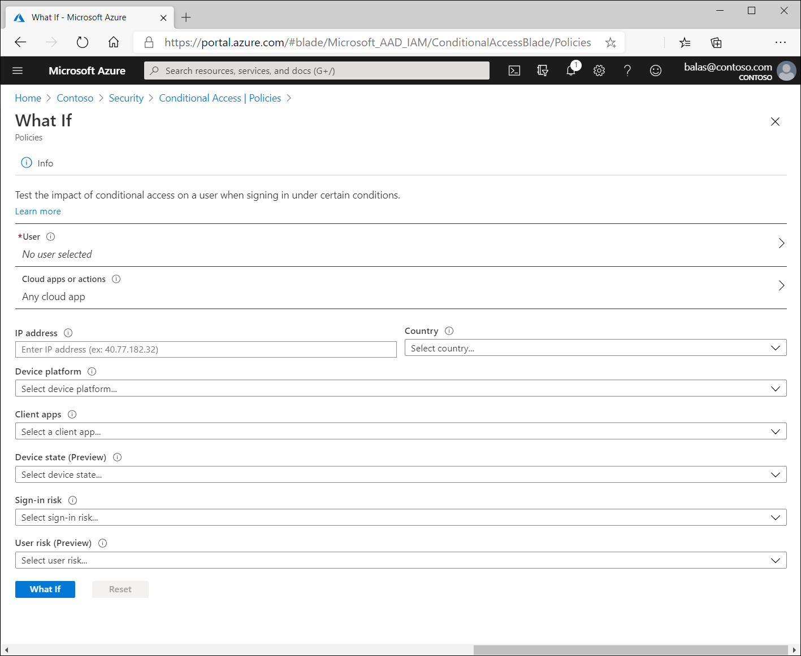
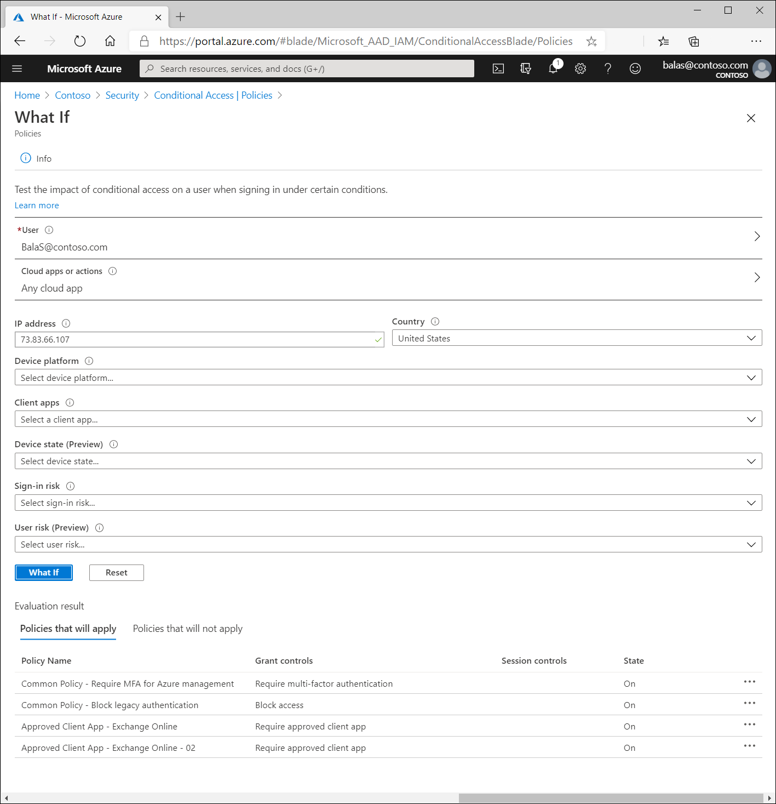

# Troubleshooting Conditional Access using the What If tool

The [What If tool](what-if-tool.md) in Conditional Access is powerful when trying to understand why a policy was or wasn't applied to a user in a specific circumstance or if a policy would apply in a known state.

The What If tool is located in the **Azure portal** > **Azure Active Directory** > **Conditional Access** > **What If**.

> [!NOTE]
> The What If tool currently does not evaluate policies in report-only mode.

## Gathering information

The What If tool requires only a **User** to get started. 

The following additional information is optional but will help to narrow the scope for specific cases.

* Cloud apps or actions
* IP address 
* Country/Region
* Device platform
* Client apps (preview)
* Device state (preview) 
* Sign-in risk

This information can be gathered from the user, their device, or the Azure AD sign-ins log.

## Generating results

Input the criteria gathered in the previous section and select **What If** to generate a list of results. 

At any point, you can select **Reset** to clear any criteria input and return to the default state.

## Evaluating results

### Policies that will apply

This list will show which Conditional Access policies would apply given the conditions. The list will include both the grant and session controls that apply. Examples include requiring multi-factor authentication to access a specific application.

### Policies that will not apply

This list will show Conditional Access policies that wouldn't apply if the conditions applied. The list will include any policies and the reason why they don't apply. Examples include users and groups that may be excluded from a policy.

## Use case

Many organizations create policies based on network locations, permitting trusted locations and blocking locations where access should not occur.

To validate that a configuration has been made appropriately, an administrator could use the What If tool to mimic access, from a location that should be allowed and from a location that should be denied.

In this instance, the user would be blocked from accessing any cloud app on their trip to North Korea as Contoso has blocked access from that location.

This test could be expanded to incorporate other data points to narrow the scope.

## Next steps

* [What is Conditional Access?](overview.md)
* [What is Azure Active Directory Identity Protection?](../identity-protection/overview-identity-protection.md)
* [What is a device identity?](../devices/overview.md)
* [How it works: Azure AD Multi-Factor Authentication](../authentication/concept-mfa-howitworks.md)