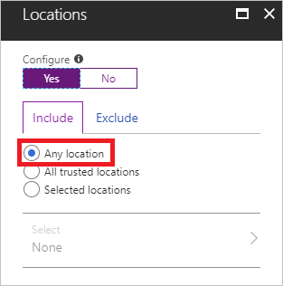

# How to: Require MFA for access from untrusted networks with conditional access   

Azure Active Directory (Azure AD) enables single sign-on to devices, apps, and services from anywhere. Your users can access your cloud apps not only from your organization's network, but also from any untrusted Internet location. A common best practice for access from untrusted networks is to require multi-factor authentication (MFA).

This article gives you the information you need to configure a conditional access policy that requires MFA for access from untrusted networks. 

## Prerequisites

This article assumes that you are familiar with: 

- The [basic concepts](overview.md) of Azure AD conditional access 
- The [best practices](best-practices.md) for configuring conditional access policies in the Azure portal

## Scenario description

To master the balance between security and productivity, it might be sufficient for you to only require a password for sign-ins from your organization's network. However, for access from an untrusted network location, there is an increased risk that sign-ins are not performed by legitimate users. To address this concern, you can block access from untrusted networks. Alternatively, you can also require multi-factor authentication (MFA) to gain back additional assurance that an attempt was made by the legitimate owner of the account. 

With Azure AD conditional access, you can address this requirement with a single policy that grants access: 

- To selected cloud apps

- For selected users and groups  

- Requiring multi-factor authentication 

- When access is originated from: 

    - A location that is not trusted

## Implementation

The challenge of this scenario is to translate *access from an untrusted network location* into a conditional access condition. In a conditional access policy, you can configure the [locations condition](location-condition.md) to address scenarios that are related to network locations. The locations condition enables you to select named locations, which are logical groupings of IP address ranges, countries and regions.  

Typically, your organization owns one or more address ranges, for example, 199.30.16.0 - 199.30.16.24.
You can configure a named location by:

- Specifying this range (199.30.16.0/24) 

- Assigning a descriptive name such as **Corporate Network** 

Instead of trying to define what all locations are that are not trusted, you can:

- Include any location 

    

- Exclude all trusted locations 

    

## Policy deployment

With the approach outlined in this article, you can now configure a conditional access policy for untrusted locations. To make sure that your policy works as expected, the recommended best practice is to test it before rolling it out into production. Ideally, use a test tenant to verify whether your new policy works as intended. For more information, see [How to deploy a new policy](best-practices.md#how-should-you-deploy-a-new-policy). 

## Next steps

If you would like to learn more about conditional access, see [What is conditional access in Azure Active Directory?](../active-directory-conditional-access-azure-portal.md)
