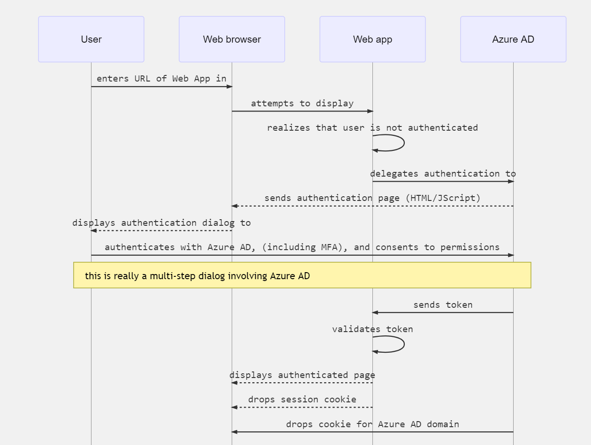
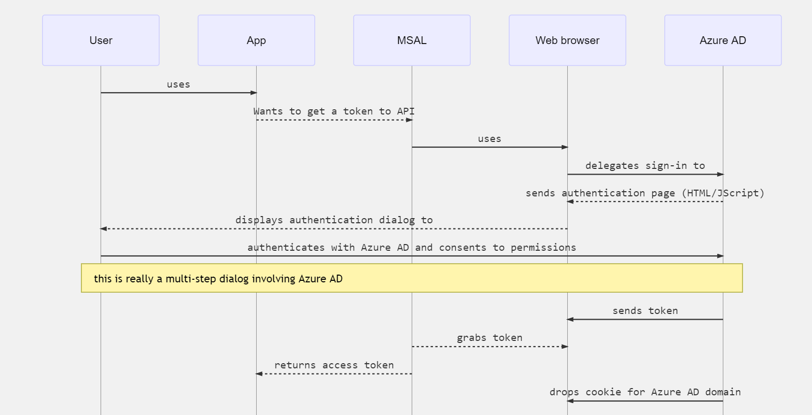

# App sign-in flow with Microsoft identity platform

This topic discusses the basic sign-in flow for web, desktop, and mobile apps using Microsoft identity platform. See [Authentication flows and app scenarios](authentication-flows-app-scenarios.md) to learn about sign-in scenarios supported by Microsoft identity platform.

## Web app sign-in flow

When a user navigates in the browser to a web app, the following happens:

* The web app determines whether the user is authenticated.
* If the user isn't authenticated, the web app delegates to Azure AD to sign in the user. That sign in will be compliant with the policy of the organization, which may mean asking the user to enter their credentials, using multi-factor-authentication, or not using a password at all (for example using Windows Hello).
* The user is asked to consent to the access that the client app needs. This is why client apps need to be registered with Azure AD, so that Microsoft identity platform can deliver tokens representing the access that the user has consented to.

When the user has successfully authenticated:

* Microsoft identity platform sends a token to the web app.
* A cookie is saved, associated with Azure AD's domain, that contains the identity of the user in the browser's cookie jar. The next time an app uses the browser to navigate to the Microsoft identity platform authorization endpoint, the browser presents the cookie so that the user doesn't have to sign in again. This is also the way that SSO is achieved. The cookie is produced by Azure AD and can only be understood by Azure AD.
* The web app then validates the token. If the validation succeeds, the web app displays the protected page and saves a session cookie in the browser's cookie jar. When the user navigates to another page, the web app knows that the user is authenticated based on the session cookie.

The following sequence diagram summarizes this interaction:

### How a web app determines if the user is authenticated

Web app developers can indicate whether all or only certain pages require authentication. For example, in ASP.NET/ASP.NET Core, this is done by adding the `[Authorize]` attribute to the controller actions.

This attribute causes ASP.NET to check for the presence of a session cookie containing the identity of the user. If a cookie isn't present, ASP.NET redirects authentication to the specified identity provider. If the identity provider is Azure AD, the web app redirects authentication to `https://login.microsoftonline.com`, which displays a sign-in dialog.

### How a web app delegates sign-in to Microsoft identity platform and obtains a token

User authentication happens via the browser. The OpenID protocol uses standard HTTP protocol messages.

* The web app sends an HTTP 302 (redirect) to the browser to use Microsoft identity platform.
* When the user is authenticated, Microsoft identity platform sends the token to the web app by using a redirect through the browser.
* The redirect is provided by the web app in the form of a redirect URI. This redirect URI is registered with the Azure AD application object. There can be several redirect URIs because the application may be deployed at several URLs. So the web app will also need to specify the redirect URI to use.
* Azure AD verifies that the redirect URI sent by the web app is one of the registered redirect URIs for the app.

## Desktop and mobile app sign-in flow

The flow described above applies, with slight differences, to desktop and mobile applications.

Desktop and mobile applications can use an embedded Web control, or a system browser, for authentication. The following diagram shows how a Desktop or mobile app uses the Microsoft authentication library (MSAL) to acquire access tokens and call web APIs.

MSAL uses a browser to get tokens. As with web apps, authentication is delegated to Microsoft identity platform.

Because Azure AD saves the same identity cookie in the browser as it does for web apps, if the native or mobile app uses the system browser it will immediately get SSO with the corresponding web app.

By default, MSAL uses the system browser. The exception is .NET Framework desktop applications where an embedded control is used to provide a more integrated user experience.

## Next steps

For other topics covering authentication and authorization basics:

* See [Authentication vs. authorization](authentication-vs-authorization.md) to learn about the basic concepts of authentication and authorization in Microsoft identity platform.
* See [Security tokens](security-tokens.md) to learn how access tokens, refresh tokens, and ID tokens are used in authentication and authorization.
* See [Application model](application-model.md) to learn about the process of registering your application so it can integrate with Microsoft identity platform.

To learn more about app sign-in flow:

* See [Authentication flows and app scenarios](authentication-flows-app-scenarios.md) to learn more about other scenarios for authenticating users supported by Microsoft identity platform.
* See [MSAL libraries](msal-overview.md) to learn about the Microsoft libraries that help you develop applications that work with Microsoft Accounts, Azure AD accounts, and Azure AD B2C users all in a single, streamlined programming model.
