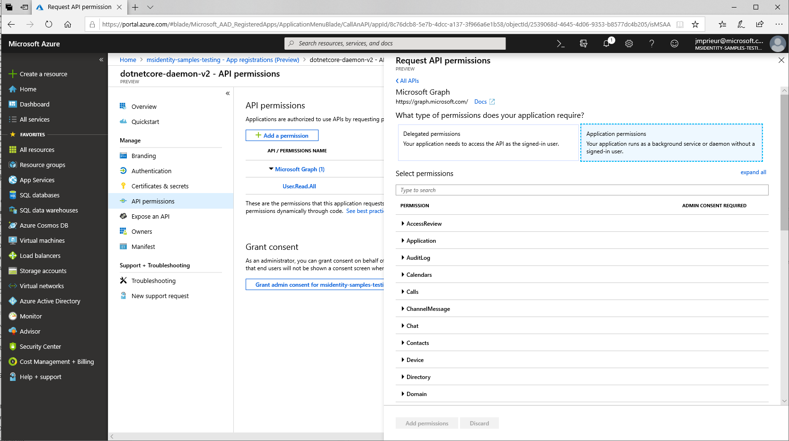

# Daemon app that calls web APIs - app registration

For a daemon application, here's what you need to know when registering the app.

## Supported account types

Given that daemon applications only make sense in Azure AD tenants, when you create the application you'll need to choose:

- either **Accounts in this organizational directory only**. This choice is the most common case, as daemon applications are usually written by line-of-business (LOB) developers.
- or **Accounts in any organizational directory**. You'll make this choice if you're an ISV providing a utility tool to your customers. You'll need customer's tenants admins to approve it.

## Authentication - no Reply URI needed

In the case where your confidential client application uses **only** the client credentials flow, the Reply URI doesn't need to be registered. It's not needed either for the application configuration/construction. The client credentials flow doesn't use it.

## API Permissions - app permissions and admin consent

A daemon application can only request application permissions to APIs (not delegated permissions). In the **API Permission** page for the application registration, after you've selected **Add a permission** and chosen the API family, choose **Application permissions**, and then select your permissions

> [!NOTE]
> The Web API that you want to call needs to define **application permissions (app roles)**, not delegated permissions. For details on how to expose such an API, see [Protected web API: App registration - when your web API is called by a daemon app](scenario-protected-web-api-app-registration.md#if-your-web-api-is-called-by-a-daemon-app)

Daemon applications require have a tenant admin pre-consent to the application calling the web API. This consent is provided in the same **API Permission** page, by a tenant admin selecting **Grant admin consent to *our organization***

If you're an ISV building a multi-tenant application, you'd want to check the [Deployment - case of multi-tenant daemon apps](scenario-daemon-production.md#deployment---case-of-multi-tenant-daemon-apps) paragraph.

[!INCLUDE [Pre-requisites](../../../includes/active-directory-develop-scenarios-registration-client-secrets.md)]

## Next steps

> [!div class="nextstepaction"]
> [Daemon app - app code configuration](./scenario-daemon-app-configuration.md)
