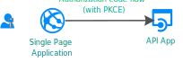

# Scenario: Single-page application

Learn all you need to build a single-page application (SPA).

## Getting started

If you haven't already,  create your first app by completing the JavaScript SPA quickstart:

[Quickstart: Single-page application](./quickstart-v2-javascript.md)

## Overview

Many modern web applications are built as client-side single-page applications. Developers write them by using JavaScript or a SPA framework such as Angular, Vue, and React. These applications run on a web browser and have different authentication characteristics than traditional server-side web applications.

The Microsoft identity platform provides **two** options to enable single-page applications to sign in users and get tokens to access back-end services or web APIs:

- [OAuth 2.0 Authorization code flow (with PKCE)](./v2-oauth2-auth-code-flow.md). The authorization code flow allows the application to exchange an authorization code for **ID** tokens to represent the authenticated user and **Access** tokens needed to call protected APIs. In addition, it returns **Refresh** tokens that provide long-term access to resources on behalf of users without requiring interaction with those users. This is the **recommended** approach.

- [OAuth 2.0 implicit flow](./v2-oauth2-implicit-grant-flow.md). The implicit grant flow allows the application to get **ID** and **Access** tokens. Unlike the authorization code flow, implicit grant flow does not return a **Refresh token**.

This authentication flow does not include application scenarios that use cross-platform JavaScript frameworks such as Electron and React-Native. They require further capabilities for interaction with the native platforms.

## Specifics

To enable this scenario for your application, you need:

* Application registration with Azure Active Directory (Azure AD). The registration steps differ between the implicit grant flow and authorization code flow.
* Application configuration with the registered application properties, such as the application ID.
* Using Microsoft Authentication Library for JavaScript (MSAL.js) to do the authentication flow to sign in and acquire tokens.

## Recommended reading

[!INCLUDE [recommended-topics](../../../includes/active-directory-develop-scenarios-prerequisites.md)]

## Next steps

> [!div class="nextstepaction"]
> [App registration](scenario-spa-app-registration.md)
