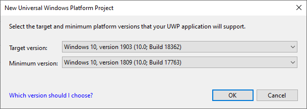
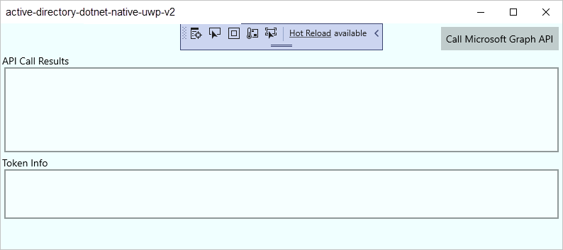
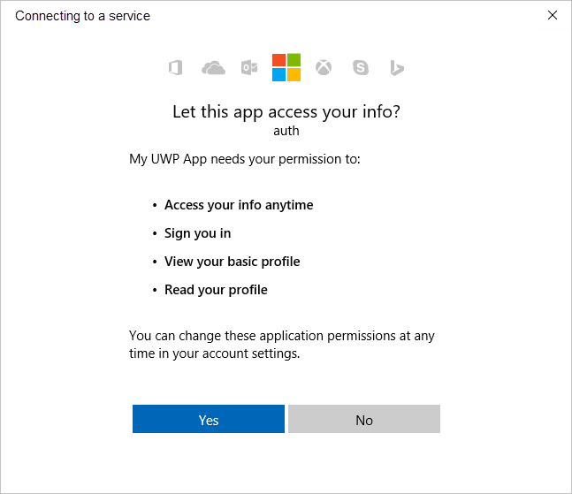
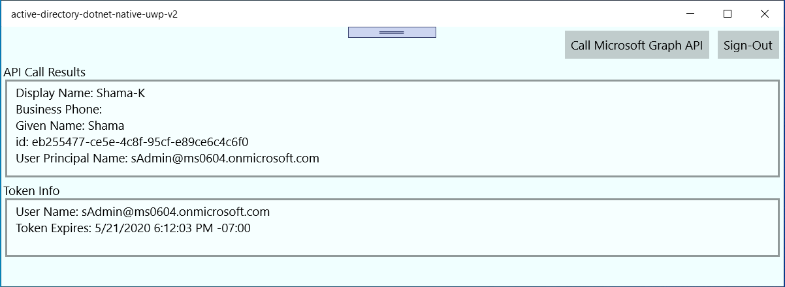

# Call Microsoft Graph API from a Universal Windows Platform application (XAML)

> [!div renderon="docs"]

This guide explains how a native Universal Windows Platform (UWP) application can request an access token. The application then calls Microsoft Graph API. The guide also applies to other APIs that require access tokens from the Microsoft identity platform endpoint.

At the end of this guide, your application calls a protected API by using personal accounts. Examples are outlook.com, live.com, and others. Your application also calls work and school accounts from any company or organization that has Azure Active Directory (Azure AD).

>[!NOTE]
> This guide requires Visual Studio with Universal Windows Platform development installed. See [Get set up](https://docs.microsoft.com/windows/uwp/get-started/get-set-up) for instructions to download and configure Visual Studio to develop Universal Windows Platform apps.

>[!NOTE]
> If you are new to the Microsoft identity platform, we recommend you start with the [Call the Microsoft Graph API from a Universal Windows Platform (UWP) application quickstart](quickstart-v2-uwp.md).

## How this guide works


This guide creates a sample UWP application that queries Microsoft Graph API. For this scenario, a token is added to HTTP requests by using the Authorization header. Microsoft Authentication Library (MSAL) handles token acquisitions and renewals.

## NuGet packages

This guide uses the following NuGet package:

|Library|Description|
|---|---|
|[Microsoft.Identity.Client](https://www.nuget.org/packages/Microsoft.Identity.Client)|Microsoft Authentication Library|

## Set up your project

This section provides step-by-step instructions to integrate a Windows Desktop .NET application (XAML) with Sign-In with Microsoft. Then the application can query Web APIs that require a token, such as Microsoft Graph API.

This guide creates an application that displays a button that queries Graph API and a button to sign out. It also displays text boxes that contain the results of the calls.

> [!NOTE]
> Do you want to download this sample's Visual Studio project instead of creating it? [Download a project](https://github.com/Azure-Samples/active-directory-dotnet-native-uwp-v2/archive/msal3x.zip) and skip to the [application registration](#register-your-application "application registration step") step to configure the code sample before it runs.

### Create your application

1. Open Visual Studio and select **Create a new project**.
1. In **Create a new project**, choose **Blank App (Universal Windows)** for C# and select **Next**.
1. In **Configure your new project**, name the app, and select **Create**.
1. If prompted, in **New Universal Windows Platform Project**, select any version for **Target** and **Minimum** versions, and select **OK**.

   

### Add Microsoft Authentication Library to your project

1. In Visual Studio, select **Tools** > **NuGet Package Manager** > **Package Manager Console**.
1. Copy and paste the following command in the **Package Manager Console** window:

    ```powershell
    Install-Package Microsoft.Identity.Client
    ```

   > [!NOTE]
   > This command installs [Microsoft Authentication Library](https://aka.ms/msal-net). MSAL acquires, caches, and refreshes user tokens that access APIs protected by Microsoft identity platform.

### Create your application’s UI

Visual Studio creates *MainPage.xaml* as a part of your project template. Open this file, and then replace your application’s **Grid** node with the following code:

```xml
<Grid>
    <StackPanel Background="Azure">
        <StackPanel Orientation="Horizontal" HorizontalAlignment="Right">
            <Button x:Name="CallGraphButton" Content="Call Microsoft Graph API" HorizontalAlignment="Right" Padding="5" Click="CallGraphButton_Click" Margin="5" FontFamily="Segoe Ui"/>
            <Button x:Name="SignOutButton" Content="Sign-Out" HorizontalAlignment="Right" Padding="5" Click="SignOutButton_Click" Margin="5" Visibility="Collapsed" FontFamily="Segoe Ui"/>
        </StackPanel>
        <TextBlock Text="API Call Results" Margin="2,0,0,-5" FontFamily="Segoe Ui" />
        <TextBox x:Name="ResultText" TextWrapping="Wrap" MinHeight="120" Margin="5" FontFamily="Segoe Ui"/>
        <TextBlock Text="Token Info" Margin="2,0,0,-5" FontFamily="Segoe Ui" />
        <TextBox x:Name="TokenInfoText" TextWrapping="Wrap" MinHeight="70" Margin="5" FontFamily="Segoe Ui"/>
    </StackPanel>
</Grid>
```

### Use MSAL to get a token for Microsoft Graph API

This section shows how to use MSAL to get a token for Microsoft Graph API. Make changes to the *MainPage.xaml.cs* file.

1. In *MainPage.xaml.cs*, add the following references:

    ```csharp
    using Microsoft.Identity.Client;
    using System.Diagnostics;
    using System.Threading.Tasks;
    ```

1. Replace your `MainPage` class with the following code:

    ```csharp
    public sealed partial class MainPage : Page
    {
        //Set the API Endpoint to Graph 'me' endpoint
        string graphAPIEndpoint = "https://graph.microsoft.com/v1.0/me";

        //Set the scope for API call to user.read
        string[] scopes = new string[] { "user.read" };

        // Below are the clientId (Application Id) of your app registration and the tenant information. 
        // You have to replace:
        // - the content of ClientID with the Application Id for your app registration
        // - the content of Tenant with the information about the accounts allowed to sign in in your application:
        //   - for Work or School account in your org, use your tenant ID, or domain
        //   - for any Work or School accounts, use organizations
        //   - for any Work or School accounts, or Microsoft personal account, use common
        //   - for Microsoft Personal account, use consumers
        private const string ClientId = "0b8b0665-bc13-4fdc-bd72-e0227b9fc011";        

        public IPublicClientApplication PublicClientApp { get; } 

        public MainPage()
        {
          this.InitializeComponent();

          PublicClientApp = PublicClientApplicationBuilder.Create(ClientId)
                .WithAuthority(AadAuthorityAudience.AzureAdAndPersonalMicrosoftAccount)
                .WithLogging((level, message, containsPii) =>
                {
                    Debug.WriteLine($"MSAL: {level} {message} ");
                }, LogLevel.Warning, enablePiiLogging:false,enableDefaultPlatformLogging:true)
                .WithUseCorporateNetwork(true)
                .Build();
        }

        /// <summary>
        /// Call AcquireTokenInteractive - to acquire a token requiring user to sign-in
        /// </summary>
        private async void CallGraphButton_Click(object sender, RoutedEventArgs e)
        {
         AuthenticationResult authResult = null;
         ResultText.Text = string.Empty;
         TokenInfoText.Text = string.Empty;

         // It's good practice to not do work on the UI thread, so use ConfigureAwait(false) whenever possible.            
         IEnumerable<IAccount> accounts = await PublicClientApp.GetAccountsAsync().ConfigureAwait(false); 
         IAccount firstAccount = accounts.FirstOrDefault();

         try
         {
          authResult = await PublicClientApp.AcquireTokenSilent(scopes, firstAccount)
                                                  .ExecuteAsync();
         }
         catch (MsalUiRequiredException ex)
         {
          // A MsalUiRequiredException happened on AcquireTokenSilent.
          // This indicates you need to call AcquireTokenInteractive to acquire a token
          System.Diagnostics.Debug.WriteLine($"MsalUiRequiredException: {ex.Message}");

          try
          {
           authResult = await PublicClientApp.AcquireTokenInteractive(scopes)
                                                      .ExecuteAsync()
                                                      .ConfigureAwait(false);
           }
           catch (MsalException msalex)
           {
            await DisplayMessageAsync($"Error Acquiring Token:{System.Environment.NewLine}{msalex}");
           }
          }
          catch (Exception ex)
          {
           await DisplayMessageAsync($"Error Acquiring Token Silently:{System.Environment.NewLine}{ex}");
           return;
          }

          if (authResult != null)
          {
           var content = await GetHttpContentWithToken(graphAPIEndpoint,
                                                       authResult.AccessToken).ConfigureAwait(false);

           // Go back to the UI thread to make changes to the UI
           await Dispatcher.RunAsync(Windows.UI.Core.CoreDispatcherPriority.Normal, () =>
           {
            ResultText.Text = content;
            DisplayBasicTokenInfo(authResult);
            this.SignOutButton.Visibility = Visibility.Visible;
           });
          }
        }
    }
    ```

#### Get a user token interactively<a name="more-information"></a>

The `AcquireTokenInteractive` method results in a window that prompts users to sign in. Applications usually require users to sign in interactively the first time to access a protected resource. They might also need to sign in when a silent operation to acquire a token fails. An example is when a user’s password has expired.

#### Get a user token silently

The `AcquireTokenSilent` method handles token acquisitions and renewals without any user interaction. After `AcquireTokenInteractive` runs for the first time and prompts the user for credentials, use the `AcquireTokenSilent` method to request tokens for later calls. That method acquires tokens silently. MSAL handles token cache and renewal.

Eventually, the `AcquireTokenSilent` method fails. Reasons for failure include a user that signed out or changed their password on another device. When MSAL detects that the issue requires an interactive action, it throws an `MsalUiRequiredException` exception. Your application can handle this exception in two ways:

* Your application calls `AcquireTokenInteractive` immediately. This call results in prompting the user to sign in. Normally, use this approach for online applications where there's no available offline content for the user. The sample generated by this guided setup follows the pattern. You see it in action the first time you run the sample.

   Because no user has used the application, `accounts.FirstOrDefault()` contains a null value, and throws an `MsalUiRequiredException` exception.

   The code in the sample then handles the exception by calling `AcquireTokenInteractive`. This call results in prompting the user to sign in.

* Your application presents a visual indication to users that they need to sign in. Then they can select the right time to sign in. The application can retry `AcquireTokenSilent` later. Use this approach when users can use other application functionality without disruption. An example is when offline content is available in the application. In this case, users can decide when they want to sign in. The application can retry `AcquireTokenSilent` after the network was temporarily unavailable.

### Call Microsoft Graph API by using the token you just obtained

Add the following new method to *MainPage.xaml.cs*:

   ```csharp
   /// <summary>
   /// Perform an HTTP GET request to a URL using an HTTP Authorization header
   /// </summary>
   /// <param name="url">The URL</param>
   /// <param name="token">The token</param>
   /// <returns>String containing the results of the GET operation</returns>
   public async Task<string> GetHttpContentWithToken(string url, string token)
   {
       var httpClient = new System.Net.Http.HttpClient();
       System.Net.Http.HttpResponseMessage response;
       try
       {
           var request = new System.Net.Http.HttpRequestMessage(System.Net.Http.HttpMethod.Get, url);
           // Add the token in Authorization header
           request.Headers.Authorization = 
             new System.Net.Http.Headers.AuthenticationHeaderValue("Bearer", token);
           response = await httpClient.SendAsync(request);
           var content = await response.Content.ReadAsStringAsync();
           return content;
       }
       catch (Exception ex)
        {
           return ex.ToString();
       }
    }
   ```

 This method makes a `GET` request from Graph API by using an `Authorization` header.

#### More information on making a REST call against a protected API

In this sample application, the `GetHttpContentWithToken` method make an HTTP `GET` request against a protected resource that requires a token. Then the method returns the content to the caller. This method adds the acquired token in the **HTTP Authorization** header. For this sample, the resource is the Microsoft Graph API **me** endpoint, which displays the user's profile information.

### Add a method to sign out the user

To sign out the user, add the following method to *MainPage.xaml.cs*:

   ```csharp
   /// <summary>
   /// Sign out the current user
   /// </summary>
   private async void SignOutButton_Click(object sender, RoutedEventArgs e)
   {
       IEnumerable<IAccount> accounts = await PublicClientApp.GetAccountsAsync().ConfigureAwait(false);
       IAccount firstAccount = accounts.FirstOrDefault();

       try
       {
           await PublicClientApp.RemoveAsync(firstAccount).ConfigureAwait(false);
           await Dispatcher.RunAsync(Windows.UI.Core.CoreDispatcherPriority.Normal, () =>
           {
               ResultText.Text = "User has signed out";
               this.CallGraphButton.Visibility = Visibility.Visible;
                   this.SignOutButton.Visibility = Visibility.Collapsed;
               });
           }
           catch (MsalException ex)
           {
               ResultText.Text = $"Error signing out user: {ex.Message}";
           }
       }
   ```

> [!NOTE]
> MSAL.NET uses asynchronous methods to acquire tokens or manipulate accounts. You need to support UI actions in the UI thread. This is the reason for the `Dispatcher.RunAsync` call and the precautions to call `ConfigureAwait(false)`.

#### More information about signing out<a name="more-information-on-sign-out"></a>

The `SignOutButton_Click` method removes the user from the MSAL user cache. This method effectively tells MSAL to forget the current user. A future request to acquire a token succeeds only if it's interactive.

The application in this sample supports a single user. MSAL supports scenarios where the user can sign in on more than one account. An example is an email application where a user has several accounts.

### Display basic token information

Add the following method to *MainPage.xaml.cs* to display basic information about the token:

   ```csharp
   /// <summary>
   /// Display basic information contained in the token. Needs to be called from the UI thread.
   /// </summary>
   private void DisplayBasicTokenInfo(AuthenticationResult authResult)
   {
       TokenInfoText.Text = "";
       if (authResult != null)
       {
           TokenInfoText.Text += $"User Name: {authResult.Account.Username}" + Environment.NewLine;
           TokenInfoText.Text += $"Token Expires: {authResult.ExpiresOn.ToLocalTime()}" + Environment.NewLine;
       }
   }
   ```

#### More information<a name="more-information-1"></a>

ID tokens acquired by using **OpenID Connect** also contain a small subset of information pertinent to the user. `DisplayBasicTokenInfo` displays basic information contained in the token. This information includes the user's display name and ID. It also includes the expiration date of the token and the string that represents the access token itself. If you select the **Call Microsoft Graph API** button several times, you'll see that the same token was reused for later requests. You can also see the expiration date extended when MSAL decides it's time to renew the token.

### Display message

Add the following new method to *MainPage.xaml.cs*:

   ```csharp
   /// <summary>
   /// Displays a message in the ResultText. Can be called from any thread.
   /// </summary>
   private async Task DisplayMessageAsync(string message)
   {
        await Dispatcher.RunAsync(Windows.UI.Core.CoreDispatcherPriority.Normal,
            () =>
            {
                ResultText.Text = message;
            });
        }
   ```

## Register your application

Now you need to register your application:

1. Sign in to the [Azure portal](https://portal.azure.com).
1. Select **Azure Active Directory** > **App registrations**.
1. Select **New registration**. Enter a meaningful application name that will be displayed to users of the app, for example *UWP-App-calling-MSGraph*.
1. Under **Supported account types**, select **Accounts in any organizational directory and personal Microsoft accounts (e.g. Skype, Xbox)**, then select **Register** to continue.
1. On the overview page, find the **Application (client) ID** value and copy it. Go back to Visual Studio, open *MainPage.xaml.cs*, and replace the value of `ClientId` with this value.

Configure authentication for your application:

1. Back in the [Azure portal](https://portal.azure.com), under **Manage**, select **Authentication**.
1. In the **Redirect URIs** | **Suggested Redirect URIs for public clients (mobile, desktop)** section, check **https://login.microsoftonline.com/common/oauth2/nativeclient**.
1. Select **Save**.

Configure API permissions for your application:

1. Under **Manage**, select **API permissions**.
1. Select **Add a permission** and then make sure that you've selected **Microsoft APIs**.
1. Select **Microsoft Graph**.
1. Select **Delegated permissions**, search for *User.Read* and verify that **User.Read** is selected.
1. If you made any changes, select **Add permissions** to save them.

## Enable integrated authentication on federated domains (optional)

To enable Windows-Integrated Authentication when it's used with a federated Azure AD domain, the application manifest must enable additional capabilities. Go back to your application in Visual Studio.

1. Open *Package.appxmanifest*.
1. Select **Capabilities** and enable the following settings:

   * **Enterprise Authentication**
   * **Private Networks (Client & Server)**
   * **Shared User Certificates**

> [!IMPORTANT]
> [Integrated Windows Authentication](https://aka.ms/msal-net-iwa) is not configured by default for this sample. Applications that request `Enterprise Authentication` or `Shared User Certificates` capabilities require a higher level of verification by the Windows Store. Also, not all developers want to perform the higher level of verification. Enable this setting only if you need Windows Integrated Authentication with a federated Azure AD domain.

## Test your code

To test your application, select F5 to run your project in Visual Studio. Your main window appears:



When you're ready to test, select **Call Microsoft Graph API**. Then use an Azure AD organizational account or a Microsoft account, such as live.com or outlook.com, to sign in. The first time a user runs this, the application displays a window asking the user to sign in.

### Consent

The first time you sign in to your application, you're presented with a consent screen similar to the following. Select **Yes** to explicitly consent to access:



### Expected results

You see user profile information returned by the Microsoft Graph API call on the **API Call Results** screen:



You also see basic information about the token acquired via `AcquireTokenInteractive` or `AcquireTokenSilent` in the **Token Info** box:

|Property  |Format  |Description |
|---------|---------|---------|
|`Username` |`user@domain.com` |The username that identifies the user.|
|`Token Expires` |`DateTime` |The time when the token expires. MSAL extends the expiration date by renewing the token as necessary.|

### More information about scopes and delegated permissions

Microsoft Graph API requires the `user.read` scope to read a user's profile. This scope is added by default in every application that's registered in the Application Registration Portal. Other APIs for Microsoft Graph and custom APIs for your back-end server might require additional scopes. For instance, Microsoft Graph API requires the `Calendars.Read` scope to list the user’s calendars.

To access the user’s calendars in the context of an application, add the `Calendars.Read` delegated permission to the application registration information. Then add the `Calendars.Read` scope to the `acquireTokenSilent` call.

> [!NOTE]
> Users might be prompted for additional consents as you increase the number of scopes.

## Known issues

### Issue 1

You receive one of the following error messages when you sign in on your application on a federated Azure AD domain:

* No valid client certificate found in the request.
* No valid certificates found in the user's certificate store.
* Try again choosing a different authentication method.

Cause: Enterprise and certificate capabilities aren't enabled.

Solution: Follow the steps in [Enable integrated authentication on federated domains (optional)](#enable-integrated-authentication-on-federated-domains-optional).

### Issue 2

You enable [integrated authentication on federated domains](#enable-integrated-authentication-on-federated-domains-optional) and try to use Windows Hello on a Windows 10 computer to sign in to an environment with multi-factor authentication configured. The list of certificates is presented. However, if you choose to use your PIN, the PIN window is never presented.

Cause: This issue is a known limitation of the web authentication broker in UWP applications that run on Windows 10 desktop. It works fine on Windows 10 Mobile.

Workaround: Select **Sign in with other options**. Then select **Sign in with a username and password**. Select **Provide your password**. Then go through the phone authentication process.

[!INCLUDE [Help and support](../../../includes/active-directory-develop-help-support-include.md)]

Help us improve the Microsoft identity platform. Tell us what you think by completing a short two-question survey:

> [!div class="nextstepaction"]
> [Microsoft identity platform survey](https://forms.office.com/Pages/ResponsePage.aspx?id=v4j5cvGGr0GRqy180BHbRyKrNDMV_xBIiPGgSvnbQZdUQjFIUUFGUE1SMEVFTkdaVU5YT0EyOEtJVi4u)
