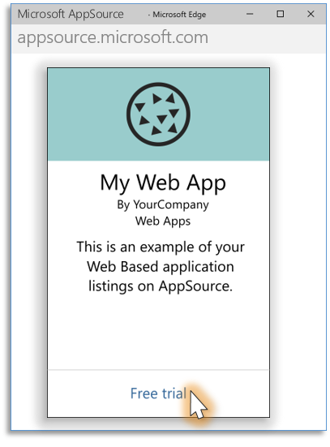
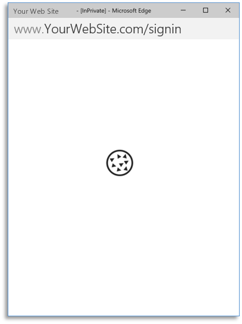
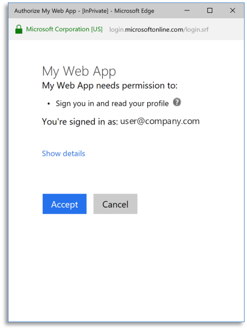
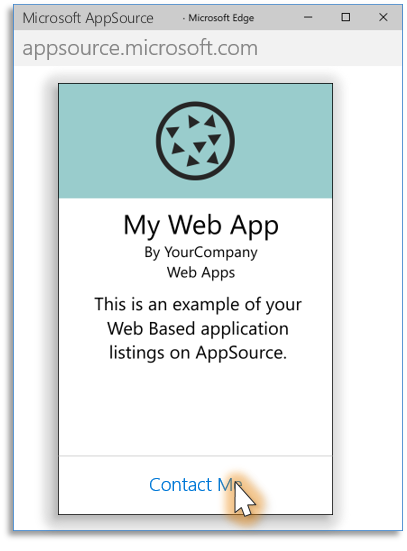
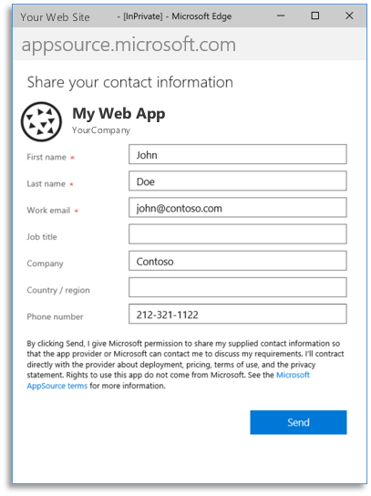
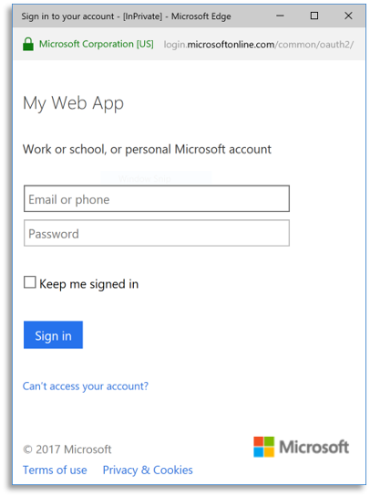
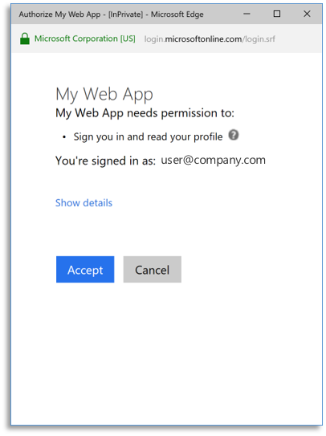

# Get AppSource certified for Azure Active Directory

[Microsoft AppSource](https://appsource.microsoft.com/) is a destination for business users to discover, try, and manage line-of-business SaaS applications (standalone SaaS and add-on to existing Microsoft SaaS products).

To list a standalone SaaS application on AppSource, your application must accept single sign-on from work accounts from any company or organization that has Azure Active Directory (Azure AD). The sign-in process must use the [OpenID Connect](v2-protocols-oidc.md) or [OAuth 2.0](v2-oauth2-auth-code-flow.md) protocols. SAML integration is not accepted for AppSource certification.

## Multi-tenant applications

A *multi-tenant application* is an application that accepts sign-ins from users from any company or organization that have Azure AD without requiring a separate instance, configuration, or deployment. AppSource recommends that applications implement multi-tenancy to enable the *single-click* free trial experience.

To enable multi-tenancy on your application, follow these steps:
1. Set `Multi-Tenanted` property to `Yes` on your application registration's information in the [Azure portal](https://portal.azure.com/#blade/Microsoft_AAD_IAM/ActiveDirectoryMenuBlade/RegisteredApps). By default, applications created in the Azure portal are configured as *[single-tenant](#single-tenant-applications)*.
1. Update your code to send requests to the `common` endpoint. To do this, update the endpoint from `https://login.microsoftonline.com/{yourtenant}` to `https://login.microsoftonline.com/common*`.
1. For some platforms, like ASP.NET, you need also to update your code to accept multiple issuers.

For more information about multi-tenancy, see [How to sign in any Azure Active Directory (Azure AD) user using the multi-tenant application pattern](howto-convert-app-to-be-multi-tenant.md).

### Single-tenant applications

A *single-tenant application* is an application that only accepts sign-ins from users of a defined Azure AD instance. External users (including work or school accounts from other organizations, or personal accounts) can sign in to a single-tenant application after adding each user as a guest account to the Azure AD instance that the application is registered. 

You can add users as guest accounts to Azure AD through the [Azure AD B2B collaboration](../external-identities/what-is-b2b.md) and you can do this [programmatically](../../active-directory-b2c/code-samples.md). When using B2B, users can create a self-service portal that does not require an invitation to sign in. For more info, see [Self-service portal for Azure AD B2B collaboration sign-up](../external-identities/self-service-portal.md).

Single-tenant applications can enable the *Contact Me* experience, but if you want to enable the single-click/free trial experience that AppSource recommends, enable multi-tenancy on your application instead.

## AppSource trial experiences

### Free trial (customer-led trial experience)

The customer-led trial is the experience that AppSource recommends as it offers a single-click access to your application. The following example shows what this experience looks like:

1.  A user finds your application in the AppSource web site, then selects **Free trial** option.

    

2.  AppSource redirects the user to a URL in your web site. Your web site starts the *single-sign-on* process automatically (on page load).

    

3.  The user is redirected to the Microsoft sign-in page and the user provides credentials to sign in.

    

4. The user gives consent for your application.

    

5.  Sign-in completes and the user is redirected back to your web site.  The user starts the free trial.

    

### Contact me (partner-led trial experience)

You can use the partner trial experience when a manual or a long-term operation needs to happen to provision the user/company--for example, your application needs to provision virtual machines, database instances, or operations that take much time to complete. In this case, after the user selects the **Request Trial** button and fills out a form, AppSource sends you the user's contact information. When you receive this information, you then provision the environment and send the instructions to the user on how to access the trial experience:  

1. A user finds your application in AppSource web site, then selects **Contact Me**.

    

2. The user fills out a form with contact information.

    

3. You receive the user's information, set up a trial instance, and send the hyperlink to access your application to the user.

    

4. The user accesses your application and completes the single sign-on process.

    

5. The user gives consent for your application.

    

6. Sign-in completes and the user is redirected back to your web site. The user starts the free trial.

    

### More information

For more information about the AppSource trial experience, see [this video](https://aka.ms/trialexperienceforwebapps). 

## Get support

For Azure AD integration, we use [Microsoft Q&A](https://docs.microsoft.com/answers/topics/azure-active-directory.html) with the community to provide support.

We highly recommend you ask your questions on [Microsoft Q&A](https://docs.microsoft.com/answers/topics/azure-active-directory.html) first and browse existing issues to see if someone has asked your question before. Make sure that your questions or comments are tagged with [`[azure-active-directory]`](https://docs.microsoft.com/answers/topics/azure-active-directory.html).

Use the following comments section to provide feedback and help us refine and shape our content.

## Next steps

- For more information on building applications that support Azure AD sign-ins, see [Authentication scenarios for Azure AD](authentication-flows-app-scenarios.md).
- For information on how to list your SaaS application in AppSource, go see [AppSource Partner Information](https://appsource.microsoft.com/partners)