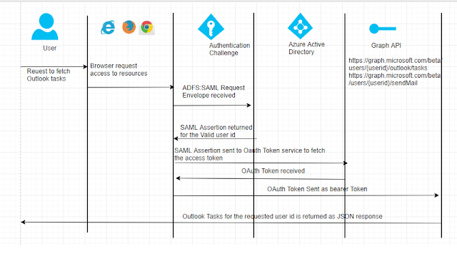
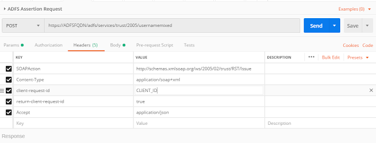
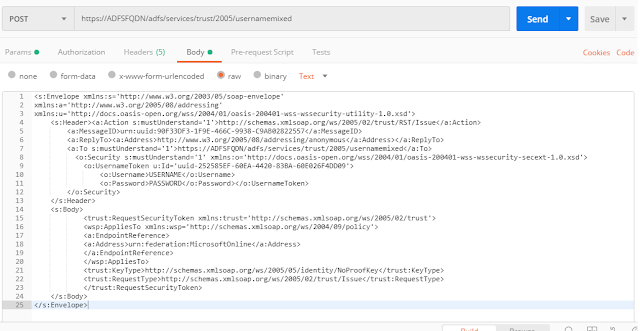

# Microsoft identity platform and OAuth 2.0 SAML bearer assertion flow
The OAuth 2.0 SAML bearer assertion flow allows you to request an OAuth access token using a SAML assertion when a client needs to use an existing trust relationship. The signature applied to the SAML assertion provides authentication of the authorized app. A SAML assertion is an XML security token issued by an identity provider and consumed by a service provider. The service provider relies on its content to identify the assertion’s subject for security-related purposes.

The SAML assertion is posted to the OAuth token endpoint.  The endpoint processes the assertion and issues an access token based on prior approval of the app. The client isn’t required to have or store a refresh token, nor is the client secret required to be passed to the token endpoint.

SAML Bearer Assertion flow is useful when fetching data from Microsoft Graph APIs (which only support delegated permissions) without prompting the user for credentials. In this scenario the client credentials grant, which is preferred for background processes, does not work.

For applications that do interactive browser-based sign-in to get a SAML assertion and then want to add access to an OAuth protected API (such as Microsoft Graph), you can make an OAuth request to get an access token for the API. When the browser is redirected to Azure AD to authenticate the user, the browser will pick up the session from the SAML sign-in and the user doesn't need to enter their credentials.

The OAuth SAML Bearer Assertion flow is also supported for users authenticating with identity providers such as Active Directory Federation Services (ADFS) federated to Azure Active Directory.  The SAML assertion obtained from ADFS can be used in an OAuth flow to authenticate the user.

## Call Graph using SAML bearer assertion
Now let us understand on how we can actually fetch SAML assertion programatically. This approach is tested with ADFS. However, this works with any identity provider that supports the return of SAML assertion programatically. The basic process is: get a SAML assertion, get an access token, and access Microsoft Graph.

### Prerequisites

Establish a trust relationship between the authorization server/environment (Microsoft 365) and the identity provider, or issuer of the SAML 2.0 bearer assertion (ADFS). To configure ADFS for single sign-on and as an identity provider you may refer to [this article](https://blogs.technet.microsoft.com/canitpro/2015/09/11/step-by-step-setting-up-ad-fs-and-enabling-single-sign-on-to-office-365/).

Register the application in the [portal](https://ms.portal.azure.com/#blade/Microsoft_AAD_RegisteredApps/ApplicationsListBlade):
1. Sign in to the [app registration blade of the portal](https://ms.portal.azure.com/#blade/Microsoft_AAD_RegisteredApps/ApplicationsListBlade) (Please note that we are using the v2.0 endpoints for Graph API and hence need to register the application in this portal. Otherwise we could have used the registrations in Azure active directory). 
1. Select **New registration**.
1. When the **Register an application** page appears, enter your application's registration information: 
    1. **Name** - Enter a meaningful application name that will be displayed to users of the app.
    1. **Supported account types** - Select which accounts you would like your application to support.
    1. **Redirect URI (optional)** - Select the type of app you're building, Web, or Public client (mobile & desktop), and then enter the redirect URI (or reply URL) for your application.
    1. When finished, select **Register**.
1. Make a note of the application (client) ID.
1. In the left pane, select **Certificates & secrets**. Click **New client secret** in the **Client secrets** section. Copy the new client secret, you won't be able to retrieve when you leave the blade.
1. In the left pane, select **API permissions** and then **Add a permission**. Select **Microsoft Graph**, then **delegated permissions**, and then select **Tasks.read** since we intend to use the Outlook Graph API. 

Install [Postman](https://www.getpostman.com/), a tool required to test the sample requests.  Later, you can convert the requests to code.

### Get the SAML assertion from ADFS
Create a POST request to the ADFS endpoint using SOAP envelope to fetch the SAML assertion:

Header values:

ADFS request body:

Once this request is posted successfully, you should receive a SAML assertion from ADFS. Only the **SAML:Assertion** tag data is required, convert it to base64 encoding to use in further requests.

### Get the OAuth2 token using the SAML assertion 
In this step, fetch an OAuth2 token using the ADFS assertion response.

1. Create a POST request as shown below with the header values:

    
1. In the body of the request, replace **client_id**, **client_secret**, and **assertion** (the base64 encoded SAML assertion obtained the previous step):

    
1. Upon successful request, you will receive an access token from Azure active directory.

### Get the data with the Oauth token

After receiving the access token, call the Graph APIs (Outlook tasks in this example). 

1. Create a GET request with the access token fetched in the previous step:

    

1. Upon successful request, you will receive a JSON response.

## Next steps

Learn about the different [authentication flows and application scenarios](authentication-flows-app-scenarios.md).