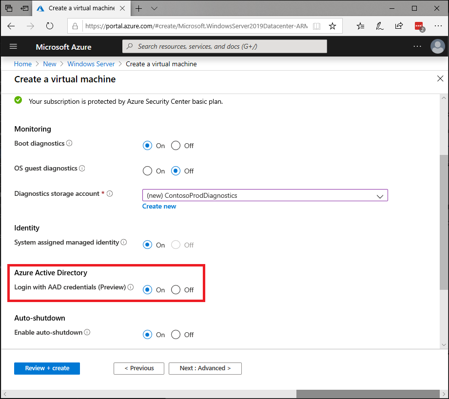
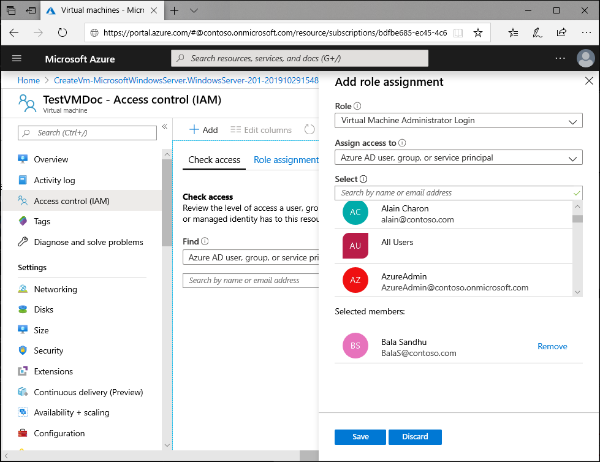
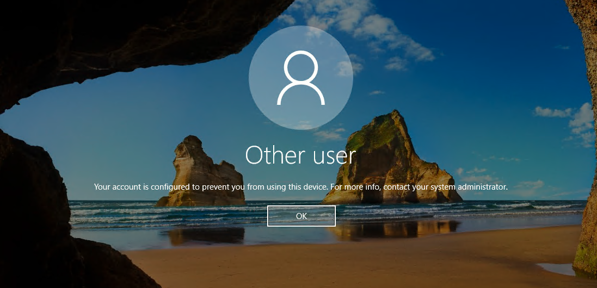
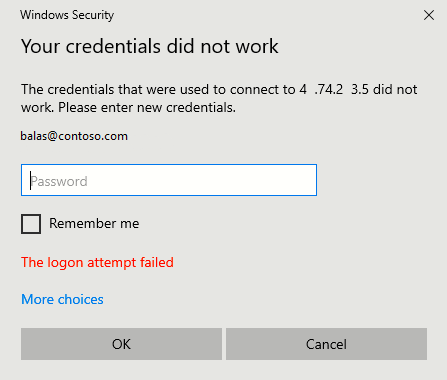
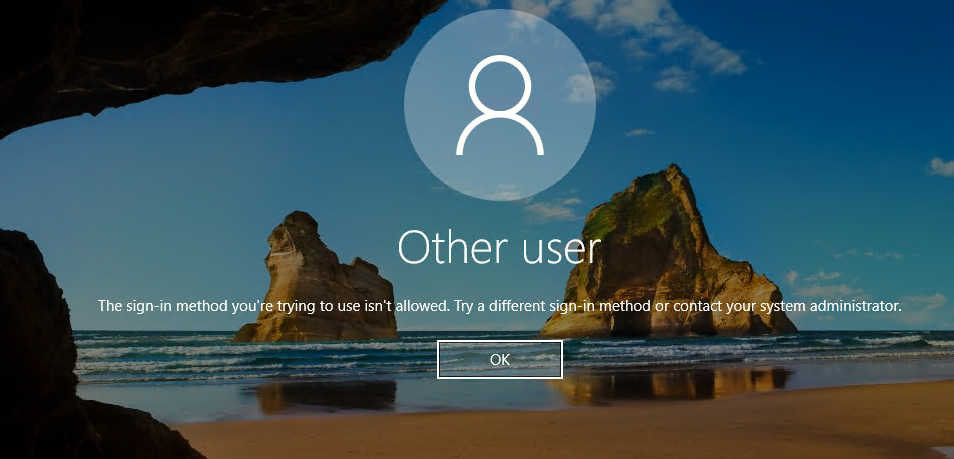

# Sign in to Windows virtual machine in Azure using Azure Active Directory authentication (Preview)

Organizations can now utilize Azure Active Directory (AD) authentication for their Azure virtual machines (VMs) running **Windows Server 2019 Datacenter edition** or **Windows 10 1809** and later. Using Azure AD to authenticate to VMs provides you with a way to centrally control and enforce policies. Tools like Azure Role-Based Access Control (RBAC) and Azure AD Conditional Access allow you to control who can access a VM. This article shows you how to create and configure a Windows Server 2019 VM to use Azure AD authentication.

|     |
| --- |
| Azure AD sign in for Azure Windows VMs is a public preview feature of Azure Active Directory. For more information about previews, see  [Supplemental Terms of Use for Microsoft Azure Previews](https://azure.microsoft.com/support/legal/preview-supplemental-terms/)|
|     |

There are many benefits of using Azure AD authentication to log in to Windows VMs in Azure, including:

- Utilize the same federated or managed Azure AD credentials you normally use.
- No longer have to manage local administrator accounts.
- Azure RBAC allows you to grant the appropriate access to VMs based on need and remove it when it is no longer needed.
- Before allowing access to a VM, Azure AD Conditional Access can enforce additional requirements such as: 
   - Multi-factor authentication
   - Sign-in risk check
- Automate and scale Azure AD join of Azure Windows VMs that are part for your VDI deployments.

## Requirements

### Supported Azure regions and Windows distributions

The following Windows distributions are currently supported during the preview of this feature:

- Windows Server 2019 Datacenter
- Windows 10 1809 and later

The following Azure regions are currently supported during the preview of this feature:

- All Azure global regions

> [!IMPORTANT]
> To use this preview feature, only deploy a supported Windows distribution and in a supported Azure region. The feature is currently not supported in Azure Government or sovereign clouds.

### Network requirements

To enable Azure AD authentication for your Windows VMs in Azure, you need to ensure your VMs network configuration permits outbound access to the following endpoints over TCP port 443:

- https://enterpriseregistration.windows.net
- https://login.microsoftonline.com
- https://device.login.microsoftonline.com
- https://pas.windows.net

## Enabling Azure AD login in for Windows VM in Azure

To use Azure AD login in for Windows VM in Azure, you need to first enable Azure AD login option for your Windows VM and then you need to configure RBAC role assignments for users who are authorized to login in to the VM.
There are multiple ways you can enable Azure AD login for your Windows VM:

- Using the Azure portal experience when creating a Windows VM
- Using the Azure Cloud Shell experience when creating a Windows VM **or for an existing Windows VM**

### Using Azure portal create VM experience to enable Azure AD login

You can enable Azure AD login for Windows Server 2019 Datacenter or Windows 10 1809 and later VM images. 

To create a Windows Server 2019 Datacenter VM in Azure with Azure AD logon: 

1. Sign in to the [Azure portal](https://portal.azure.com), with an account that has access to create VMs, and select **+ Create a resource**.
1. Type **Windows Server** in Search the Marketplace search bar.
   1. Click **Windows Server** and choose **Windows Server 2019 Datacenter** from Select a software plan dropdown.
   1. Click on **Create**.
1. On the “Management” tab, enable the option to **Login with AAD credentials (Preview)** under the Azure Active Directory section from Off to **On**.
1. Make sure **System assigned managed identity** under the Identity section is set to **On**. This action should happen automatically once you enable Login with Azure AD credentials.
1. Go through the rest of the experience of creating a virtual machine. During this preview, you will have to create an administrator username and password for the VM.



> [!NOTE]
> In order to log in to the VM using your Azure AD credential, you will first need to configure role assignments for the VM as described in one of the sections below.

### Using the Azure Cloud Shell experience to enable Azure AD login

Azure Cloud Shell is a free, interactive shell that you can use to run the steps in this article. Common Azure tools are preinstalled and configured in Cloud Shell for you to use with your account. Just select the Copy button to copy the code, paste it in Cloud Shell, and then press Enter to run it. There are a few ways to open Cloud Shell:

Select Try It in the upper-right corner of a code block.
Open Cloud Shell in your browser.
Select the Cloud Shell button on the menu in the upper-right corner of the [Azure portal](https://portal.azure.com).

If you choose to install and use the CLI locally, this article requires that you are running the Azure CLI version 2.0.31 or later. Run az --version to find the version. If you need to install or upgrade, see the article [Install Azure CLI](https://docs.microsoft.com/cli/azure/install-azure-cli).

1. Create a resource group with [az group create](https://docs.microsoft.com/cli/azure/group#az-group-create). 
1. Create a VM with [az vm create](https://docs.microsoft.com/cli/azure/vm#az-vm-create) using a supported distribution in a supported region. 
1. Install the Azure AD login VM extension. 

The following example deploys a VM named myVM that uses Win2019Datacenter, into a resource group named myResourceGroup, in the southcentralus region. In the following examples, you can provide your own resource group and VM names as needed.

```AzureCLI
az group create --name myResourceGroup --location southcentralus

az vm create \
    --resource-group myResourceGroup \
    --name myVM \
    --image Win2019Datacenter \
    --assign-identity \
    --admin-username azureuser \
    --admin-password yourpassword
```

It takes a few minutes to create the VM and supporting resources.

Finally, install the Azure AD login VM extension to enable Azure AD login for Windows VM. VM extensions are small applications that provide post-deployment configuration and automation tasks on Azure virtual machines. Use [az vm extension](https://docs.microsoft.com/cli/azure/vm/extension#az-vm-extension-set) set to install the AADLoginForWindows extension on the VM named myVM in the myResourceGroup resource group:

> [!NOTE]
> You can install AADLoginForWindows extension on an existing Windows Server 2019 or Windows 10 1809 and later VM to enable it for Azure AD authentication. An example of AZ CLI is shown below.

```AzureCLI
az vm extension set \
    --publisher Microsoft.Azure.ActiveDirectory \
    --name AADLoginForWindows \
    --resource-group myResourceGroup \
    --vm-name myVM
```

The `provisioningState` of `Succeeded` is shown, once the extension is installed on the VM.

## Configure role assignments for the VM

Now that you have created the VM, you need to configure Azure RBAC policy to determine who can log in to the VM. Two RBAC roles are used to authorize VM login:

- **Virtual Machine Administrator Login**: Users with this role assigned can log in to an Azure virtual machine with administrator privileges.
- **Virtual Machine User Login**: Users with this role assigned can log in to an Azure virtual machine with regular user privileges.

> [!NOTE]
> To allow a user to log in to the VM over RDP, you must assign either the Virtual Machine Administrator Login or Virtual Machine User Login role. An Azure user with the Owner or Contributor roles assigned for a VM do not automatically have privileges to log in to the VM over RDP. This is to provide audited separation between the set of people who control virtual machines versus the set of people who can access virtual machines.

There are multiple ways you can configure role assignments for VM:

- Using the Azure AD Portal experience
- Using the Azure Cloud Shell experience

### Using Azure AD Portal experience

To configure role assignments for your Azure AD enabled Windows Server 2019 Datacenter VMs:

1. Navigate to the specific virtual machine overview page
1. Select **Access control (IAM)** from the menu options
1. Select **Add**, **Add role assignment** to open the Add role assignment pane.
1. In the **Role** drop-down list, select a role such as **Virtual Machine Administrator Login** or **Virtual Machine User Login**.
1. In the **Select** field, select a user, group, service principal, or managed identity. If you don't see the security principal in the list, you can type in the **Select** box to search the directory for display names, email addresses, and object identifiers.
1. Select **Save**, to assign the role.

After a few moments, the security principal is assigned the role at the selected scope.



### Using the Azure Cloud Shell experience

The following example uses [az role assignment create](https://docs.microsoft.com/cli/azure/role/assignment#az-role-assignment-create) to assign the Virtual Machine Administrator Login role to the VM for your current Azure user. The username of your active Azure account is obtained with [az account show](https://docs.microsoft.com/cli/azure/account#az-account-show), and the scope is set to the VM created in a previous step with [az vm show](https://docs.microsoft.com/cli/azure/vm#az-vm-show). The scope could also be assigned at a resource group or subscription level, and normal RBAC inheritance permissions apply. For more information, see [Role-Based Access Controls](../../virtual-machines/linux/login-using-aad.md).

```AzureCLI
username=$(az account show --query user.name --output tsv)
vm=$(az vm show --resource-group myResourceGroup --name myVM --query id -o tsv)

az role assignment create \
    --role "Virtual Machine Administrator Login" \
    --assignee $username \
    --scope $vm
```

> [!NOTE]
> If your AAD domain and logon username domain do not match, you must specify the object ID of your user account with the `--assignee-object-id`, not just the username for `--assignee`. You can obtain the object ID for your user account with [az ad user list](https://docs.microsoft.com/cli/azure/ad/user#az-ad-user-list).

For more information on how to use RBAC to manage access to your Azure subscription resources, see the following articles:

- [Manage access to Azure resources using RBAC and Azure CLI](https://docs.microsoft.com/azure/role-based-access-control/role-assignments-cli)
- [Manage access to Azure resources using RBAC and the Azure portal](https://docs.microsoft.com/azure/role-based-access-control/role-assignments-portal)
- [Manage access to Azure resources using RBAC and Azure PowerShell](https://docs.microsoft.com/azure/role-based-access-control/role-assignments-powershell).

## Using Conditional Access

You can enforce Conditional Access policies such as multi-factor authentication or user sign-in risk check before authorizing access to Windows VMs in Azure that are enabled with Azure AD sign in. To apply Conditional Access policy, you must select "Azure Windows VM Sign-In" app from the cloud apps or actions assignment option and then use Sign-in risk as a condition and/or 
require multi-factor authentication as a grant access control. 

> [!NOTE]
> If you use "Require multi-factor authentication" as a grant access control for requesting access to the "Azure Windows VM Sign-In" app, then you must supply multi-factor authentication claim as part of the client that initiates the RDP session to the target Windows VM in Azure. The only way to achieve this on a Windows 10 client is to use Windows Hello for Business PIN or biometric authenication with the RDP client. Support for biometric authentication was added to the RDP client in Windows 10 version 1809. Remote desktop using Windows Hello for Business authentication is only available for deployments that use cert trust model and currently not available for key trust model.

## Log in using Azure AD credentials to a Windows VM

> [!IMPORTANT]
> Remote connection to VMs joined to Azure AD is only allowed from Windows 10 PCs that are Azure AD joined or hybrid Azure AD joined to the **same** directory as the VM. Additionally, to RDP using Azure AD credentials, the user must belong to one of the two RBAC roles, Virtual Machine Administrator Login or Virtual Machine User Login.

To login in to your Windows Server 2019 virtual machine using Azure AD: 

1. Navigate to the overview page of the virtual machine that has been enabled with Azure AD logon.
1. Select **Connect** to open the Connect to virtual machine blade.
1. Select **Download RDP File**.
1. Select **Open** to launch the Remote Desktop Connection client.
1. Select **Connect** to launch the Windows logon dialog.
1. Logon using your Azure AD credentials.

You are now signed in to the Windows Server 2019 Azure virtual machine with the role permissions as assigned, such as VM User or VM Administrator. 

> [!NOTE]
> You can save the .RDP file locally on your computer to launch future remote desktop connections to your virtual machine instead of having to navigate to virtual machine overview page in the Azure portal and using the connect option.

## Troubleshoot

### Troubleshoot deployment issues

The AADLoginForWindows extension must install successfully in order for the VM to complete the Azure AD join process. Perform the following steps if the VM extension fails to install correctly.

1. RDP to the VM using the local administrator account and examine the CommandExecution.log under  
   
   C:\WindowsAzure\Logs\Plugins\Microsoft.Azure.ActiveDirectory.AADLoginForWindows\0.3.1.0. 

   > [!NOTE]
   > If the extension restarts after the initial failure, the log with the deployment error will be saved as CommandExecution_YYYYMMDDHHMMSSSSS.log. 

1. Open a command prompt on the VM and verify these queries against the Instance Metadata Service (IMDS) Endpoint running on the Azure host returns:

   | Command to run | Expected output |
   | --- | --- |
   | curl -H Metadata:true "http://169.254.169.254/metadata/instance?api-version=2017-08-01" | Correct information about the Azure VM |
   | curl -H Metadata:true "http://169.254.169.254/metadata/identity/info?api-version=2018-02-01" | Valid Tenant ID associated with the Azure Subscription |
   | curl -H Metadata:true "http://169.254.169.254/metadata/identity/oauth2/token?resource=urn:ms-drs:enterpriseregistration.windows.net&api-version=2018-02-01" | Valid access token issued by Azure Active Directory for the managed identity that is assigned to this VM |

   > [!NOTE]
   > The access token can be decoded using a tool like [http://calebb.net/](http://calebb.net/). Verify the "appid" in the access token matches the managed identity assigned to the VM.

1. Ensure the required endpoints are accessible from the VM using the command line:
   
   - curl https://login.microsoftonline.com/ -D –
   - curl https://login.microsoftonline.com/`<TenantID>`/ -D –

   > [!NOTE]
   > Replace `<TenantID>` with the Azure AD Tenant ID that is associated with the Azure subscription.

   - curl https://enterpriseregistration.windows.net/ -D -
   - curl https://device.login.microsoftonline.com/ -D -
   - curl https://pas.windows.net/ -D -

1. The Device State can be viewed by running `dsregcmd /status`. The goal is for Device State to show as `AzureAdJoined : YES`.

   > [!NOTE]
   > Azure AD join activity is captured in Event viewer under the User Device Registration\Admin log.

If AADLoginForWindows extension fails with certain error code, you can perform the following steps:

#### Issue 1: AADLoginForWindows extension fails to install with terminal error code '1007' and Exit code: -2145648574.

This exit code translates to DSREG_E_MSI_TENANTID_UNAVAILABLE because the extension is unable to query the Azure AD Tenant information.

1. Verify the Azure VM can retrieve the TenantID from the Instance Metadata Service.

   - RDP to the VM as a local administrator and verify the endpoint returns valid Tenant ID by running this command from an elevated command line on the VM:
      
      - curl -H Metadata:true http://169.254.169.254/metadata/identity/info?api-version=2018-02-01

1. The VM admin attempts to install the AADLoginForWindows extension, but a system assigned managed identity has not enabled the VM first. Navigate to the Identity blade of the VM. From the System assigned tab, verify Status is toggled to On.

#### Issue 2: AADLoginForWindows extension fails to install with Exit code: -2145648607

This Exit code translates to DSREG_AUTOJOIN_DISC_FAILED because the extension is not able to reach the https://enterpriseregistration.windows.net endpoint.

1. Verify the required endpoints are accessible from the VM using the command line:

   - curl https://login.microsoftonline.com/ -D –
   - curl https://login.microsoftonline.com/`<TenantID>`/ -D –
   
   > [!NOTE]
   > Replace `<TenantID>` with the Azure AD Tenant ID that is associated with the Azure subscription. If you need to find the tenant ID, you can hover over your account name to get the directory / tenant ID, or select Azure Active Directory > Properties > Directory ID in the Azure portal.

   - curl https://enterpriseregistration.windows.net/ -D -
   - curl https://device.login.microsoftonline.com/ -D -
   - curl https://pas.windows.net/ -D -

1. If any of the commands fails with "Could not resolve host `<URL>`", try running this command to determine the DNS server that is being used by the VM.
   
   `nslookup <URL>`

   > [!NOTE] 
   > Replace `<URL>` with the fully qualified domain names used by the endpoints, such as “login.microsoftonline.com”.

1. Next, see if specifying a public DNS server allows the command to succeed:

   `nslookup <URL> 208.67.222.222`

1. If necessary, change the DNS server that is assigned to the network security group that the Azure VM belongs to.

#### Issue 3: AADLoginForWindows extension fails to install with Exit code: 51

Exit code 51 translates to "This extension is not supported on the VM's operating system".

At Public Preview, the AADLoginForWindows extension is only intended to be installed on Windows Server 2019 or Windows 10 (Build 1809 or later). Ensure the version of Windows is supported. If the build of Windows is not supported, uninstall the VM Extension.

### Troubleshoot sign-in issues

Some common errors when you try to RDP with Azure AD credentials include no RBAC roles assigned, unauthorized client, or 2FA sign-in method required. Use the following information to correct these issues.

The Device and SSO State can be viewed by running `dsregcmd /status`. The goal is for Device State to show as `AzureAdJoined : YES` and `SSO State` to show `AzureAdPrt : YES`.

Also, RDP Sign-in using Azure AD accounts is captured in Event viewer under the AAD\Operational event logs.

#### RBAC role not assigned

If you see the following error message when you initiate a remote desktop connection to your VM: 

- Your account is configured to prevent you from using this device. For more info, contact your system administrator



Verify that you have [configured RBAC policies](../../virtual-machines/linux/login-using-aad.md) for the VM that grants the user either the Virtual Machine Administrator Login or Virtual Machine User Login role:
 
#### Unauthorized client

If you see the following error message when you initiate a remote desktop connection to your VM: 

- Your credentials did not work



Verify that the Windows 10 PC you are using to initiate the remote desktop connection is one that is either Azure AD joined, or hybrid Azure AD joined to the same Azure AD directory where your VM is joined to. For more information about device identity, see the article [What is a device identity](https://docs.microsoft.com/azure/active-directory/devices/overview).

> [!NOTE]
> Windows 10 20H1, will add support for Azure AD Registered PC to initiate remote desktop connection to your VM. Join the Windows Insider Program to try this out and explore new features of Windows 10.

Also, verify the AADLoginForWindows extension has not been uninstalled after Azure AD join has completed.
 
#### MFA sign-in method required

If you see the following error message when you initiate a remote desktop connection to your VM: 

- The sign-in method you're trying to use isn't allowed. Try a different sign-in method or contact your system administrator.



If you have configured a Conditional Access policy that requires multi-factor authentication (MFA) before you can access the resource, then you need to ensure that the Windows 10 PC initiating the remote desktop connection to your VM signs in using a strong authentication method such as Windows Hello. If you do not use a strong authentication method for your remote desktop connection, you will see the previous error.

If you have not deployed Windows Hello for Business and if that is not an option for now, you can exclude MFA requirement by configuring Conditional Access policy that excludes "Azure Windows VM Sign-In" app from the list of cloud apps that require MFA. To learn more about Windows Hello for Business, see [Windows Hello for Business Overview](https://docs.microsoft.com/windows/security/identity-protection/hello-for-business/hello-identity-verification).

> [!NOTE]
> Windows Hello for Business PIN authentication with RDP has been supported by Windows 10 for several versions, however support for Biometric authentication with RDP was added in Windows 10 version 1809. Using Windows Hello for Business auth during RDP is only available for deployments that use cert trust model and currently not available for key trust model.
 
## Preview feedback

Share your feedback about this preview feature or report issues using it on the [Azure AD feedback forum](https://feedback.azure.com/forums/169401-azure-active-directory?category_id=166032).

## Next steps
For more information on Azure Active Directory, see [What is Azure Active Directory](https://docs.microsoft.com/azure/active-directory/fundamentals/active-directory-whatis)
