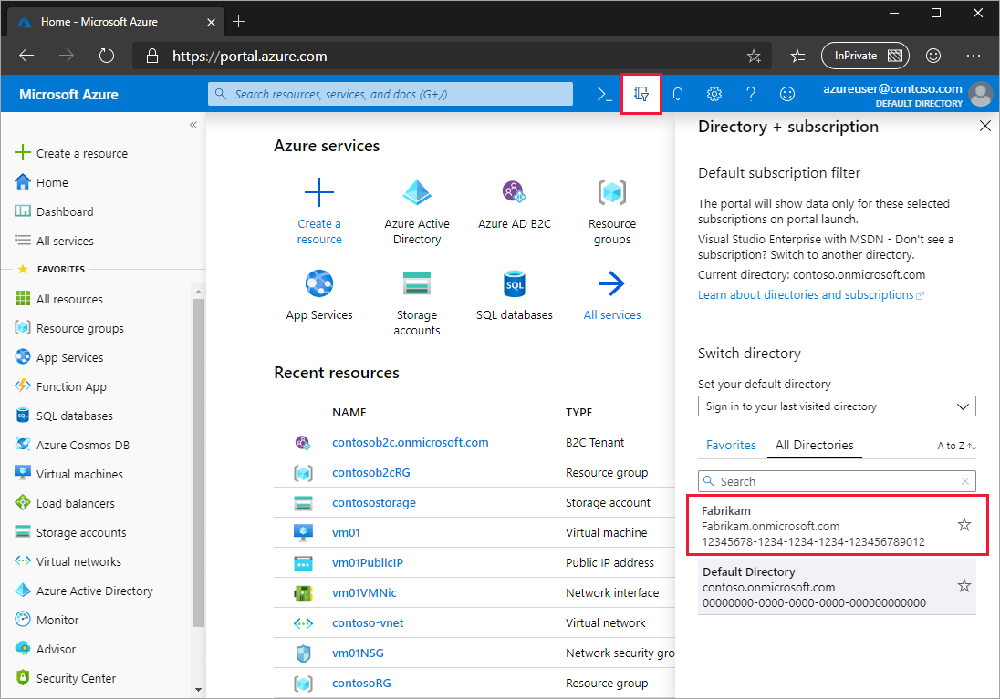
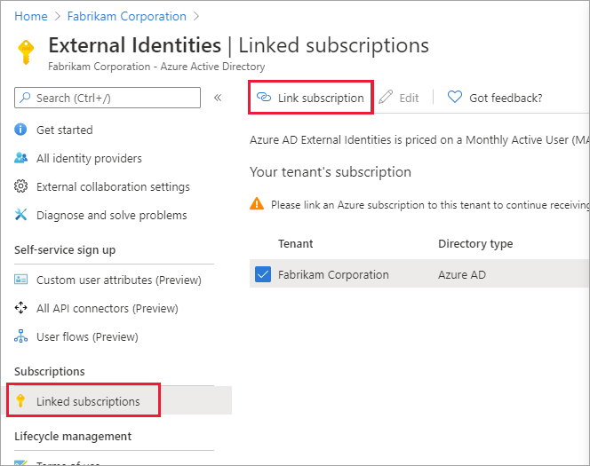
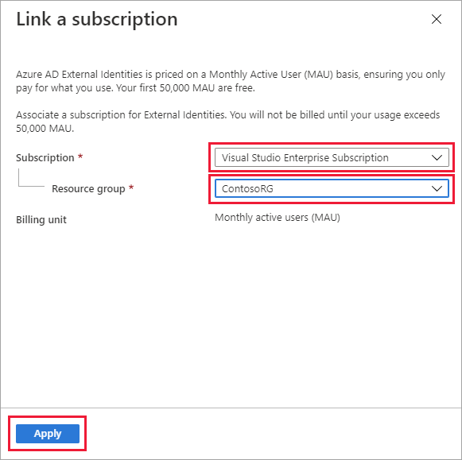

# Billing model for Azure AD External Identities

Azure Active Directory (Azure AD) External Identities pricing is based on monthly active users (MAU), which is the count of unique users with authentication activity within a calendar month. This billing model applies to both Azure AD guest user collaboration (B2B) and [Azure AD B2C tenants](https://docs.microsoft.com/azure/active-directory-b2c/billing). MAU billing helps you reduce costs by offering a free tier and flexible, predictable pricing. In this article, learn about MAU billing and linking your Azure AD tenants to a subscription.

> [!IMPORTANT]
> This article does not contain pricing details. For the latest information about usage billing and pricing, see [Azure Active Directory pricing](https://azure.microsoft.com/pricing/details/active-directory/).

## What do I need to do?

To take advantage of MAU billing, your Azure AD tenant must be linked to an Azure subscription.

|If your tenant is:  |You need to:  |
|---------|---------|
| An Azure AD tenant already linked to a subscription     | Do nothing. When you use External Identities features to collaborate with guest users, you'll be automatically billed using the MAU model.        |
| An Azure AD tenant not yet linked to a subscription     | [Link your Azure AD tenant to a subscription](#link-your-azure-ad-tenant-to-a-subscription) to activate MAU billing.        |
|  |  |

## About monthly active users (MAU) billing

In your Azure AD tenant, guest user collaboration usage is billed based on the count of unique guest users with authentication activity within a calendar month. This model replaces the 1:5 ratio billing model, which allowed up to five guest users for each Azure AD Premium license in your tenant. When your tenant is linked to a subscription and you use External Identities features to collaborate with guest users, you'll be automatically billed using the MAU-based billing model.
  
The pricing tier that applies to your guest users is based on the highest pricing tier assigned to your Azure AD tenant. For example, if the highest pricing tier in your tenant is Azure AD Premium P1, the Premium P1 pricing tier also applies to your guest users. If the highest pricing is Azure AD Free, you'll be asked to upgrade to a premium pricing tier when you try to use premium features for guest users.

## Link your Azure AD tenant to a subscription

An Azure AD tenant must be linked to an Azure subscription for proper billing and access to features. If the directory doesn't already have a subscription you can link to, you'll have the opportunity to add one during this process.

1. Sign in to the [Azure portal](https://portal.azure.com/) with an Azure account that's been assigned at least the [Contributor](https://docs.microsoft.com/azure/role-based-access-control/built-in-roles) role within the subscription or a resource group within the subscription.

2. Select the directory you want to link: In the Azure portal toolbar, select the **Directory + Subscription** icon, and then select the directory.

    

3. Under **Azure Services**, select **Azure Active Directory**.

4. In the left menu, select **External Identities**.

5. Under **Subscriptions**, select **Linked subscriptions**.

6. In the tenant list, select the checkbox next to the tenant, and then select **Link subscription**.

    

7. In the Link a subscription pane, select a **Subscription** and a **Resource group**. Then select **Apply**.

   > [!NOTE]
   > If there are no subscriptions listed, you can [associate a subscription to your tenant](../fundamentals/active-directory-how-subscriptions-associated-directory.md). Or, you can add a new subscription by selecting the link **if you don't already have a subscription you may create one here**.

    

After you complete these steps, your Azure subscription is billed based on your Azure Direct or Enterprise Agreement details, if applicable.

## Next steps

For the latest pricing information, see [Azure Active Directory pricing](https://azure.microsoft.com/pricing/details/active-directory/).
