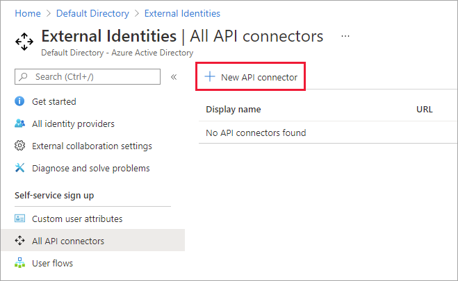
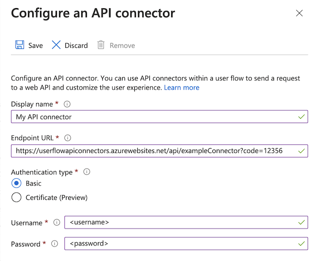
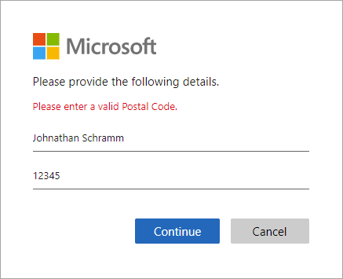

# Add an API connector to a user flow

To use an [API connector](api-connectors-overview.md), you first create the API connector and then enable it in a user flow.

> [!IMPORTANT]
>**Starting January 4, 2021**, Google is [deprecating WebView sign-in support](https://developers.googleblog.com/2020/08/guidance-for-our-effort-to-block-less-secure-browser-and-apps.html). If you’re using Google federation or self-service sign-up with Gmail, you should [test your line-of-business native applications for compatibility](google-federation.md#deprecation-of-webview-sign-in-support).

## Create an API connector

1. Sign in to the [Azure portal](https://portal.azure.com/) as an Azure AD administrator.
2. Under **Azure services**, select **Azure Active Directory**.
3. In the left menu, select **External Identities**.
4. Select **All API connectors (Preview)**, and then select **New API connector**.

   

5. Provide a display name for the call. For example, **Check approval status**.
6. Provide the **Endpoint URL** for the API call.
7. Provide the authentication information for the API.

   - Only Basic Authentication is currently supported. If you wish to use an API without Basic Authentication for development purposes, simply enter a dummy **Username** and **Password** that your API can ignore. For use with an Azure Function with an API key, you can include the code as a query parameter in the **Endpoint URL** (for example, https[]()://contoso.azurewebsites.net/api/endpoint<b>?code=0123456789</b>).

   
8. Select **Save**.

> [!IMPORTANT]
> Previously, you had to configure which user attributes to send to the API ('Claims to send') and which user attributes to accept from the API ('Claims to receive'). Now, all user attributes are sent by default if they have a value and any user attribute can be returned by the API in a 'continuation' response.

## The request sent to your API
An API connector materializes as an **HTTP POST** request, sending user attributes ('claims') as key-value pairs in a JSON body. Attributes are serialized similarly to [Microsoft Graph](/graph/api/resources/user#properties) user properties. 

**Example request**
```http
POST <API-endpoint>
Content-type: application/json

{
 "email": "johnsmith@fabrikam.onmicrosoft.com",
 "identities": [ //Sent for Google and Facebook identity providers
     {
     "signInType":"federated",
     "issuer":"facebook.com",
     "issuerAssignedId":"0123456789"
     }
 ],
 "displayName": "John Smith",
 "givenName":"John",
 "surname":"Smith",
 "jobTitle":"Supplier",
 "streetAddress":"1000 Microsoft Way",
 "city":"Seattle",
 "postalCode": "12345",
 "state":"Washington",
 "country":"United States",
 "extension_<extensions-app-id>_CustomAttribute1": "custom attribute value",
 "extension_<extensions-app-id>_CustomAttribute2": "custom attribute value",
 "ui_locales":"en-US"
}
```

Only user properties and custom attributes listed in the **Azure Active Directory** > **External Identities** > **Custom user attributes** experience are available to be sent in the request.

Custom attributes exist in the **extension_\<extensions-app-id>_AttributeName**  format in the directory. Your API should expect to receive claims in this same serialized format. For more information on custom attributes, see [define custom attributes for self-service sign-up flows](user-flow-add-custom-attributes.md).

Additionally, the **UI Locales ('ui_locales')** claim is sent by default in all requests. It provides a user's locale(s) as configured on their device that can be used by the API to return internationalized responses.

> [!IMPORTANT]
> If a claim to send does not have a value at the time the API endpoint is called, the claim will not be sent to the API. Your API should be designed to explicitly check for the value it expects.

> [!TIP] 
> [**identities ('identities')**](/graph/api/resources/objectidentity) and the **Email Address ('email')** claims can be used by your API to identify a user before they have an account in your tenant. The 'identities' claim is sent when a user authenticates with an identity provider such as Google or Facebook. 'email' is always sent.

## Enable the API connector in a user flow

Follow these steps to add an API connector to a self-service sign-up user flow.

1. Sign in to the [Azure portal](https://portal.azure.com/) as an Azure AD administrator.
2. Under **Azure services**, select **Azure Active Directory**.
3. In the left menu, select **External Identities**.
4. Select **User flows (Preview)**, and then select the user flow you want to add the API connector to.
5. Select **API connectors**, and then select the API endpoints you want to invoke at the following steps in the user flow:

   - **After signing in with an identity provider**
   - **Before creating the user**

   

6. Select **Save**.

## After signing in with an identity provider

An API connector at this step in the sign-up process is invoked immediately after the user authenticates with an identity provider (Google, Facebook, Azure AD). This step precedes the ***attribute collection page***, which is the form presented to the user to collect user attributes. 

<!-- The following are examples of API connector scenarios you may enable at this step:
- Use the email or federated identity that the user provided to look up claims in an existing system. Return these claims from the existing system, pre-fill the attribute collection page, and make them available to return in the token.
- Validate whether the user is included in an allow or deny list, and control whether they can continue with the sign-up flow. -->

### Example request sent to the API at this step
```http
POST <API-endpoint>
Content-type: application/json

{
 "email": "johnsmith@fabrikam.onmicrosoft.com",
 "identities": [ //Sent for Google and Facebook identity providers
     {
     "signInType":"federated",
     "issuer":"facebook.com",
     "issuerAssignedId":"0123456789"
     }
 ],
 "displayName": "John Smith",
 "givenName":"John",
 "lastName":"Smith",
 "ui_locales":"en-US"
}
```

The exact claims sent to the API depends on which information is provided by the identity provider. 'email' is always sent.

### Expected response types from the web API at this step

When the web API receives an HTTP request from Azure AD during a user flow, it can return these responses:

- Continuation response
- Blocking response

#### Continuation response

A continuation response indicates that the user flow should continue to the next step: the attribute collection page.

In a continuation response, the API can return claims. If a claim is returned by the API, the claim does the following:

- Pre-fills the input field in the attribute collection page.

See an example of a [continuation response](#example-of-a-continuation-response).

#### Blocking Response

A blocking response exits the user flow. It can be purposely issued by the API to stop the continuation of the user flow by displaying a block page to the user. The block page displays the `userMessage` provided by the API.

See an example of a [blocking response](#example-of-a-blocking-response).

## Before creating the user

An API connector at this step in the sign-up process is invoked after the attribute collection page, if one is included. This step is always invoked before a user account is created in Azure AD. 

<!-- The following are examples of scenarios you might enable at this point during sign-up: -->
<!-- 
- Validate user input data and ask a user to resubmit data.
- Block a user sign-up based on data entered by the user.
- Perform identity verification.
- Query external systems for existing data about the user and overwrite the user-provided value. -->

### Example request sent to the API at this step

```http
POST <API-endpoint>
Content-type: application/json

{
 "email": "johnsmith@fabrikam.onmicrosoft.com",
 "identities": [ //Sent for Google and Facebook identity providers
     {
     "signInType":"federated",
     "issuer":"facebook.com",
     "issuerAssignedId":"0123456789"
     }
 ],
 "displayName": "John Smith",
 "givenName":"John",
 "surname":"Smith",
 "jobTitle":"Supplier",
 "streetAddress":"1000 Microsoft Way",
 "city":"Seattle",
 "postalCode": "12345",
 "state":"Washington",
 "country":"United States",
 "extension_<extensions-app-id>_CustomAttribute1": "custom attribute value",
 "extension_<extensions-app-id>_CustomAttribute2": "custom attribute value",
 "ui_locales":"en-US"
}
```
The exact claims sent to the API depends on which information is collected from the user or is provided by the identity provider.

### Expected response types from the web API at this step

When the web API receives an HTTP request from Azure AD during a user flow, it can return these responses:

- Continuation response
- Blocking response
- Validation response

#### Continuation response

A continuation response indicates that the user flow should continue to the next step: create the user in the directory.

In a continuation response, the API can return claims. If a claim is returned by the API, the claim does the following:

- Overrides any value that has already been assigned to the claim from the attribute collection page.

See an example of a [continuation response](#example-of-a-continuation-response).

#### Blocking Response
A blocking response exits the user flow. It can be purposely issued by the API to stop the continuation of the user flow by displaying a block page to the user. The block page displays the `userMessage` provided by the API.

See an example of a [blocking response](#example-of-a-blocking-response).

### Validation-error response
 When the API responds with a validation-error response, the user flow stays on the attribute collection page and a `userMessage` is displayed to the user. The user can then edit and resubmit the form. This type of response can be used for input validation.

See an example of a [validation-error response](#example-of-a-validation-error-response).

## Example responses

### Example of a continuation response

```http
HTTP/1.1 200 OK
Content-type: application/json

{
    "version": "1.0.0",
    "action": "Continue",
    "postalCode": "12349", // return claim
    "extension_<extensions-app-id>_CustomAttribute": "value" // return claim
}
```

| Parameter                                          | Type              | Required | Description                                                                                                                                                                                                                                                                            |
| -------------------------------------------------- | ----------------- | -------- | -------------------------------------------------------------------------------------------------------------------------------------------------------------------------------------------------------------------------------------------------------------------------------------- |
| version                                            | String            | Yes      | The version of the API.                                                                                                                                                                                                                                                                |
| action                                             | String            | Yes      | Value must be `Continue`.                                                                                                                                                                                                                                                              |
| \<builtInUserAttribute>                            | \<attribute-type> | No       | Values can be stored in the directory if they selected as a **Claim to receive** in the API connector configuration and **User attributes** for a user flow. Values can be returned in the token if selected as an **Application claim**.                                              |
| \<extension\_{extensions-app-id}\_CustomAttribute> | \<attribute-type> | No       | The returned claim does not need to contain `_<extensions-app-id>_`. Values are be stored in the directory if they selected as a **Claim to receive** in the API connector configuration and **User attribute** for a user flow. Custom attributes cannot be sent back in the token. |

### Example of a blocking response

```http
HTTP/1.1 200 OK
Content-type: application/json

{
    "version": "1.0.0",
    "action": "ShowBlockPage",
    "userMessage": "There was a problem with your request. You are not able to sign up at this time.",
    "code": "CONTOSO-BLOCK-00"
}

```

| Parameter   | Type   | Required | Description                                                                |
| ----------- | ------ | -------- | -------------------------------------------------------------------------- |
| version     | String | Yes      | The version of the API.                                                    |
| action      | String | Yes      | Value must be `ShowBlockPage`                                              |
| userMessage | String | Yes      | Message to display to the user.                                            |
| code        | String | No       | Error code. Can be used for debugging purposes. Not displayed to the user. |

**End-user experience with a blocking response**


### Example of a validation-error response

```http
HTTP/1.1 400 Bad Request
Content-type: application/json

{
    "version": "1.0.0",
    "status": 400,
    "action": "ValidationError",
    "userMessage": "Please enter a valid Postal Code.",
    "code": "CONTOSO-VALIDATION-00"
}
```

| Parameter   | Type    | Required | Description                                                                |
| ----------- | ------- | -------- | -------------------------------------------------------------------------- |
| version     | String  | Yes      | The version of the API.                                                    |
| action      | String  | Yes      | Value must be `ValidationError`.                                           |
| status      | Integer | Yes      | Must be value `400` for a ValidationError response.                        |
| userMessage | String  | Yes      | Message to display to the user.                                            |
| code        | String  | No       | Error code. Can be used for debugging purposes. Not displayed to the user. |

**End-user experience with a validation-error response**




## Best practices and how to troubleshoot

### Using serverless cloud functions
Serverless functions, like HTTP triggers in Azure Functions, provide a simple way create API endpoints to use with the API connector. You can use the serverless cloud function to, [for example](code-samples-self-service-sign-up.md#api-connector-azure-function-quickstarts), perform validation logic and limit sign-ups to specific domains. The serverless cloud function can also call and invoke other web APIs, user stores, and other cloud services for more complex scenarios.

### Best practices
Ensure that:
* Your API is following the API request and response contracts as outlined above. 
* The **Endpoint URL** of the API connector points to the correct API endpoint.
* Your API explicitly checks for null values of received claims.
* Your API responds as quickly as possible to ensure a fluid user experience.
    * If using a serverless function or scalable web service, use a hosting plan that keeps the API "awake" or "warm." For Azure Functions, its recommended to use the [Premium plan](../../azure-functions/functions-premium-plan.md). 


### Use logging
In general, it's helpful to use the logging tools enabled by your web API service, like [Application insights](../../azure-functions/functions-monitoring.md), to monitor your API for unexpected error codes, exceptions, and poor performance.
* Monitor for HTTP status codes that aren't HTTP 200 or 400.
* A 401 or 403 HTTP status code typically indicates there's an issue with your authentication. Double-check your API's authentication layer and the corresponding configuration in the API connector.
* Use more aggressive levels of logging (e.g. "trace" or "debug") in development if needed.
* Monitor your API for long response times.

## Next steps
<!-- - Learn [where you can enable an API connector](api-connectors-overview.md#where-you-can-enable-an-api-connector-in-a-user-flow) -->
- Learn how to [add a custom approval workflow to self-service sign-up](self-service-sign-up-add-approvals.md)
- Get started with our [Azure Function quickstart samples](code-samples-self-service-sign-up.md#api-connector-azure-function-quickstarts).
<!-- - Learn how to [use API connectors to verify a user identity](code-samples-self-service-sign-up.md#identity-verification) -->