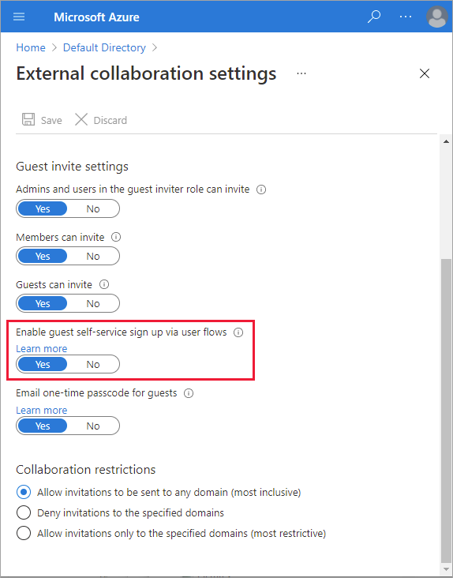
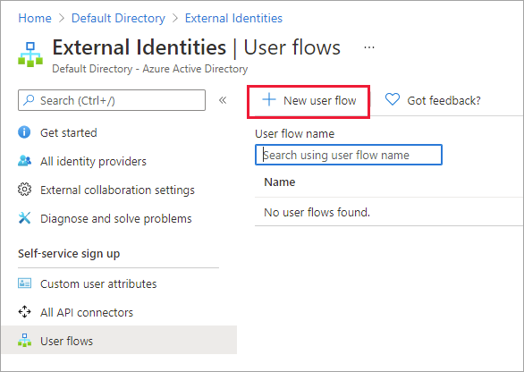
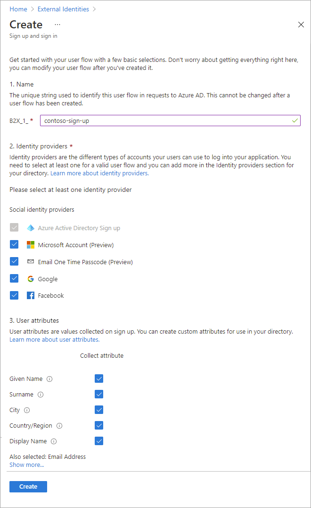
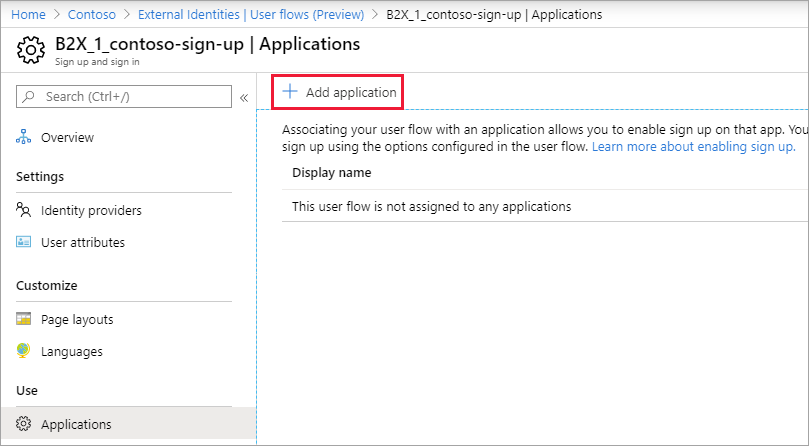

# Add a self-service sign-up user flow to an app (Preview)
> [!NOTE]
> Self-service sign-up is a public preview feature of Azure Active Directory. For more information about previews, see [Supplemental Terms of Use for Microsoft Azure Previews](https://azure.microsoft.com/support/legal/preview-supplemental-terms/).

You can create user flows for apps that are built by your organization. Associating your user flow with an application allows you to enable sign-up on that app. You can choose more than one application to be associated with the user flow. Once you associate the user flow with one or more applications, users who visit that app will be able to sign up and gain a guest account using the options configured in the user flow.

> [!NOTE]
> You can associate user flows with apps built by your organization. User flows can't be used for Microsoft apps, like SharePoint or Teams.

## Before you begin

### Add social identity providers (optional)

Azure AD is the default identity provider for self-service sign-up. This means that users are able to sign up by default with an Azure AD account. Social identity providers can also be included in these sign-up flows to support Google and Facebook accounts.

- [Add Facebook to your list of social identity providers](facebook-federation.md)
- [Add Google to your list of social identity providers](google-federation.md)

> [!NOTE]
> In the current preview, if a self-service sign-up user flow is associated with an app and you send a user an invitation to that app, the user won't be able to use a Gmail account to redeem the invitation. As a workaround, the user can go through the self-service sign-up process. Or, they can redeem the invitation by accessing a different app or by using their My Apps portal at https://myapps.microsoft.com.

### Define custom attributes (optional)

User attributes are values collected from the user during self-service sign-up. Azure AD comes with a built-in set of attributes, but you can create custom attributes for use in your user flow. You can also read and write these attributes by using the Microsoft Graph API. See [Define custom attributes for user flows](user-flow-add-custom-attributes.md).

## Enable self-service sign-up for your tenant

Before you can add a self-service sign-up user flow to your applications, you need to enable the feature for your tenant. After it's enabled, controls become available in the user flow that let you associate the user flow with an application.

1. Sign in to the [Azure portal](https://portal.azure.com) as an Azure AD administrator.
2. Under **Azure services**, select **Azure Active Directory**.
3. Select **User settings**, and then under **External users**, select **Manage external collaboration settings**.
4. Set the **Enable guest self-service sign up via user flows (Preview)** toggle to **Yes**.

   

## Create the user flow for self-service sign-up

Next, you'll create the user flow for self-service sign-up and add it to an application.

1. Sign in to the [Azure portal](https://portal.azure.com) as an Azure AD administrator.
2. Under **Azure services**, select **Azure Active Directory**.
3. In the left menu, select **External Identities**.
4. Select **User flows (Preview)**, and then select **New user flow**.

   

5. On the **Create** page, enter a **Name** for the user flow. Note that the name is automatically prefixed with **B2X_1_**.
6. In the **Identity providers** list, select one or more identity providers that your external users can use to log into your application. **Azure Active Directory Sign up** is selected by default. (See [Before you begin](#before-you-begin) earlier in this article to learn how to add identity providers.)
7. Under **User attributes**, choose the attributes you want to collect from the user. For additional attributes, select **Show more**. For example, select **Show more**, and then choose attributes and claims for **Country/Region**, **Display Name**, and **Postal Code**. Select **OK**.

   

8. Select **Create**.
9. The new user flow appears in the **User flows (Preview)** list. If necessary, refresh the page.

## Select the layout of the attribute collection form

You can choose order in which the attributes are displayed on the sign-up page. 

1. In the [Azure portal](https://portal.azure.com), select **Azure Active Directory**.
2. Select **External Identities**, select **User flows (Preview)**.
3. Select the self-service sign-up user flow from the list.
4. Under **Customize**, select **Page layouts**.
5. The attributes you chose to collect are listed. To change the order of display, select an attribute, and then select **Move up**, **Move down**, **Move to the top**, or **Move to the bottom**.
6. Select **Save**.

## Add applications to the self-service sign-up user flow

Now you can associate applications with the user flow.

1. Sign in to the [Azure portal](https://portal.azure.com) as an Azure AD administrator.
2. Under **Azure services**, select **Azure Active Directory**.
3. In the left menu, select **External Identities**.
4. Under **Self-service sign up**, select **User flows (Preview)**.
5. Select the self-service sign-up user flow from the list.
6. In the left menu, under **Use**, select **Applications**.
7. Select **Add application**.

   

8. Select the application from the list. Or use the search box to find the application, and then select it.
9. Click **Select**.

## Next steps

- [Add Google to your list of social identity providers](google-federation.md)
- [Add Facebook to your list of social identity providers](facebook-federation.md)
- [Use API connectors to customize and extend your user flows via web APIs](api-connectors-overview.md)
- [Add custom approval workflow to your user flow](self-service-sign-up-add-approvals.md)
