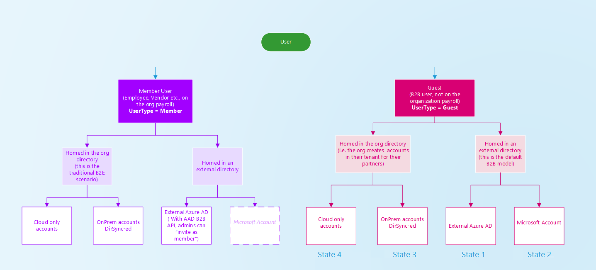
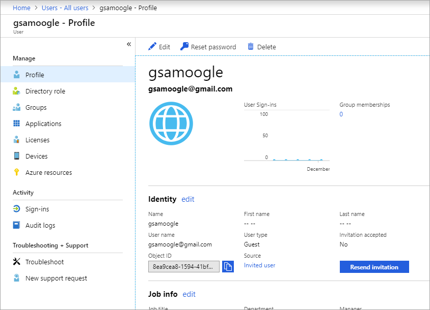
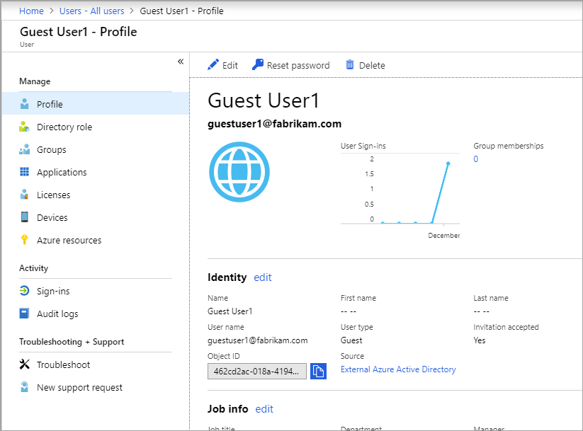
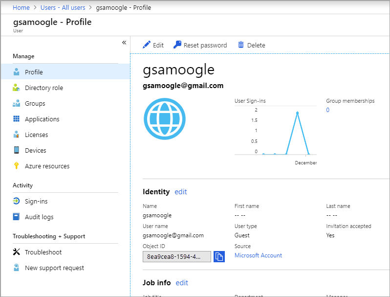
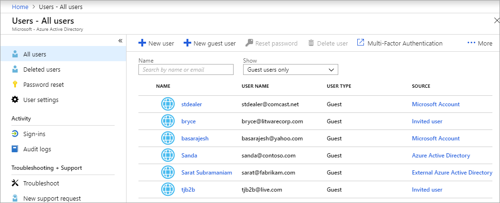
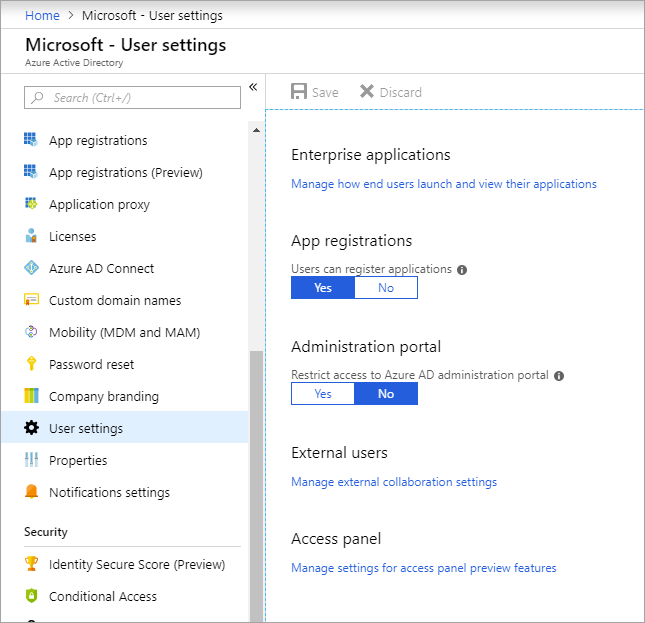

# Properties of an Azure Active Directory B2B collaboration user

This article describes the properties and states of the B2B guest user object in Azure Active Directory (Azure AD) before and after invitation redemption. An Azure AD business-to-business (B2B) collaboration user is a user with UserType = Guest. This guest user typically is from a partner organization and has limited privileges in the inviting directory, by default.

Depending on the inviting organization's needs, an Azure AD B2B collaboration user can be in one of the following account states:

- State 1: Homed in an external instance of Azure AD and represented as a guest user in the inviting organization. In this case, the B2B user signs in by using an Azure AD account that belongs to the invited tenant. If the partner organization doesn't use Azure AD, the guest user in Azure AD is still created. The requirements are that they redeem their invitation and Azure AD verifies their email address. This arrangement is also called a just-in-time (JIT) tenancy or a "viral" tenancy.

   > [!IMPORTANT]
   > **Starting March 31, 2021**, Microsoft will no longer support the redemption of invitations by creating unmanaged Azure AD accounts and tenants for B2B collaboration scenarios. In preparation, we encourage customers to opt into [email one-time passcode authentication](one-time-passcode.md). We welcome your feedback on this public preview feature and are excited to create even more ways to collaborate.

- State 2: Homed in a Microsoft or other account and represented as a guest user in the host organization. In this case, the guest user signs in with a Microsoft account or a social account (google.com or similar). The invited user's identity is created as a Microsoft account in the inviting organization’s directory during offer redemption.

- State 3: Homed in the host organization's on-premises Active Directory and synced with the host organization's Azure AD. You can use Azure AD Connect to sync the partner accounts to the cloud as Azure AD B2B users with UserType = Guest. See [Grant locally-managed partner accounts access to cloud resources](hybrid-on-premises-to-cloud.md).

- State 4: Homed in the host organization's Azure AD with UserType = Guest and credentials that the host organization manages.

  

Now, let's see what an Azure AD B2B collaboration user looks like in Azure AD.

### Before invitation redemption

State 1 and State 2 accounts are the result of inviting guest users to collaborate by using the guest users' own credentials. When the invitation is initially sent to the guest user, an account is created in your directory. This account doesn’t have any credentials associated with it because authentication is performed by the guest user's identity provider. The **Source** property for the guest user account in your directory is set to **Invited user**. 

### After invitation redemption

After the guest user accepts the invitation, the **Source** property is updated based on the guest user’s identity provider.

For guest users in State 1, the **Source** is **External Azure Active Directory**.

For guest users in State 2, the **Source** is **Microsoft Account**.

For guest users in State 3 and State 4, the **Source** property is set to **Azure Active Directory** or **Windows Server Active Directory**, as described in the next section.

## Key properties of the Azure AD B2B collaboration user
### UserType
This property indicates the relationship of the user to the host tenancy. This property can have two values:
- Member: This value indicates an employee of the host organization and a user in the organization's payroll. For example, this user expects to have access to internal-only sites. This user is not considered an external collaborator.

- Guest: This value indicates a user who isn't considered internal to the company, such as an external collaborator, partner, or customer. Such a user isn't expected to receive a CEO's internal memo or receive company benefits, for example.

  > [!NOTE]
  > The UserType has no relation to how the user signs in, the directory role of the user, and so on. This property simply indicates the user's relationship to the host organization and allows the organization to enforce policies that depend on this property.

For pricing related details please reference [Azure Active Directory pricing](https://azure.microsoft.com/pricing/details/active-directory).

### Source
This property indicates how the user signs in.

- Invited User: This user has been invited but has not yet redeemed an invitation.

- External Azure Active Directory: This user is homed in an external organization and authenticates by using an Azure AD account that belongs to the other organization. This type of sign-in corresponds to State 1.

- Microsoft account: This user is homed in a Microsoft account and authenticates by using a Microsoft account. This type of sign-in corresponds to State 2.

- Windows Server Active Directory: This user is signed in from on-premises Active Directory that belongs to this organization. This type of sign-in corresponds to State 3.

- Azure Active Directory: This user authenticates by using an Azure AD account that belongs to this organization. This type of sign-in corresponds to State 4.
  > [!NOTE]
  > Source and UserType are independent properties. A value of Source does not imply a particular value for UserType.

## Can Azure AD B2B users be added as members instead of guests?
Typically, an Azure AD B2B user and guest user are synonymous. Therefore, an Azure AD B2B collaboration user is added as a user with UserType = Guest by default. However, in some cases, the partner organization is a member of a larger organization to which the host organization also belongs. If so, the host organization might want to treat users in the partner organization as members instead of guests. Use the Azure AD B2B Invitation Manager APIs to add or invite a user from the partner organization to the host organization as a member.

## Filter for guest users in the directory

## Convert UserType
It's possible to convert UserType from Member to Guest and vice-versa by using PowerShell. However, the UserType property represents the user's relationship to the organization. Therefore, you should change this property only if the relationship of the user to the organization changes. If the relationship of the user changes, should the user principal name (UPN) change? Should the user continue to have access to the same resources? Should a mailbox be assigned? We don't recommend changing the UserType by using PowerShell as an atomic activity. Also, in case this property becomes immutable by using PowerShell, we don't recommend taking a dependency on this value.

## Remove guest user limitations
There may be cases where you want to give your guest users higher privileges. You can add a guest user to any role and even remove the default guest user restrictions in the directory to give a user the same privileges as members.

It's possible to turn off the default limitations so that a guest user in the company directory has the same permissions as a member user.

## Can I make guest users visible in the Exchange Global Address List?
Yes. By default, guest objects aren't visible in your organization's global address list, but you can use Azure Active Directory PowerShell to make them visible. For details, see **Can I make guest objects visible in the global address list?** in [Manage guest access in Microsoft 365 Groups](/office365/admin/create-groups/manage-guest-access-in-groups).

## Can I update a guest user's email address?

If a guest user accepts your invitation and they subsequently change their email address, the new email doesn't automatically sync to the guest user object in your directory. The mail property is created via [Microsoft Graph API](/graph/api/resources/user). You can update the mail property via the Microsoft Graph API, the Exchange admin center, or [Exchange Online PowerShell](/powershell/module/exchange/users-and-groups/set-mailuser). The change will be reflected in the Azure AD guest user object.

## Next steps

* [What is Azure AD B2B collaboration?](what-is-b2b.md)
* [B2B collaboration user tokens](user-token.md)
* [B2B collaboration user claims mapping](claims-mapping.md)
