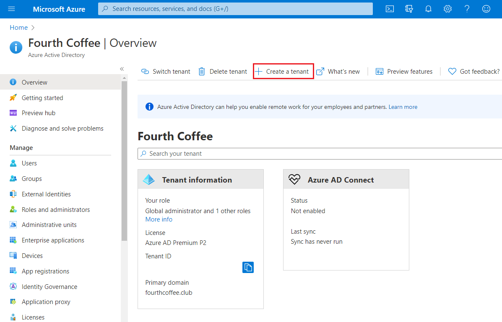
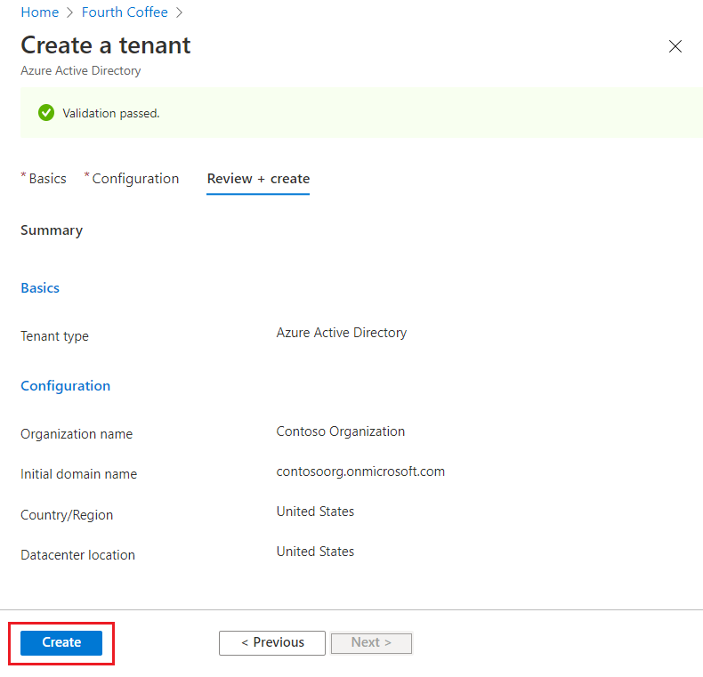

# Quickstart: Create a new tenant in Azure Active Directory

You can do all of your administrative tasks using the Azure Active Directory (Azure AD) portal, including creating a new tenant for your organization. 

In this quickstart, you'll learn how to get to the Azure portal and Azure Active Directory, and you'll learn how to create a basic tenant for your organization.

If you don't have an Azure subscription, create a [free account](https://azure.microsoft.com/free/) before you begin.

## Create a new tenant for your organization

After you sign in to the Azure portal, you can create a new tenant for your organization. Your new tenant represents your organization and helps you to manage a specific instance of Microsoft cloud services for your internal and external users.

### To create a new tenant

1. Sign in to your organization's [Azure portal](https://portal.azure.com/).

1. From the Azure portal menu, select **Azure Active Directory**.  

    <kbd></kbd>  

1. Select **Create a tenant**.

1. On the Basics tab, select the type of tenant you want to create, either **Azure Active Directory** or **Azure Active Directory (B2C)**.

1. Select **Next: Configuration** to move on to the Configuration tab.

    <kbd></kbd>

1.  On the Configuration tab, enter the following information:
    
    - Type _Contoso Organization_ into the **Organization name** box.

    - Type _Contosoorg_ into the **Initial domain name** box.

    - Leave the _United States_ option in the **Country or region** box.

1. Select **Next: Review + Create**. Review the information you entered and if the information is correct, select **create**.

    <kbd></kbd>

Your new tenant is created with the domain contoso.onmicrosoft.com.

## Your user account in the new tenant

When you create a new Azure AD tenant, you become the first user of that tenant. As the first user, you're automatically assigned the [Global Admin](https://docs.microsoft.com/azure/active-directory/roles/permissions-reference#global-administrator) role. Check out your user account by navigating to the [**Users**](https://portal.azure.com/#blade/Microsoft_AAD_IAM/UsersManagementMenuBlade/MsGraphUsers) page.

By default, you're also listed as the [technical contact](https://docs.microsoft.com/microsoft-365/admin/manage/change-address-contact-and-more?view=o365-worldwide#what-do-these-fields-mean) for the tenant. Technical contact information is something you can change in [**Properties**](https://portal.azure.com/#blade/Microsoft_AAD_IAM/ActiveDirectoryMenuBlade/Properties).

> [!WARNING]
> Ensure your directory has at least two accounts with global administrator privileges assigned to them. This will help in the case that one global administrator is locked out. For more detail see the article, [Manage emergency access accounts in Azure AD](../roles/security-emergency-access.md).

## Clean up resources

If you're not going to continue to use this application, you can delete the tenant using the following steps:

- Ensure that you're signed in to the directory that you want to delete through the **Directory + subscription** filter in the Azure portal. Switch to the target directory if needed.
- Select **Azure Active Directory**, and then on the **Contoso - Overview** page, select **Delete directory**.

    The tenant and its associated information is deleted.

    <kbd></kbd>

## Next steps

- Change or add additional domain names, see [How to add a custom domain name to Azure Active Directory](add-custom-domain.md)

- Add users, see [Add or delete a new user](add-users-azure-active-directory.md)

- Add groups and members, see [Create a basic group and add members](active-directory-groups-create-azure-portal.md)

- Learn about [role-based access using Privileged Identity Management](../../role-based-access-control/best-practices.md) and [Conditional Access](../../role-based-access-control/conditional-access-azure-management.md) to help manage your organization's application and resource access.

- Learn about Azure AD, including [basic licensing information, terminology, and associated features](active-directory-whatis.md).
