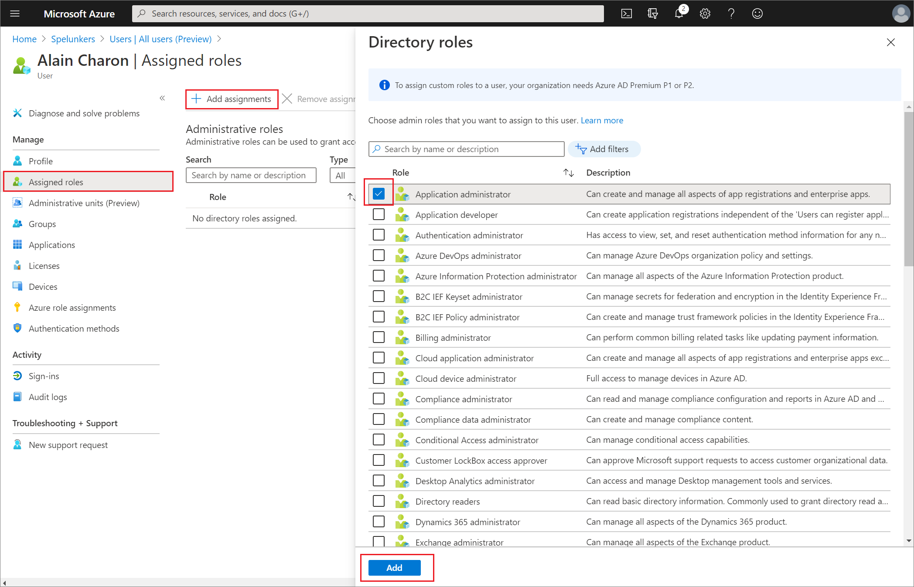
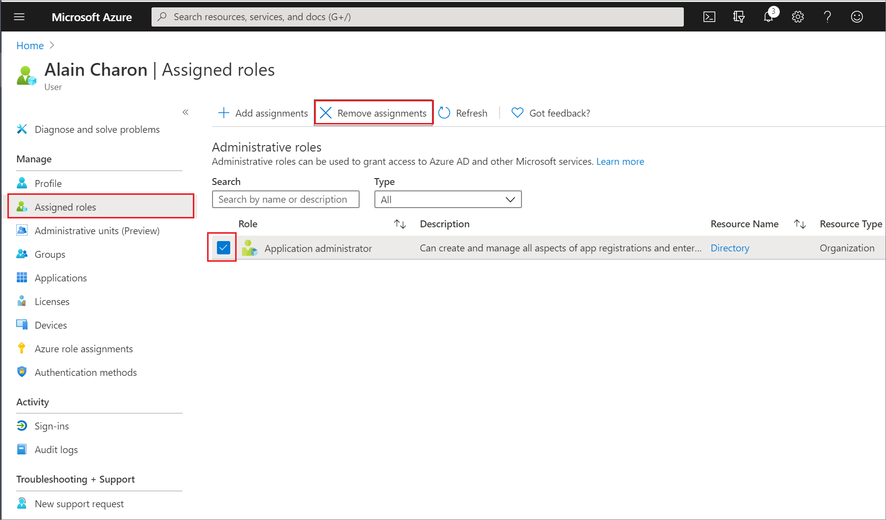

# Assign administrator and non-administrator roles to users with Azure Active Directory
If a user in your organization needs permission to manage Azure Active Directory (Azure AD) resources, you must assign the user an appropriate role in Azure AD, based on the actions the user needs permission to perform.

For more information about the available roles, see [Assigning administrator roles in Azure Active Directory](../users-groups-roles/directory-assign-admin-roles.md). For more information about adding users, see [Add new users to Azure Active Directory](add-users-azure-active-directory.md).

## Assign roles
A common way to assign Azure AD roles to a user is on the **Directory role** page for a user.

You can also assign roles using Privileged Identity Management (PIM). For more detailed information about how to use PIM, see [Privileged Identity Management](https://docs.microsoft.com/azure/active-directory/privileged-identity-management).

### To assign a role to a user
1. Sign in to the [Azure portal](https://portal.azure.com/) using a Global administrator account for the directory.

2. Select **Azure Active Directory**, select **Users**, and then search for and select the user getting the role assignment. For example, _Alain Charon_.

3. On the **Alain Charon - Profile** page, select **Directory role**.

    The **Alain Charon - Directory role** page appears.

4. Select **Add role**, select the role to assign to Alain (for example, _Application administrator_), and then choose **Select**.

    

    The Application administrator role is assigned to Alain Charon and it appears on the **Alain Charon - Directory role** page.

## Remove a role assignment
If you need to remove the role assignment from a user, you can also do that from the **Alain Charon - Directory role** page.

### To remove a role assignment from a user

1. Select **Azure Active Directory**, select **Users**, and then search for and select the user getting the role assignment removed. For example, _Alain Charon_.

2. Select **Directory role**, select **Application administrator**, and then select **Remove role**.

    

    The Application administrator role is removed from Alain Charon and it no longer appears on the **Alain Charon - Directory role** page.

## Next steps
- [Add or delete users](add-users-azure-active-directory.md)

- [Add or change profile information](active-directory-users-profile-azure-portal.md)

- [Add guest users from another directory](../b2b/what-is-b2b.md)

Or you can perform other user management tasks, such as assigning delegates, using policies, and sharing user accounts. For more information about other available actions, see [Azure Active Directory user management documentation](../users-groups-roles/index.yml).

