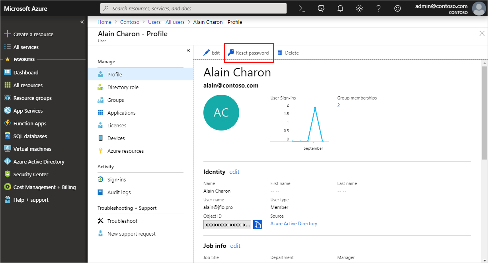

---

title: Reset a user's password - Azure Active Directory | Microsoft Docs
description: Instructions about how to reset a user's password using Azure Active Directory.
services: active-directory
author: msaburnley
manager: daveba

ms.assetid: fad5624b-2f13-4abc-b3d4-b347903a8f16
ms.service: active-directory
ms.subservice: fundamentals
ms.workload: identity
ms.topic: conceptual
ms.date: 09/05/2018
ms.author: ajburnle
ms.reviewer: jeffsta
ms.custom: "it-pro, seodec18"

ms.collection: M365-identity-device-management
---
# Reset a user's password using Azure Active Directory

As an administrator, you can reset a user's password if the password is forgotten, if the user gets locked out of a device, or if the user never received a password.

>[!Note]
>Unless your Azure AD tenant is the home directory for a user, you won't be able reset their password. This means that if your user is signing in to your organization using an account from another organization, a Microsoft account, or a Google account, you won't be able to reset their password.  If your user has a source of authority as Windows Server Active Directory, you'll only be able to reset the password if you've turned on password writeback.  If your user has a source of authority as External Azure AD, you won't be able to reset the password. Only the user, or an adminsitrator in External Azure AD, can reset the password.

>[!Note]
>If you're not an administrator and are instead looking for instructions about how to reset your own work or school password, see [Reset your work or school password](../user-help/active-directory-passwords-update-your-own-password.md).

## To reset a password

1. Sign in to the [Azure portal](https://portal.azure.com/) as a user administrator, or password administrator. For more information about the available roles, see [Assigning administrator roles in Azure Active Directory](../users-groups-roles/directory-assign-admin-roles.md#available-roles)

2. Select **Azure Active Directory**, select **Users**, search for and select the user that needs the reset, and then select **Reset Password**.

    The **Alain Charon - Profile** page appears with the **Reset password** option.

    

3. In the **Reset password** page, select **Reset password**.

    > [!Note]
    > When using Azure Active Directory, a temporary password is auto-generated for the user. When using Active Directory on-premises, you create the password for the user.

4. Copy the password and give it to the user. The user will be required to change the password during the next sign-in process.

    >[!Note]
    >The temporary password never expires. The next time the user signs in, the password will still work, regardless how much time has passed since the temporary password was generated.

## Next steps

After you've reset your user's password, you can perform the following basic processes:

- [Add or delete users](add-users-azure-active-directory.md)

- [Assign roles to users](active-directory-users-assign-role-azure-portal.md)

- [Add or change profile information](active-directory-users-profile-azure-portal.md)

- [Create a basic group and add members](active-directory-groups-create-azure-portal.md)

Or you can perform more complex user scenarios, such as assigning delegates, using policies, and sharing user accounts. For more information about other available actions, see [Azure Active Directory user management documentation](../users-groups-roles/index.yml).
