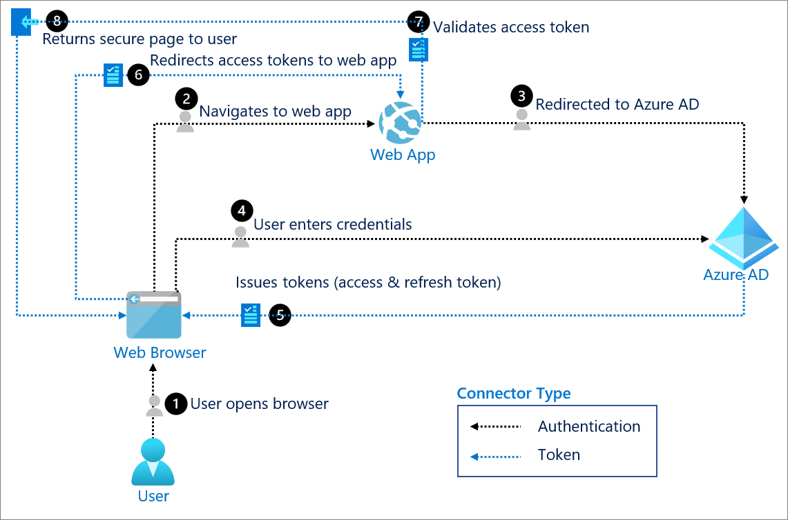

# OAuth 2.0 authentication with Azure Active Directory

The OAuth 2.0 is the industry protocol for authorization. It allows a user to grant limited access to its protected resources. Designed to work specifically with Hypertext Transfer Protocol (HTTP), OAuth separates the role of the client from the resource owner. The client requests access to the resources controlled by the resource owner and hosted by the resource server. The resource server issues access tokens with the approval of the resource owner. The client uses the access tokens to access the protected resources hosted by the resource server. 

OAuth 2.0 is directly related to OpenID Connect (OIDC). Since OIDC is an authentication and authorization layer built on top of OAuth 2.0, it isn't backwards compatible with OAuth 1.0. Azure Active Directory (Azure AD) supports all OAuth 2.0 flows. 

## Use when:

For rich client & modern app scenarios and RESTful Web API access.

## Components of system

* **User**: Requests a service from the web application (app). The user is typically the resource owner who owns the data and has the power to allow clients to access the data or resource. 

* **Web browser**: The web browser that the user interacts with is the OAuth client. 

* **Web app**: The web app, or resource server, is where the resource or data resides. It trusts the authorization server to securely authenticate and authorize the OAuth client. 

* **Azure AD**: Azure AD is the authorization server, also known as the Identity Provider (IdP). It securely handles anything to do with the user's information, their access, and the trust relationship. It's responsible for issuing the tokens that grant and revoke access to resources.

## Implement OAuth 2.0 with Azure AD

* [Integrating applications with Azure AD](https://docs.microsoft.com/azure/active-directory/saas-apps/tutorial-list) 

* [OAuth 2.0 and OpenID Connect protocols on the Microsoft Identity Platform](https://docs.microsoft.com/azure/active-directory/develop/active-directory-v2-protocols) 

* [Application types and OAuth2](https://docs.microsoft.com/azure/active-directory/develop/v2-app-types) 

 
