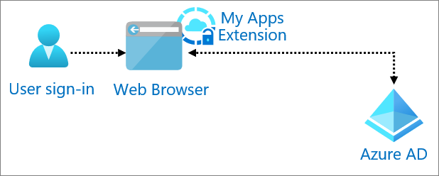

# Password-based authentication with Azure Active Directory

Password based Single Sign-On (SSO) uses the existing authentication process for the application. When you enable password-based SSO, Azure Active Directory (Azure AD) collects, encrypts, and securely stores user credentials in the directory. Azure AD supplies the username and password to the application when the user attempts to sign in.

Choose password-based SSO when an application authenticates with a username and password instead of access tokens and headers. Password-based SSO supports any cloud-based application that has an HTML-based sign in page. 

## Use when

You need to protect with pre-authentication and provide SSO through password vaulting to web apps.

## Components of system

* **User**: Accesses formed based application from either My Apps or by directly visiting the site. 

* **Web browser**: The component that the user interacts with to access the external URL of the application. The user accesses the form-based application via the MyApps extension. 

* **MyApps extension**: Identifies the configured password-based SSO application and supplies the credentials to the sign in form. The MyApps extension is installed on the web browser. 

* **Azure AD**: Authenticates the user.

## Implement password-based SSO with Azure AD

* [What is password based SSO](https://docs.microsoft.com/azure/active-directory/manage-apps/what-is-single-sign-on) 

* [Configure password based SSO for cloud applications ](https://docs.microsoft.com/azure/active-directory/manage-apps/configure-password-single-sign-on-non-gallery-applications)

* [Configure password-based SSO for on-premises applications with Application Proxy](https://docs.microsoft.com/azure/active-directory/manage-apps/application-proxy-configure-single-sign-on-password-vaulting)

 
