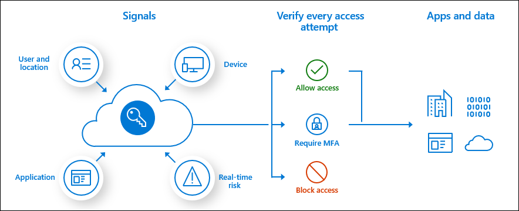

# Overview of Azure AD Multi-Factor Authentication for your organization

There are multiple ways to enable Azure AD Multi-Factor Authentication for your Azure Active Directory (AD) users based on the licenses that your organization owns. 

Based on our studies, your account is more than 99.9% less likely to be compromised if you use multi-factor authentication (MFA).

So how does your organization turn on MFA even for free, before becoming a statistic?

## Free option

Customers who are utilizing the free benefits of Azure AD can use [security defaults](../fundamentals/concept-fundamentals-security-defaults.md) to enable multi-factor authentication in their environment.

## Microsoft 365 Business, E3, or E5

For customers with Microsoft 365, there are two options:

* Azure AD Multi-Factor Authentication is either enabled or disabled for all users, for all sign-in events. There is no ability to only enable multi-factor authentication for a subset of users, or only under certain scenarios. Management is through the Office 365 portal. 
* For an improved user experience, upgrade to Azure AD Premium P1 or P2 and use Conditional Access. For more information, see secure Microsoft 365 resources with multi-factor authentication.

## Azure AD Premium P1

For customers with Azure AD Premium P1 or similar licenses that include this functionality such as Enterprise Mobility + Security E3, Microsoft 365 F1, or Microsoft 365 E3: 

Use [Azure AD Conditional Access](../authentication/tutorial-enable-azure-mfa.md) to prompt users for multi-factor authentication during certain scenarios or events to fit your business requirements.

## Azure AD Premium P2

For customers with Azure AD Premium P2 or similar licenses that include this functionality such as Enterprise Mobility + Security E5 or Microsoft 365 E5: 

Provides the strongest security position and improved user experience. Adds [risk-based Conditional Access](../conditional-access/howto-conditional-access-policy-risk.md) to the Azure AD Premium P1 features that adapts to user's patterns and minimizes multi-factor authentication prompts.

## Authentication methods

| Method | Security defaults | All other methods |
| --- | --- | --- |
| Notification through mobile app | X | X |
| Verification code from mobile app or hardware token |   | X |
| Text message to phone |   | X |
| Call to phone |   | X |

## Next steps

To get started, see the tutorial to [secure user sign-in events with Azure AD Multi-Factor Authentication](../authentication/tutorial-enable-azure-mfa.md).

For more information on licensing, see [Features and licenses for Azure AD Multi-Factor Authentication](../authentication/concept-mfa-licensing.md).
