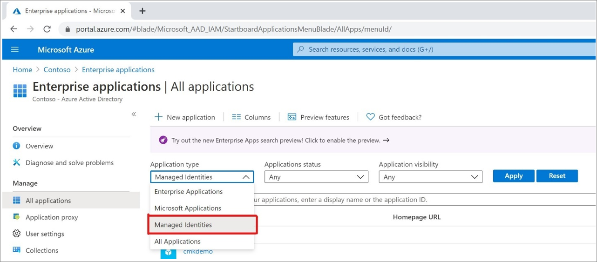

# Securing managed identities

Developers are often challenged by the management of secrets and credentials used to secure communication between different services. Managed identities are secure Azure Active Directory (Azure AD) identities created to provide identities for Azure resources.

## Benefits of using managed identities for Azure resources

The following are benefits of using managed identities:

* You don't need to manage credentials. With managed identities, credentials are fully managed, rotated, and protected by Azure. Identities are automatically provided and deleted with Azure resources. Managed identities enable Azure resources to communicate with all services that support Azure AD authentication.

* No one (including any Global admin) has access to the credentials, so they cannot be accidentally leaked by, for example, being included in code.

## When to use managed identities?

Managed identities are best used for communications among services that support Azure AD authentication. 

A source system requests access to a target service. Any Azure resource can be a source system. For example, an Azure VM, Azure Function instance, and Azure App Services instances support managed identities.

   > [!VIDEO https://www.youtube.com/embed/5lqayO_oeEo]

### How authentication and authorization work

With managed identities the source system can obtain a token from Azure AD without the source owner having to manage credentials. Azure manages the credentials. The token obtained by the source system is presented to the target system for authentication. 

The target system needs to authenticate (identify) and authorize the source system before allowing access. When the target service supports Azure AD-based authentication it accepts an access token issued by Azure AD. 

Azure has a control plane and a data plane. In the control plane, you create resources, and in the data plane you access them. For example, you create a Cosmos database in the control plane, but query it in the data plane.

Once the target system accepts the token for authentication, it can support different mechanisms for authorization for its control plane and data plane.

All of Azure’s control plane operations are managed by [Azure Resource Manager](../../azure-resource-manager/management/overview.md) and use [Azure Role Based Access Control](../../role-based-access-control/overview.md). In the data plane,, each target system has its own authorization mechanism. Azure Storage supports Azure RBAC on the data plane. For example, applications using Azure App Services can read data from Azure Storage, and applications using Azure Kubernetes Service can read secrets stored in Azure Key Vault.

For more information about control and data planes, see [Control plane and data plane operations - Azure Resource Manager](../../azure-resource-manager/management/control-plane-and-data-plane.md).

All Azure services will eventually support managed identities. For more information, see [Services that support managed identities for Azure resources](../managed-identities-azure-resources/services-support-managed-identities.md).

##  

## Types of managed identities

There are two types of managed identities—system-assigned and user-assigned.

System-assigned managed identity has the following properties:

* They have 1:1 relationship with the Azure resource. For example, there's a unique managed identity associated with each VM.

* They are tied to the lifecycle of Azure resources. When the resource is deleted, the managed identity associated with it's automatically deleted, eliminating the risk associated with orphaned accounts. 

User-assigned managed identities have the following properties:

* The lifecycle of these identities is independent of an Azure resource, and you must manage the lifecycle. When the Azure resource is deleted, the assigned user-assigned managed identity is not automatically deleted for you.

* A single user-assigned managed identity can be assigned to zero or more Azure resources.

* They can be created ahead of time and then assigned to a resource.

## Find managed identity service principals in Azure AD

There are several ways in which you can find managed identities:

* Using the Enterprise Applications page in the Azure portal

* Using Microsoft Graph

### Using the Azure portal

1. In Azure Active Directory, select Enterprise applications.

2. Select the filter for “Managed Identities” 

   

 

### Using Microsoft Graph

You can get a list of all managed identities in your tenant with the following GET request to Microsoft Graph:

`https://graph.microsoft.com/v1.0/servicePrincipals?$filter=(servicePrincipalType eq 'ManagedIdentity') `

You can filter these requests. For more information, see the Graph documentation for [GET servicePrincipal](/graph/api/serviceprincipal-get).

## Assess the security of managed identities 

You can assess the security of managed identities in the following ways:

* Examine privileges and ensure that the least privileged model is selected. Use the following PowerShell cmdlet to get the permissions assigned to your managed identities.

   ` Get-AzureADServicePrincipal | % { Get-AzureADServiceAppRoleAssignment -ObjectId $_ }`

 
* Ensure the managed identity is not part of any privileged groups, such as an administrators group.  
‎You can do this by enumerating the members of your highly privileged groups with PowerShell.

   `Get-AzureADGroupMember -ObjectId <String> [-All <Boolean>] [-Top <Int32>] [<CommonParameters>]`

* [Ensure you know what resources the managed identity is accessing](../../role-based-access-control/role-assignments-list-powershell.md).

## Move to managed identities

If you are using a  service principal or an Azure AD user account, evaluate if you can instead use a managed identity to eliminate the need to protect, rotate, and manage credentials. 

## Next steps

**For information on creating managed identities, see:** 

[Create a user assigned managed identity](../managed-identities-azure-resources/how-to-manage-ua-identity-portal.md). 

[Enable a system assigned managed identity during resource creation](../managed-identities-azure-resources/qs-configure-portal-windows-vm.md)

[Enable system assigned managed identity on an existing resource](../managed-identities-azure-resources/qs-configure-portal-windows-vm.md)

**For more information on service accounts see:**

[Introduction to Azure Active Directory service accounts](service-accounts-introduction-azure.md)

[Securing service principals](service-accounts-principal.md)

[Governing Azure service accounts](service-accounts-governing-azure.md)

[Introduction to on-premises service accounts](service-accounts-on-premises.md)

 

 

