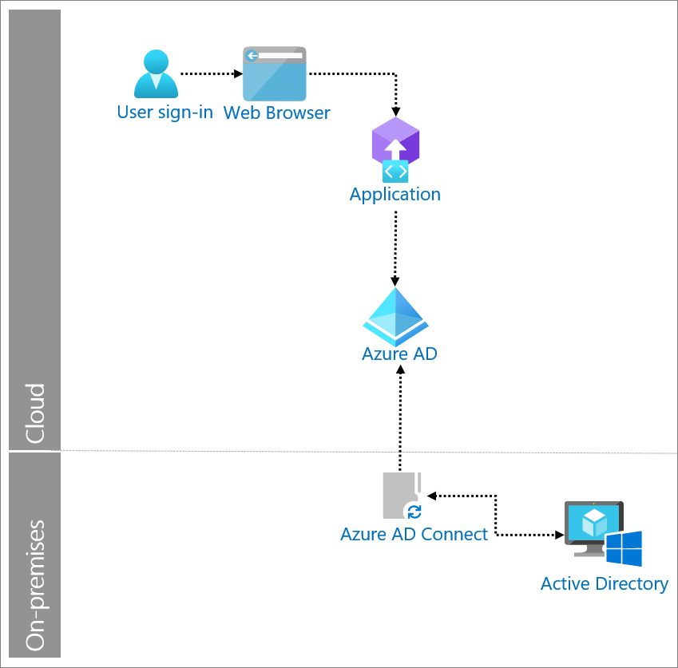

# Directory synchronization

Many organizations have a hybrid infrastructure encompassing both on-premises and cloud components. Synchronizing users’ identities between local and cloud directories lets users access resources with a single set of credentials. 

Synchronization is the process of 

* creating an object based on certain conditions
* keeping the object updated
* removing the object when conditions are no longer met. 

On-premises provisioning involves provisioning from on-premises sources (like Active Directory) to Azure Active Directory (Azure AD). 

## Use when

You need to synchronize identity data from your on-premises Active Directory environments to Azure AD.

## Components of system

* **User**: Accesses an application using Azure AD.

* **Web browser**: The component that the user interacts with to access the external URL of the application.

* **Application**: Web app that relies on the use of Azure AD for authentication and authorization purposes.

* **Azure AD**: Synchronizes identity information from organization’s on-premises directory via Azure AD Connect. 

* **Azure AD Connect**: A tool for connecting on premises identity infrastructures to Microsoft Azure AD. The wizard and guided experiences help you deploy and configure pre-requisites and components required for the connection, including sync and sign on from Active Directories to Azure AD. 

* **Active Directory**: Active Directory is a directory service included in most Windows Server operating systems. Servers running Active Directory Domain Services (AD DS) are called domain controllers. They authenticate and authorize all users and computers in the domain.

## Implement directory synchronization with Azure AD

* [What is identity provisioning?](../cloud-sync/what-is-provisioning.md) 

* [Hybrid identity directory integration tools](../hybrid/plan-hybrid-identity-design-considerations-tools-comparison.md) 

* [Azure AD Connect installation roadmap](../hybrid/how-to-connect-install-roadmap.md)