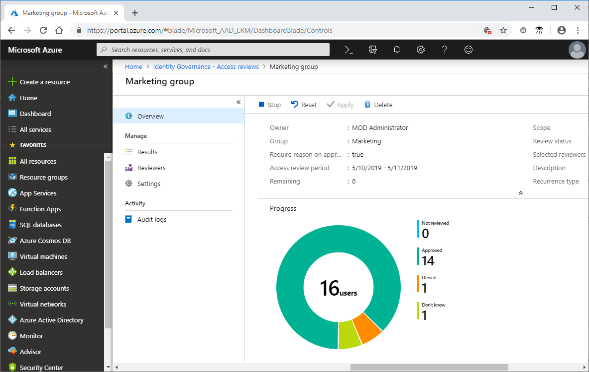
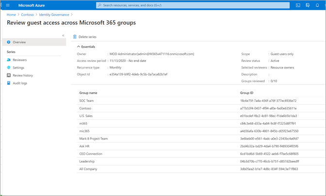
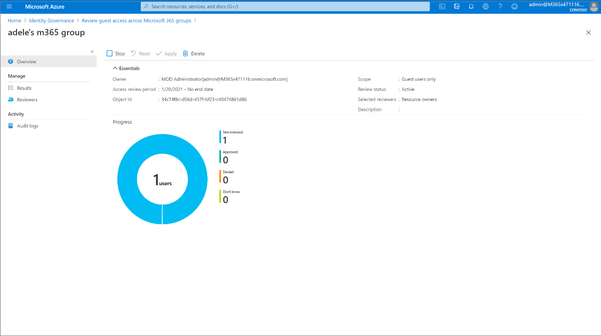
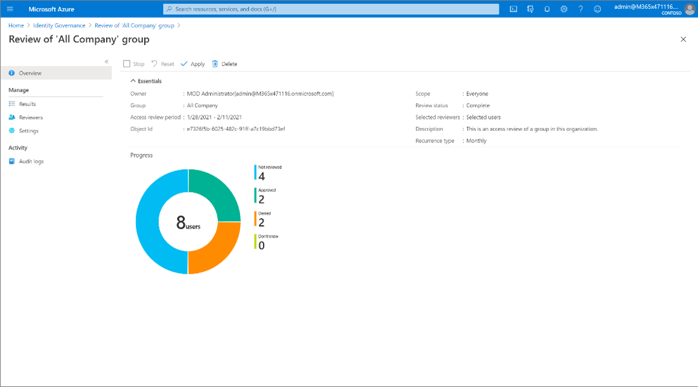
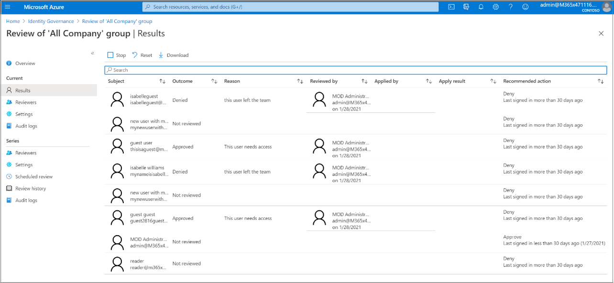

# Complete an access review of groups and applications in Azure AD access reviews

As an administrator, you [create an access review of groups or applications](create-access-review.md) and reviewers [perform the access review](perform-access-review.md). This article describes how to see the results of the access review and apply the results.

[!INCLUDE [GDPR-related guidance](../../../includes/gdpr-intro-sentence.md)]

## Prerequisites

- Azure AD Premium P2
- Global administrator, User administrator, Security administrator, or Security reader

For more information, see [License requirements](access-reviews-overview.md#license-requirements).

## View an access review

You can track the progress as the reviewers complete their reviews.

1. Sign in to the Azure portal and open the [Identity Governance page](https://portal.azure.com/#blade/Microsoft_AAD_ERM/DashboardBlade/).

1. In the left menu, click **Access reviews**.

1. In the list, click an access review.

    To view future instances of an access reviews, navigate to the access review, and select Scheduled reviews.

    On the **Overview** page, you can see the progress. No access rights are changed in the directory until the review is completed.

    
    
    If you are viewing an access review that reviews guest access across Microsoft 365 groups (Preview), the Overview blade lists each group in the review.  

   

    Click on a group to see the progress of the review on that group.

   

1. If you want to stop an access review before it has reached the scheduled end date, click the **Stop** button.

    When stop a review, reviewers will no longer be able to give responses. You can't restart a review after it's stopped.

1. If you're no longer interested in the access review, you can delete it by clicking the **Delete** button.

## Apply the changes

If **Auto apply results to resource** was enabled and based on your selections in **Upon completion settings**, auto-apply will be executed after the review's end date or when you manually stop the review.

If **Auto apply results to resource** wasn't enabled for the review, click **Apply** to manually apply the changes. If a user's access was denied in the review, when you click **Apply**, Azure AD removes their membership or application assignment.

The status of the review will change from **Completed** through intermediate states such as **Applying** and finally to state **Result applied**. You should expect to see denied users, if any, being removed from the group membership or application assignment in a few minutes.

A configured auto applying review, or selecting **Apply** doesn't have an effect on a group that originates in an on-premises directory or a dynamic group. If you want to change a group that originates on-premises, download the results and apply those changes to the representation of the group in that directory.

## Retrieve the results

To view the results for a one-time access review, click the **Results** page. To view just a user's access, in the Search box, type the display name or user principal name of a user whose access was reviewed.

 

To view the progress of an active access review that is recurring, click on the **Results** page.

To view the results of a completed instance of an access review that is recurring, click **Review history**, then select the specific instance from the list of completed access review instances, based on the instance's start and end date. The results of this instance can be obtained from the **Results** page.

To retrieve all the results of an access review, click the **Download** button. The resulting CSV file can be viewed in Excel or in other programs that open UTF-8 encoded CSV files.

## Remove users from an access review

 By default, a deleted user will remain deleted in Azure AD for 30 days, during which time they can be restored by an administrator if necessary.  After 30 days, that user is permanently deleted.  In addition, using the Azure Active Directory portal, a Global Administrator can explicitly [permanently delete a recently deleted user](../fundamentals/active-directory-users-restore.md) before that time period is reached.  One a user has been permanently deleted, subsequently data about that user will be removed from active access reviews.  Audit information about deleted users remains in the audit log.

## Next steps

- [Manage user access with Azure AD access reviews](manage-user-access-with-access-reviews.md)
- [Manage guest access with Azure AD access reviews](manage-guest-access-with-access-reviews.md)
- [Create an access review of groups or applications](create-access-review.md)
- [Create an access review of users in an Azure AD administrative role](../privileged-identity-management/pim-how-to-start-security-review.md)
