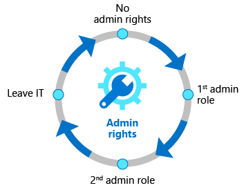
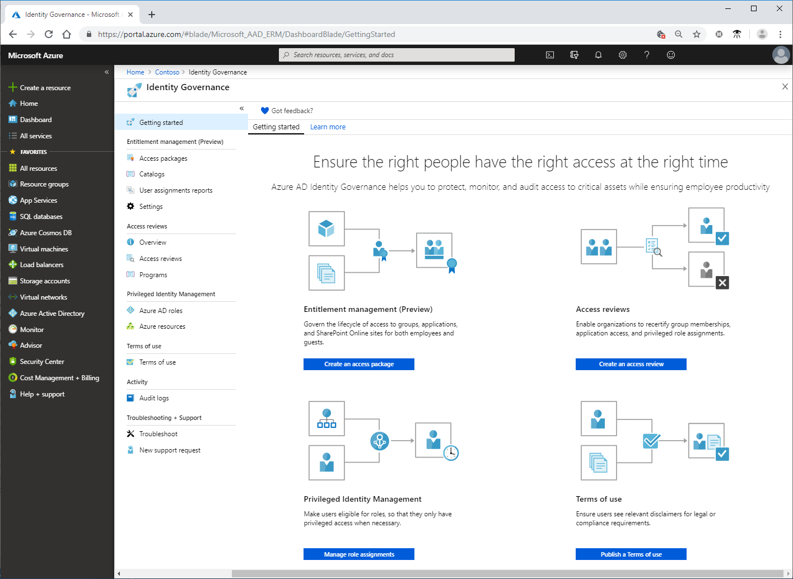

# What is Azure AD Identity Governance?

Azure Active Directory (Azure AD) Identity Governance allows you to balance your organization's need for security and employee productivity with the right processes and visibility. It provides you with capabilities to ensure that the right people have the right access to the right resources. These and related Azure AD and Enterprise Mobility + Security features allows you to mitigate access risk by protecting, monitoring, and auditing access to critical assets -- while ensuring employee and business partner productivity.  

Identity Governance give organizations the ability to do the following tasks across employees, business partners and vendors, and across services and applications both on-premises and in clouds:

- Govern the identity lifecycle
- Govern access lifecycle
- Secure privileged access for administration

Specifically, it is intended to help organizations address these four key questions:

- Which users should have access to which resources?
- What are those users doing with that access?
- Are there effective organizational controls for managing access?
- Can auditors verify that the controls are working?

## Identity lifecycle

Identity Governance helps organizations achieve a balance between *productivity* - How quickly can a person have access to the resources they need, such as when they join my organization? And *security* - How should their access change over time, such as due to changes to that person's employment status?  Identity lifecycle management is the foundation for Identity Governance, and effective governance at scale requires modernizing the identity lifecycle management infrastructure for applications.

For many organizations, identity lifecycle for employees is tied to the representation of that user in an HCM (human capital management) system.  Azure AD Premium automatically maintains user identities for people represented in Workday in both Active Directory and Azure Active Directory, as described in the [Workday inbound provisioning tutorial](../saas-apps/workday-inbound-tutorial.md).  Azure AD Premium also includes [Microsoft Identity Manager](/microsoft-identity-manager/), which can import records from on-premises HCM systems such as SAP, Oracle eBusiness, and Oracle PeopleSoft.

Increasingly, scenarios require collaboration with people outside your organization. [Azure AD B2B](/azure/active-directory/b2b/) collaboration enables you to securely share your organization's applications and services with guest users and external partners from any organization, while maintaining control over your own corporate data.  [Azure AD entitlement management](entitlement-management-overview.md) enables you to select which organization's users are allowed to request access and be added as B2B guests to your organization's directory, and ensures that these guests are removed when they no longer need access.

## Access lifecycle

Organizations need a process to manage access beyond what was initially provisioned for a user when that user's identity was created.  Furthermore, enterprise organizations need to be able to scale efficiently to be able to develop and enforce access policy and controls on an ongoing basis.

Typically, IT delegates access approval decisions to business decision makers.  Furthermore, IT can involve the users themselves.  For example, users that access confidential customer data in a company's marketing application in Europe need to know the company's policies. Guest users may be unaware of the handling requirements for data in an organization to which they have been invited.

Organizations can automate the access lifecycle process through technologies such as [dynamic groups](../users-groups-roles/groups-dynamic-membership.md), coupled with user provisioning to [SaaS apps](../saas-apps/tutorial-list.md) or [apps integrated with SCIM](../manage-apps/use-scim-to-provision-users-and-groups.md).  Organizations can also control which [guest users have access to on-premises applications](../b2b/hybrid-cloud-to-on-premises.md).  These access rights can then be regularly reviewed using recurring [Azure AD access reviews](access-reviews-overview.md).   [Azure AD entitlement management](entitlement-management-overview.md) also enables you to define how users request access across packages of group and team memberships, application roles, and SharePoint Online roles.

When a user attempts to access applications, Azure AD enforces [Conditional Access](/azure/active-directory/conditional-access/) policies. For example, Conditional Access policies can include displaying a [terms of use](../conditional-access/terms-of-use.md) and [ensuring the user has agreed to those terms](../conditional-access/require-tou.md) prior to being able to access an application.

## Privileged access lifecycle

Historically, privileged access has been described by other vendors as a separate capability from Identity Governance. However, at Microsoft, we think governing privileged access is a key part of Identity Governance -- especially given the potential for misuse associated with those administrator rights can cause to an organization. The employees, vendors, and contractors that take on administrative rights need to be governed.

[Azure AD Privileged Identity Management (PIM)](../privileged-identity-management/pim-configure.md) provides additional controls tailored to securing access rights for resources, across Azure AD, Azure, and other Microsoft Online Services.  The just-in-time access, and role change alerting capabilities provided by Azure AD PIM, in addition to multi-factor authentication and Conditional Access, provide a comprehensive set of governance controls to help secure your company's resources (directory, Office 365, and Azure resource roles). As with other forms of access, organizations can use access reviews to configure recurring access recertification for all users in administrator roles.

## Getting started

Check out the Getting started tab of **Identity Governance** in the Azure portal to start using entitlement management, access reviews, Privileged Identity Management, and Terms of use.

If you have any feedback about Identity Governance features, click **Got feedback?** in the Azure portal to submit your feedback. The team regularly reviews your feedback.

While there is no perfect solution or recommendation for every customer, the following configuration guides also provide the baseline policies Microsoft recommends you follow to ensure a more secure and productive workforce.

- [Identity and device access configurations](/microsoft-365/enterprise/microsoft-365-policies-configurations)
- [Securing privileged access](../users-groups-roles/directory-admin-roles-secure.md)

## Appendix - least privileged roles for managing in Identity Governance features

It's a best practice to use the least privileged role to perform administrative tasks in Identity Governance. We recommend that you use Azure AD PIM to activate a role as needed to perform these tasks. The following are the least privileged directory roles to configure Identity Governance features:

| Feature | Least privileged role |
| ------- | --------------------- |
| Entitlement management | User administrator (with the exception of adding SharePoint Online sites to catalogs, which requires Global administrator) |
| Access reviews | User administrator (with the exception of access reviews of Azure or Azure AD roles, which requires Privileged role administrator) |
|Privileged Identity Management | Privileged role administrator |
| Terms of use | Security administrator or Conditional access administrator |

## Next steps

- [What is Azure AD entitlement management?](entitlement-management-overview.md)
- [What are Azure AD access reviews?](access-reviews-overview.md)
- [What is Azure AD Privileged Identity Management?](../privileged-identity-management/pim-configure.md)
- [What can I do with Terms of use?](active-directory-tou.md)

